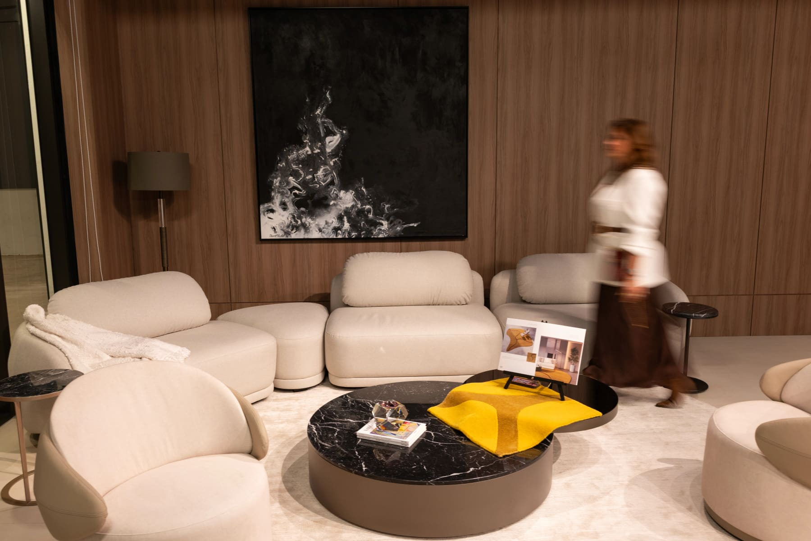
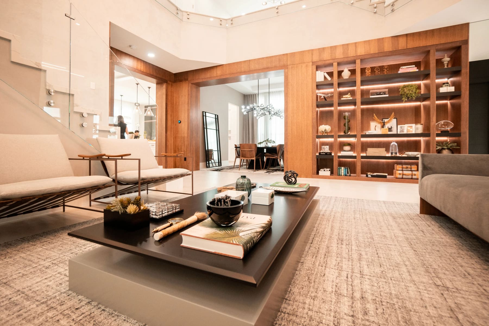
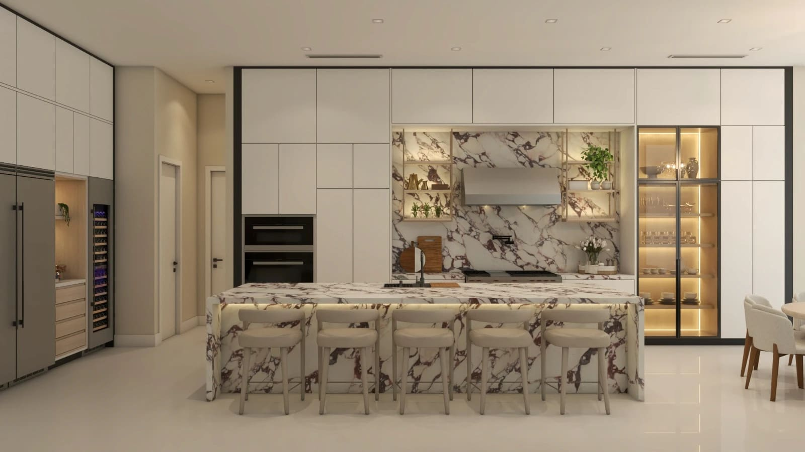

Most people imagine that hiring an interior designer means months of uncertainty: contractor delays, endless decisions, showroom visits on weekends, and a renovation that takes over your life. At Paula Ambrosio Interior Design, we built our entire process around a different promise, a fully transformed, move-in-ready home in 40 days, with zero stress on your end.

This is not a shortcut. It is a system.

Over two decades of designing luxury residential and commercial spaces in Miami and internationally have taught us that our clients' most precious resource is not money. It is time. The 40-day turnkey process was designed to honor that.

Here is exactly how it works.

## What is a turnkey interior design service?

A turnkey project means we handle everything. From the first conversation to the final styling session, you make decisions and we execute. You never have to call a contractor, track a furniture delivery, or stand in a showroom on a Saturday morning.

When we hand you the keys at the end of the process, your home is complete, photographed, styled, and ready to live in from the first night.

This is the standard we hold ourselves to on every project, regardless of size.

## Phase 1: Discovery & vision (Days 1-5)

Every great design starts with listening.

In the first phase, we sit down with you, in person at your property or virtually if you are based internationally, for a deep-dive consultation. We ask the questions most designers skip: How do you move through your home in the morning? Do you entertain formally or casually? How much natural light matters to you? What does "home" feel like to you?

We review your space with fresh eyes, measure every room, and identify both the opportunities and the constraints. We also discuss budget ranges transparently at this stage because we believe that clarity early saves everyone from disappointment later.

By the end of Phase 1, we have a clear picture of who you are, how you live, and what your home needs to become.

What happens in this phase: Initial consultation, site visit and measurements, lifestyle and budget alignment, vision reference review.

## Phase 2: Concept & 3D design (Days 6-15)

This is where the transformation begins, on paper and on screen, before a single item is purchased.

Our design team develops your full concept: a furniture layout, a curated material palette, a color story, and custom millwork drawings. We source from our network of luxury furniture brands.

Before any order is placed, you receive photorealistic 3D renderings of every room. This is one of the most important steps in our process. You will see your future living room, bedroom, and kitchen in full detail: lighting, textures, proportions, so that when you approve the design, you are approving something you have already seen.

> Changes are made at this stage, not after installation.

What happens in this phase: Full floor plan, photorealistic 3D renderings, material and finish palette, custom millwork design, client walkthrough and final approval.

## Phase 3: Procurement & coordination (Days 16-25)

Once the design is signed off, we take over completely.

Every piece of furniture, every fabric, every fixture, and every piece of art is sourced, ordered, and tracked by our team. We coordinate directly with vendors, manage lead times, and schedule deliveries to align with your installation window.

Our clients do not receive a single invoice from a contractor or a notification from a shipping company. We absorb all of that coordination so you can focus on your life.

For international clients purchasing a Miami property, this phase is especially valuable. We manage the entire project remotely on your behalf, with regular photo updates and status reports throughout.

What happens in this phase: All furniture and fixture orders placed, contractor scheduling, vendor negotiation, logistics and delivery coordination, timeline management.

## Phase 4: Installation & build (Days 26-37)

This is the longest phase, and the one where our clients are least involved, by design.

Our team arrives at your property and manages every aspect of the physical transformation. Millwork goes in first. Paint and wall treatments follow. Then furniture arrives in the correct sequence, flooring is protected throughout, and lighting and fixtures are installed and tested.

We are on-site every day. Our project coordinators oversee each trade, verify quality at every step, and flag any issues before they become problems. If something is not right, we fix it before we move to the next phase, not after you move in.

You receive daily photo updates throughout installation, so you can watch your home come to life from wherever you are.

What happens in this phase: Custom millwork installation, painting and specialty finishes, furniture placement, lighting and fixture installation, ongoing quality control inspections.

## Phase 5: Styling & reveal (Days 38-40)

The final three days are where a beautifully designed room becomes a home.

Our styling team curates the last layer of every space: art placement, books, sculptural objects, plants, candles, throws, and all the details that make a room feel lived-in and alive. We do not work from a checklist. We respond to what each room is asking for, layering warmth and personality until the space feels complete.

On the final day, we bring in our photographer to document the project professionally. Then comes the moment we love most: the reveal. You walk through your home for the first time as it was meant to be, and it is ready, not "almost ready," not "just needs a few more things." Fully ready.

What happens in this phase: Full styling with art, plants, accessories and decorative objects, professional photography, final client walkthrough, move-in.

## Why 40 days, and why does it matter?

Most residential design projects in Miami take six to twelve months. That timeline is not inevitable. It is the result of a fragmented process, where the designer, contractor, and client are constantly waiting on each other.

Our 40-day model works because we control the entire chain. We do not hand you a shopping list and wait for you to approve items one by one. We do not start installation before procurement is complete. Every phase is sequenced so the next one can begin without delay.

The result is a project that moves with intention, and a client who is never left wondering what comes next.

## Who is the 40-day process for?

Our turnkey clients typically fall into one of these profiles:

Busy professionals who want a beautiful home but cannot dedicate months to managing a renovation. International buyers purchasing a Miami property and relocating from abroad. Real estate investors staging or upgrading a property for resale or rental. Local homeowners who have lived with a space that no longer reflects who they are, and are ready for a transformation.

What they have in common is this: they want a result, not a process. They want to hand the project to someone they trust, and come back to a home that exceeds their expectations.

That is exactly what we deliver.

## Ready to begin?

If you are considering a design project in Miami, whether it is a full home, a single floor, or a commercial space, we invite you to share the details with us. Our team will review your project and schedule a complimentary discovery call to walk you through what the 40-day process would look like for your specific home.

info@paulaambrosio.com

IG: @paulaambrosio_

