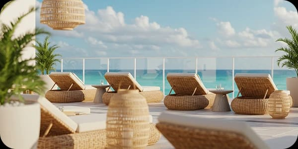
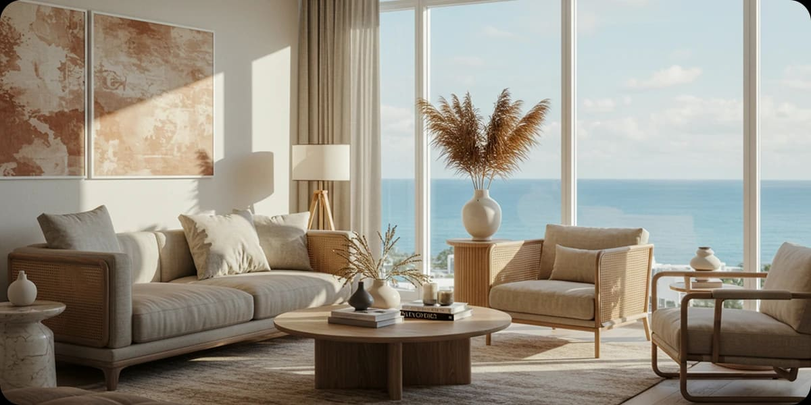
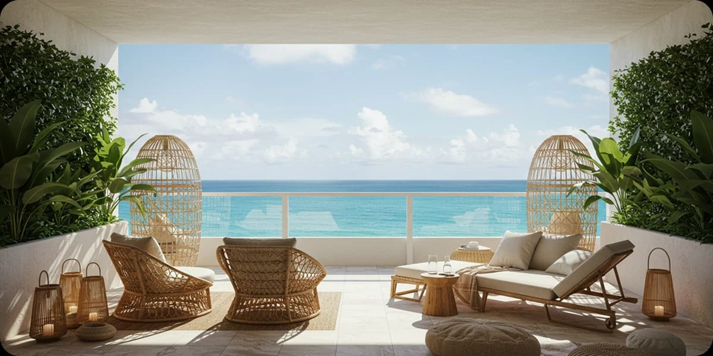

This time it’s all about softness and ease. Think layered textures that feel lived-in, sun-kissed tones that bring warmth, and natural materials that look perfectly undone yet curated. Just like a timeless fashion glow, interiors can carry that same effortless charm.

From woven details and organic fabrics to earthy palettes with a subtle flush of color, the modern boho look is about creating a lifestyle that feels authentic and free-spirited.

Tap to discover how to bring this boho glow into both your wardrobe and your home and make the look truly your own.

