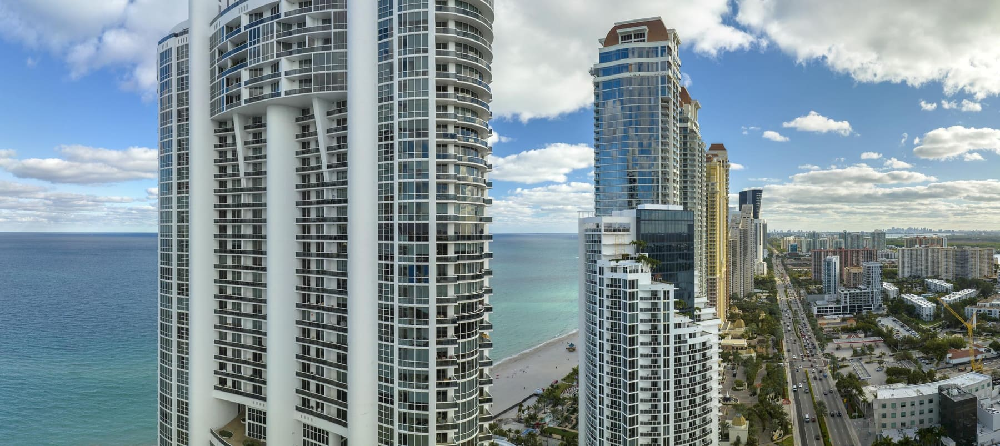
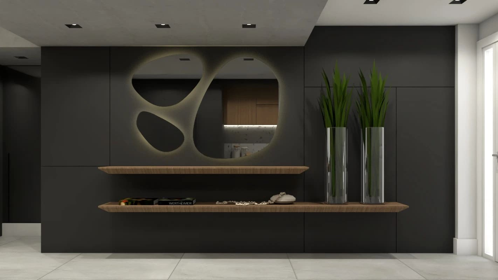
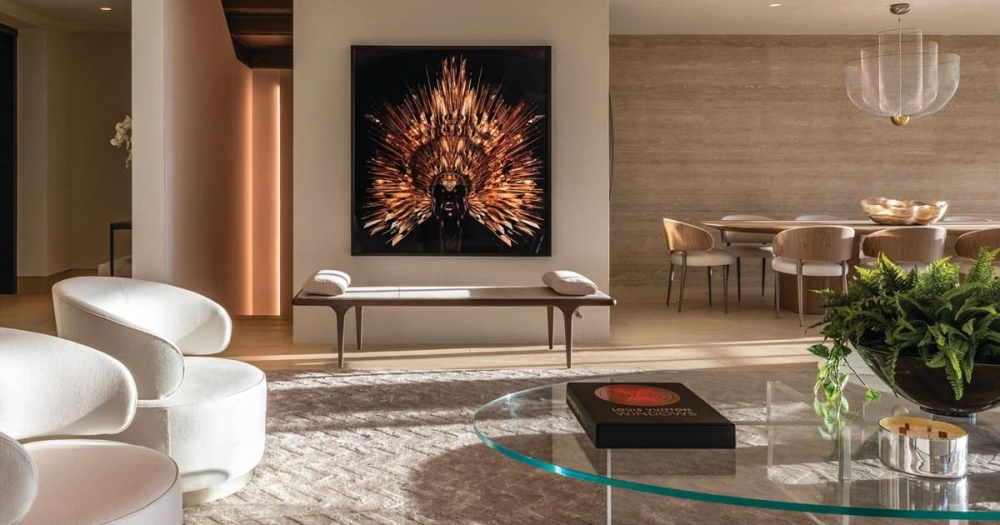
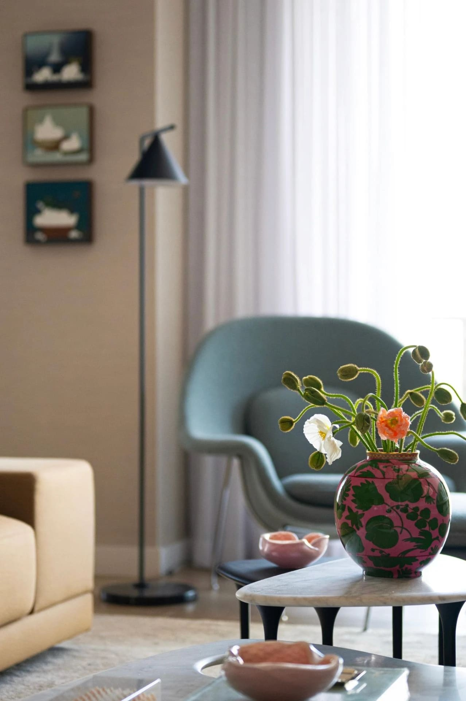
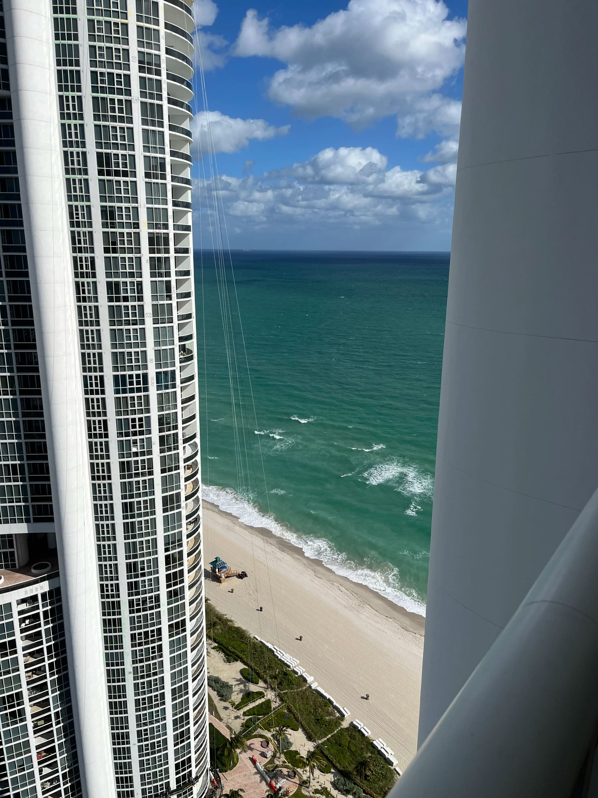
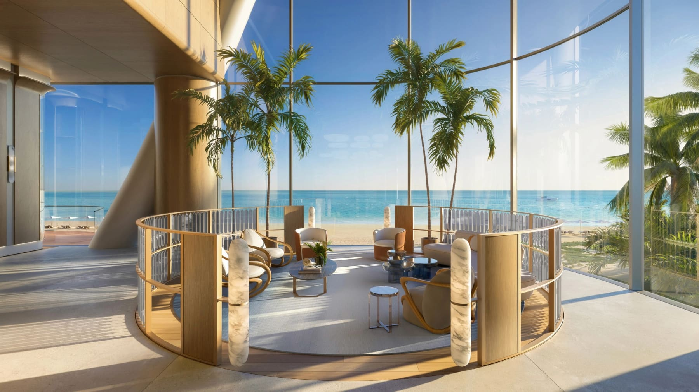
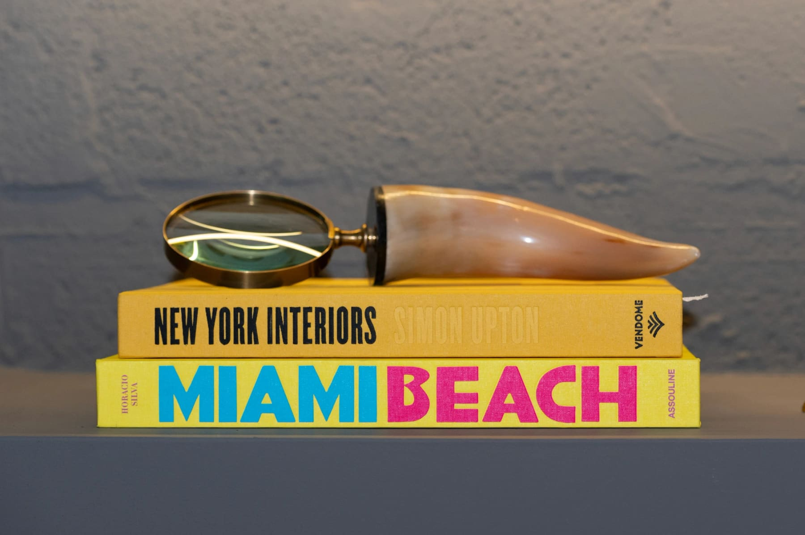
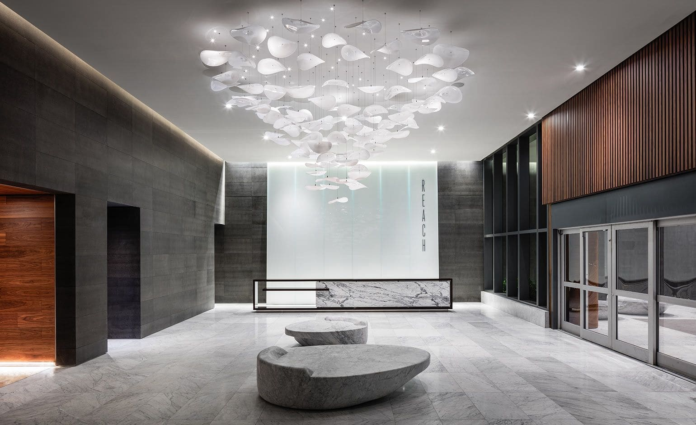

Choosing the Right Location in Miami: How Lifestyle, Culture and Interior Design Increase Property Value

Choosing where to live in Miami is not just a real estate decision. It is a lifestyle choice. Each neighborhood carries a different rhythm, energy and mix of people, and interior design plays a key role in translating that lifestyle into a space that feels right and holds value over time.

Understanding location is the first step to designing well and investing smart.

## Living in Sunny Isles Beach: Resort Lifestyle and International Energy

Sunny Isles is calm, international and ocean-driven. It attracts residents from Europe, South America and families looking for a relaxed, resort-style lifestyle. Life here is slower, more contemplative and deeply connected to the beach.

Interior design in Sunny Isles should reflect lightness and comfort. Natural materials, soft textures, layered neutrals and fluid layouts work best. Design here is about serenity, flow and timeless elegance.

Properties in Sunny Isles gain value when interiors feel like permanent vacations without excess. Calm sells.

## Living in Brickell: Urban Life and Global Movement

Brickell is fast, global and metropolitan. It attracts young professionals, executives, investors and people who live between cities and countries. Everything moves quickly. Space must be efficient, functional and visually impactful.

Interior design in Brickell needs clarity and intention. Clean lines, smart storage, modern materials and layered lighting are essential. Design here must support productivity while still offering comfort.

In Brickell, properties are valued when interiors feel sophisticated, current and flexible. Design must match the pace of the city.

## Different Neighborhoods, Different Design Strategies

Miami is a mosaic of lifestyles.

In Miami Beach, design often balances glamour with ease. In Bal Harbour, luxury is discreet and refined. Coral Gables reflects tradition and architectural heritage, while Boca Raton and West Palm Beach lean toward residential comfort and long-term living.

Each area attracts a different mix of people. Families, investors, international buyers, professionals, retirees. Interior design must speak their language.

There is no universal design solution for Miami. Location defines strategy.

## The Mix of People Shapes the Space

Miami is one of the most culturally diverse cities in the world. This mix of backgrounds influences how people experience space.

Some clients value openness and social areas. Others prioritize privacy, calm and tradition. Good interior design listens to these needs and translates them into layout, materials and flow.

Design that understands people always feels more valuable.

## How Interior Design Increases Property Value

Interior design is one of the most effective ways to increase real estate value in Miami.

Well-designed interiors photograph better, rent faster and sell at higher prices. Design influences perception before square footage does.

Strategic interior design includes timeless materials, cohesive layers, functional layouts and a clear lifestyle narrative. It avoids trends that age quickly and focuses on longevity.

In competitive markets like Sunny Isles, Brickell and Miami Beach, design can be the deciding factor between a property that sits and one that sells.

## Design as a Real Estate Strategy

Interior design is not decoration. It is positioning.

A property designed with intention appeals to a specific lifestyle and buyer profile. It tells a clear story. This clarity creates emotional connection, and emotional connection drives value.

Design that respects location, culture and lifestyle always performs better in the market.

## Final Thought

Choosing where to live in Miami is choosing how you want to live. Interior design is what transforms that choice into reality.

When design aligns with location and people, homes feel authentic and properties gain value.

That is the power of thoughtful interior design in Miami.

Paula Ambrosio.

