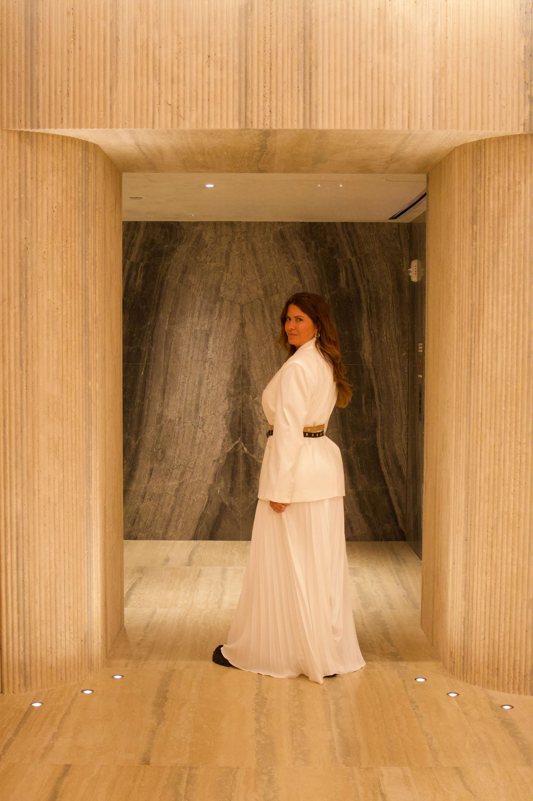
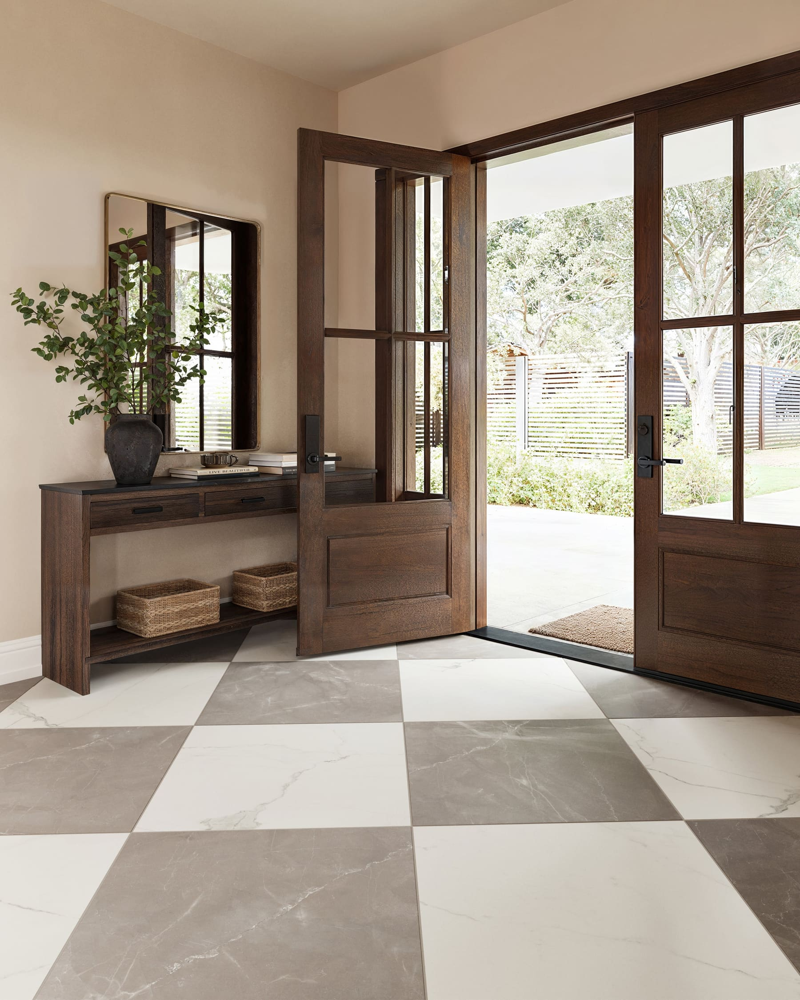
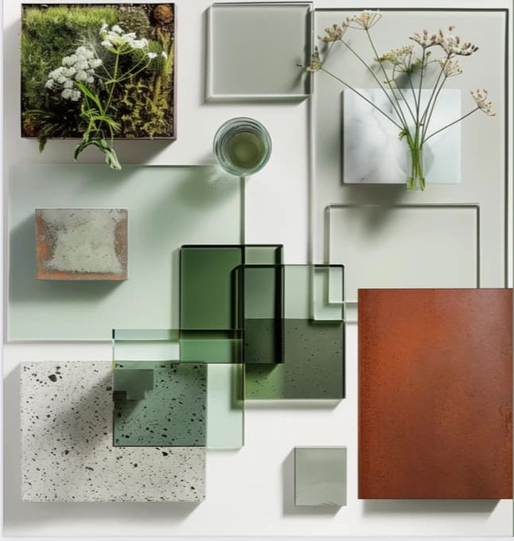
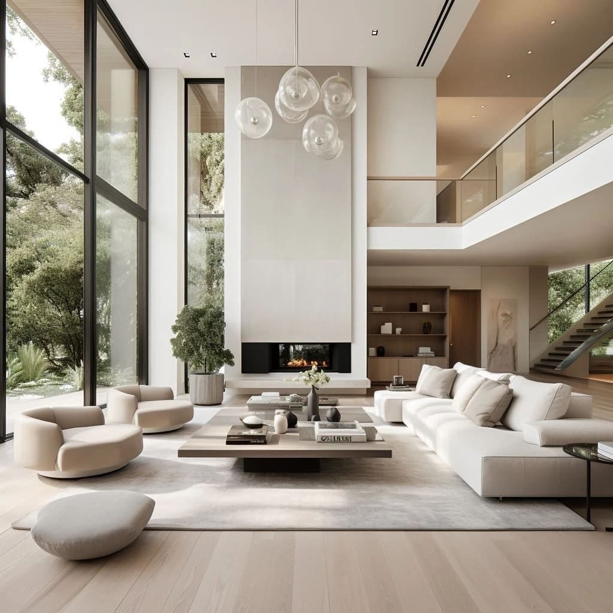
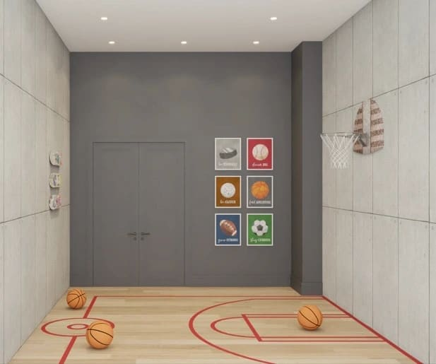
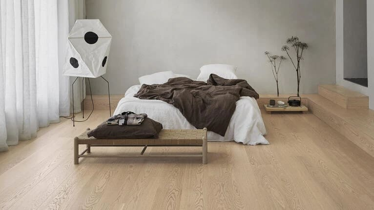

Choosing the Right Tiles in Miami: How Flooring Impacts Well-Being, Balance and Timeless Design

Choosing the right tile is not just a technical decision. It is an emotional, sensory and architectural one. Floors carry the weight of the home. They ground us. They influence how we feel the moment we step inside a space.

In interior design projects across Miami, Brickell, Miami Beach, Sunny Isles, Bal Harbour, Coral Gables, Boca Raton, Parkland and West Palm Beach, flooring choices define comfort, flow and well-being more than most people realize.

> The wrong choice can disturb a space. The right one creates calm.**

## Floors and the Way We Feel

Everything in a home communicates with the body. Floors especially.

If you think about nature, everything makes sense. The sky shines above us. Light reflects in the clouds, in the sun, in the stars. When we look down, we see sand, earth, stone, wood. All matte. All grounded. All calm.

That is not accidental. It is balance.

> That is why, in my design philosophy, shine belongs to the eyes, not to the floor**.

## Why Glossy Floors Disrupt Spaces

Glossy floors reflect what should not be reflected. They bounce ceiling lights, furniture lines and movement back into the eyes. Instead of grounding the space, they create visual noise.

In high-end interior design, especially in modern homes and condos in Brickell and Downtown Miami, glossy flooring can feel cold, busy and uncomfortable over time. It competes with architecture instead of supporting it.

A floor should absorb, not reflect. It should calm, not stimulate.

> This is a clear rule in my office: no shine on floors.***

## Matte, Smooth and Timeless Tiles

The most elegant flooring choices are smooth, matte and timeless.

Matte porcelain tiles, honed natural stone and soft-textured surfaces create visual balance. They allow walls, lighting and architecture to shine. They feel luxurious without trying too hard.

Sometimes, very rarely, I will mix a stone with a subtle natural sheen, but always with intention and restraint. The priority is always a surface that feels calm, sophisticated and enduring.

Timeless materials never shout. They whisper.

## Natural Stone and Well-Being

Natural stone connects interiors to nature. Its texture, imperfections and movement create emotional grounding.

In Miami Beach, Sunny Isles and Bal Harbour, stone floors work beautifully when chosen with the right finish. Honed limestone, travertine or quartzite bring elegance without glare. They complement ocean light instead of fighting it.

Stone should feel soft under the eyes and stable under the feet.

## The Ideal Flooring for Bedrooms

Bedrooms are sacred spaces. They are meant for rest, intimacy and restoration.

For bedrooms, wood is always my first choice. Engineered wood or high-quality wood flooring adds warmth, comfort and acoustic softness. It immediately changes how the room feels.

And wood should always be layered with rugs.

Rugs create emotional warmth. They define zones. They soften the step when you wake up. They add texture and comfort to the space.

This layering of the floor is essential for well-being.

## Flooring as a Design Layer

Floors are not a single decision. They are part of the design layers.

They must work with wall textures, lighting, millwork, furniture and art. A calm floor allows other elements to speak. A busy or shiny floor steals attention.

In luxury interior design across Coral Gables, Boca Raton and West Palm Beach, the most sophisticated homes are the ones where the floor quietly supports everything else.

That is true elegance.

## Choosing the Right Tile for Each Space

There is no universal tile that works everywhere. Each space has its own rhythm and function.

Living areas benefit from matte, continuous flooring that connects spaces visually. Kitchens need durability without glare. Bathrooms require safety, texture and softness under light. Bedrooms ask for warmth and layers.

A professional interior designer understands how to choose the right material for each environment, avoiding costly mistakes and creating harmony throughout the home.

## Final Thought

Floors are the foundation of how we experience a space. When chosen with intention, they bring calm, balance and timeless beauty.

Shine belongs above us, in the light.The ground should always ground us.

That is the essence of thoughtful interior design.

> ✨ shine for the eyes, calm for the ground.***

Paula Ambrosio.

