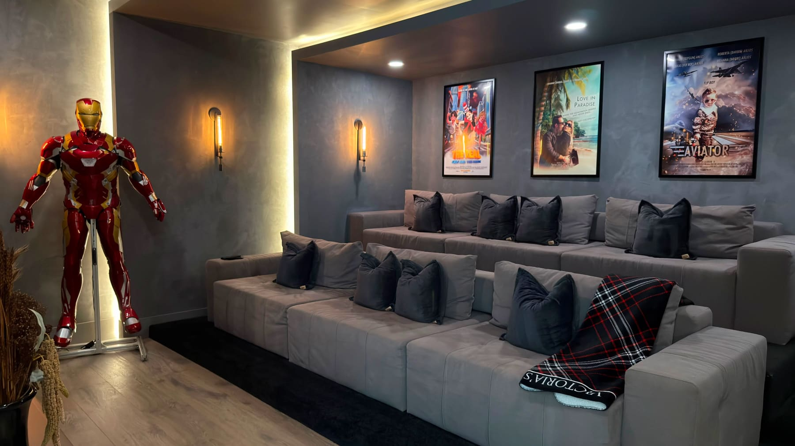
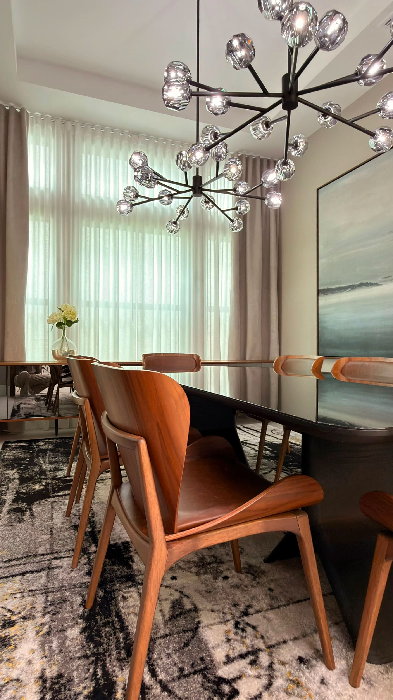
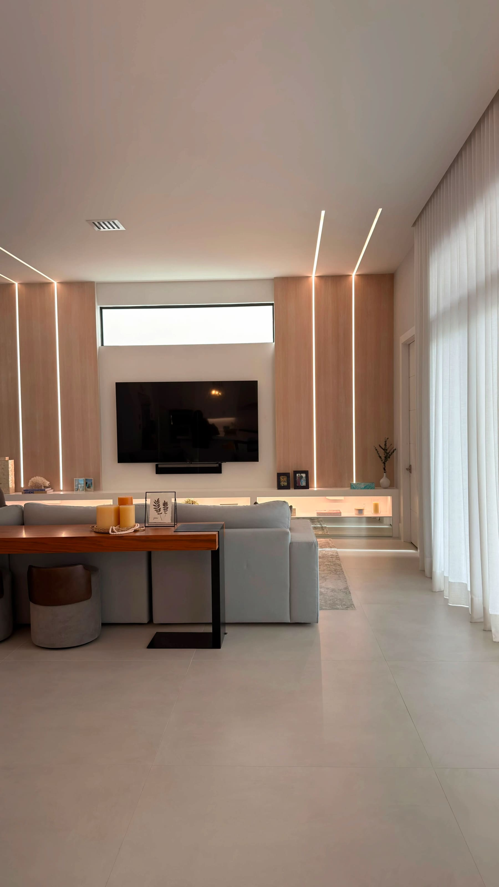

The right furniture transforms a house into a home.**

Every decision from scale and comfort to materials and craftsmanship contributes to creating spaces that feel welcoming, elegant, and timeless.

Instead of following short-lived trends, focus on quality, thoughtful planning, and pieces that support your lifestyle. When furniture is selected with intention, every room becomes more functional, more beautiful, and more meaningful.

Luxury interior design isn’t about filling a space. It’s about creating an environment that tells your story and enhances the way you live every day.

Frequently Asked Questions**

What is the most important factor when choosing furniture?**

Start with your lifestyle, room dimensions, and functionality. Furniture should support the way you live before focusing on aesthetics.

Should all my furniture match?**

No. Layering complementary styles, materials, and finishes creates a more sophisticated and timeless interior.

Is custom furniture worth the investment?**

For many homeowners, custom furniture provides better proportions, higher-quality craftsmanship, and a tailored fit that maximizes both functionality and design.

How do I make my home look more luxurious?**

Focus on quality over quantity, invest in timeless materials, create balanced layouts, incorporate layered lighting, and choose furniture with refined proportions rather than chasing trends.

About the Author**

Paula Ambrosio** is an internationally recognized luxury interior designer with more than 21 years of experience designing sophisticated residential and hospitality projects. Her work blends timeless elegance, modern functionality, and natural materials to create interiors that enhance everyday living. She serves clients throughout Miami, Palm Beach, Boca Raton, South Florida, and internationally.

