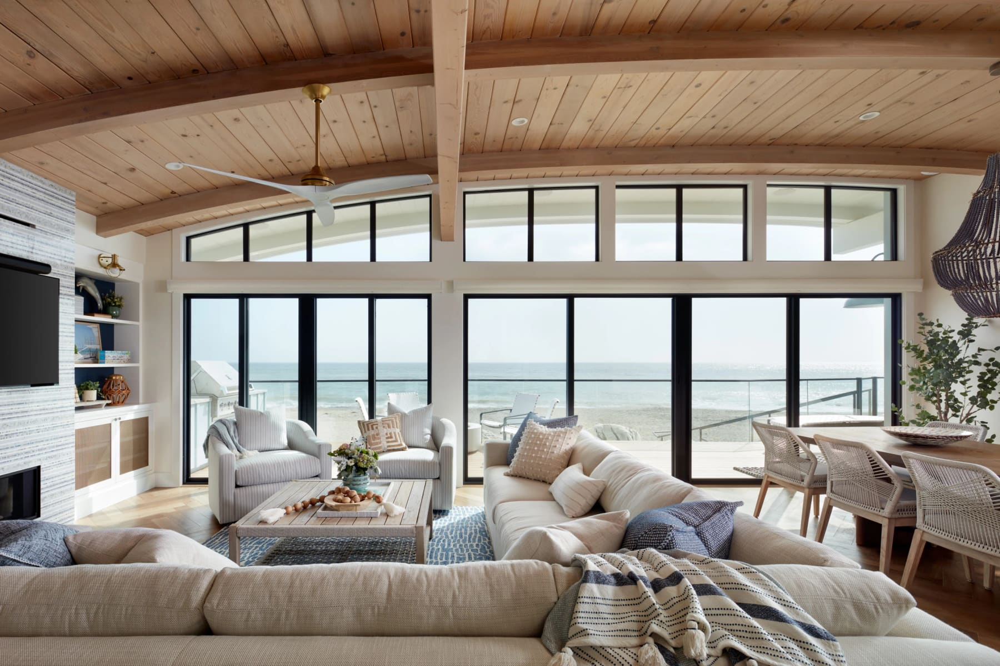
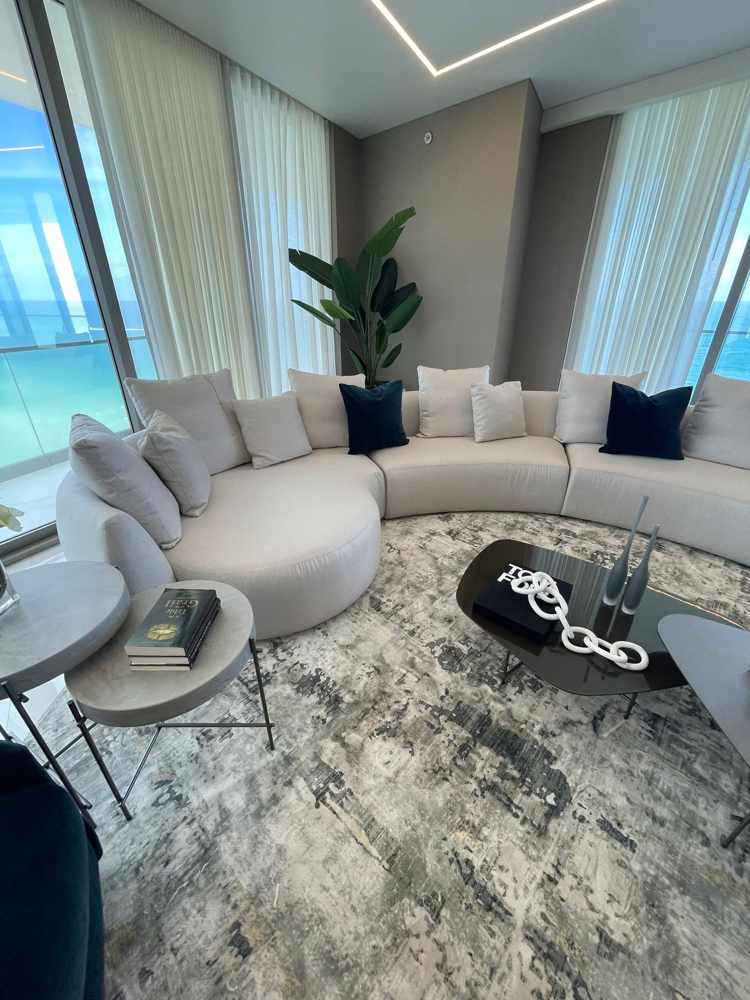
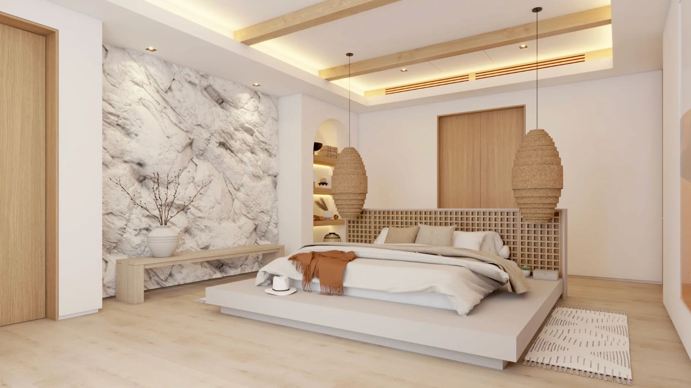
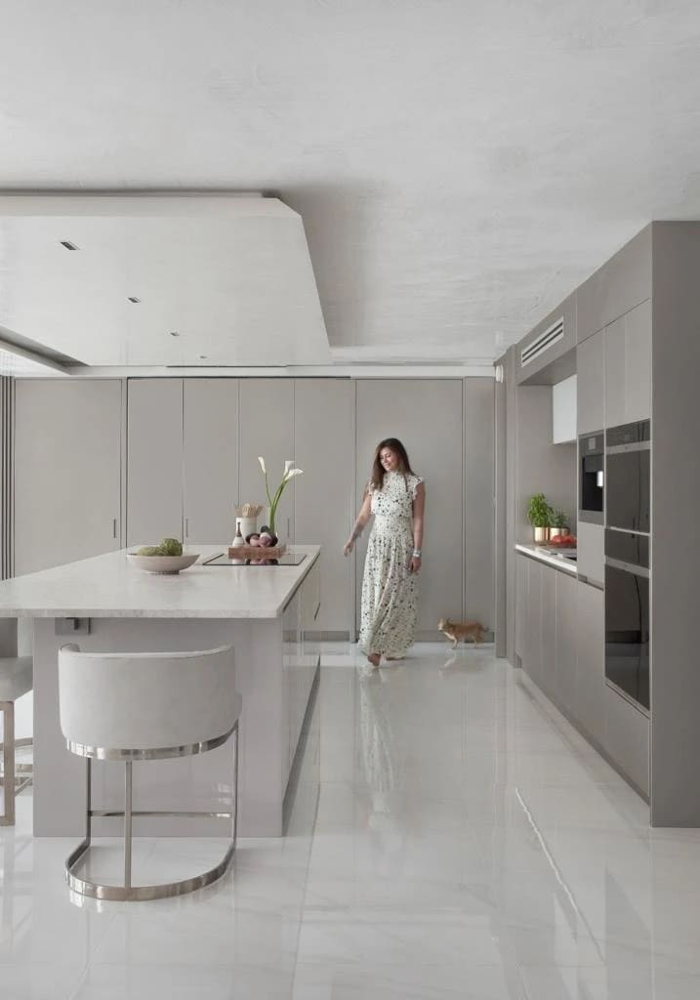
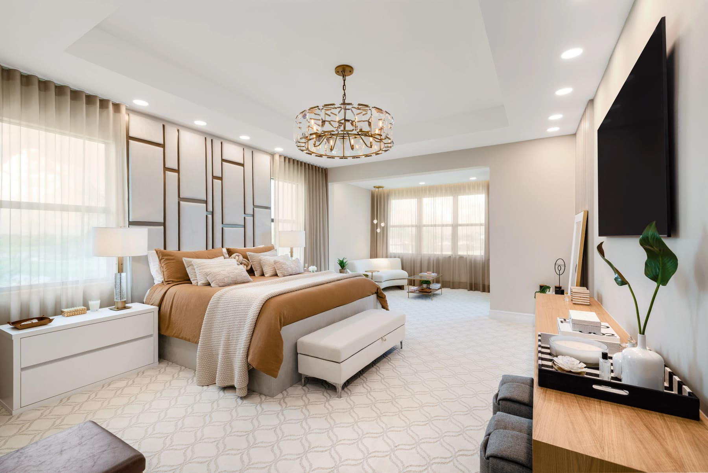
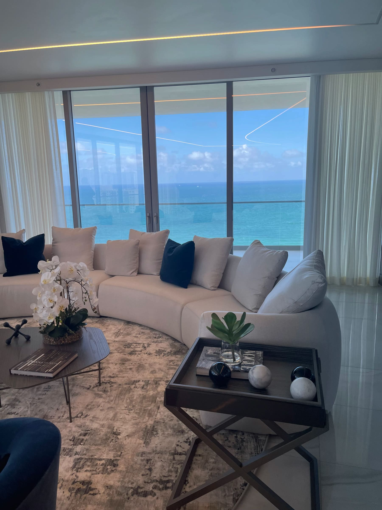
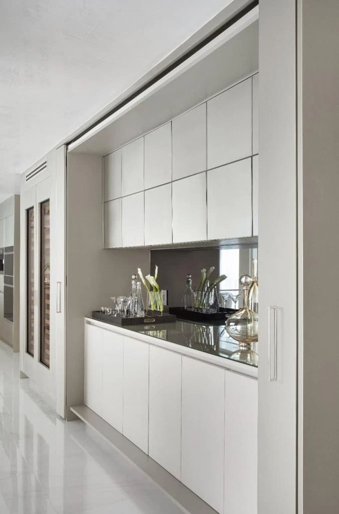

Coastal Luxury Living in Miami: Natural Materials, Light Woods and Timeless Oceanfront Design

by Paula Ambrosio

@paulaambrosio_

Mar 1, 2026

-

2 min read

Living by the Ocean in Miami : Natural Materials, Soft Tones and the Art of Coastal Luxury

Living by the ocean is not just about the view. It is about how a home feels when the light enters, when the breeze moves the curtains and when natural textures respond to the rhythm of the sea.

Across Sunny Isles Beach, Bal Harbour and waterfront residences in Miami, coastal interior design is evolving. It is no longer

## Light Woods: The Foundation of Coastal Calm

In oceanfront homes across Sunny Isles Beach and Bal Harbour, light wood tones are essential.

White oak has become one of the most refined choices for coastal interiors. Its warmth is gentle, its grain is elegant and its neutrality allows light to move freely through the space.

Light woods ground the home without darkening it. They reflect natural light softly and age beautifully over time.

In waterfront design, the goal is always balance. The ocean is already dramatic. The interior should feel calm.

## Natural Stone: Texture That Connects to Earth

Natural stone brings authenticity and permanence to a coastal home.

Honed limestone, travertine, Taj Mahal quartzite and other matte stones create texture without glare. By the ocean, shine competes with sunlight. Matte finishes absorb light and create serenity.

Stone floors and surfaces should feel smooth, timeless and effortless. In Miami Beach residences, natural stone creates continuity between indoor and outdoor spaces.

Nature outside, nature inside.

## Fabrics That Feel Like Air

Coastal living demands softness.

Egyptian cotton, linen and other breathable fabrics allow movement and lightness. Curtains should float, not weigh down the space. Upholstery should feel inviting and relaxed.

In waterfront properties, fabrics must also resist humidity and sun exposure. The choice of material is not only aesthetic but functional.

Luxury by the sea is about comfort without heaviness.

## Neutral Tones with Hints of Blue

Color in coastal interiors should whisper, not shout.

Neutral palettes—soft whites, warm beiges, sand tones and greige—create a foundation that feels timeless. Subtle touches of blue echo the ocean without overpowering the space.

Blue should appear as a memory of the sea, not as a theme. A pillow, an art piece, a subtle fabric detail.

When done correctly, these tones bring the outside in without imitation.

## Indoor-Outdoor Continuity

One of the most important aspects of oceanfront living in Miami is the seamless transition between indoor and outdoor spaces.

Materials should flow. Flooring can extend visually from living room to terrace. Wood tones can repeat in exterior details. Stone selections can unify the experience.

In Miami Beach and Sunny Isles Beach, this continuity enhances the sense of openness and lifestyle.

Design should never interrupt the view. It should frame it.

## Wellness and Emotional Impact

Living by the ocean already offers natural therapy. Interior design should amplify that.

Soft lighting, layered textures and natural materials create an atmosphere of retreat. Bedrooms should feel serene. Bathrooms should resemble spa environments with matte stone and warm woods.

Coastal design is not about decoration. It is about emotional balance.

Homes that feel calm hold greater long-term value.

## Design Strategy for Waterfront Property Value

From an investment perspective, coastal homes with timeless interiors sell faster and photograph better.

Buyers looking at properties in Bal Harbour, Sunny Isles or Miami Beach expect refined simplicity. Overdesigned or trend-heavy interiors can reduce perceived luxury.

Natural materials, cohesive palettes and thoughtful lighting increase both desirability and market performance.

Design should respect the ocean, not compete with it.

## Final Thought

Living by the ocean is about rhythm, light and softness.

When materials like white oak, natural stone and Egyptian cotton are layered with neutral tones and subtle blues, a home becomes more than a residence. It becomes an experience.

Coastal luxury is not loud.It is quiet, grounded and timeless.

By Paula Ambrosio

Follow me: IG @paulaambrosio_

