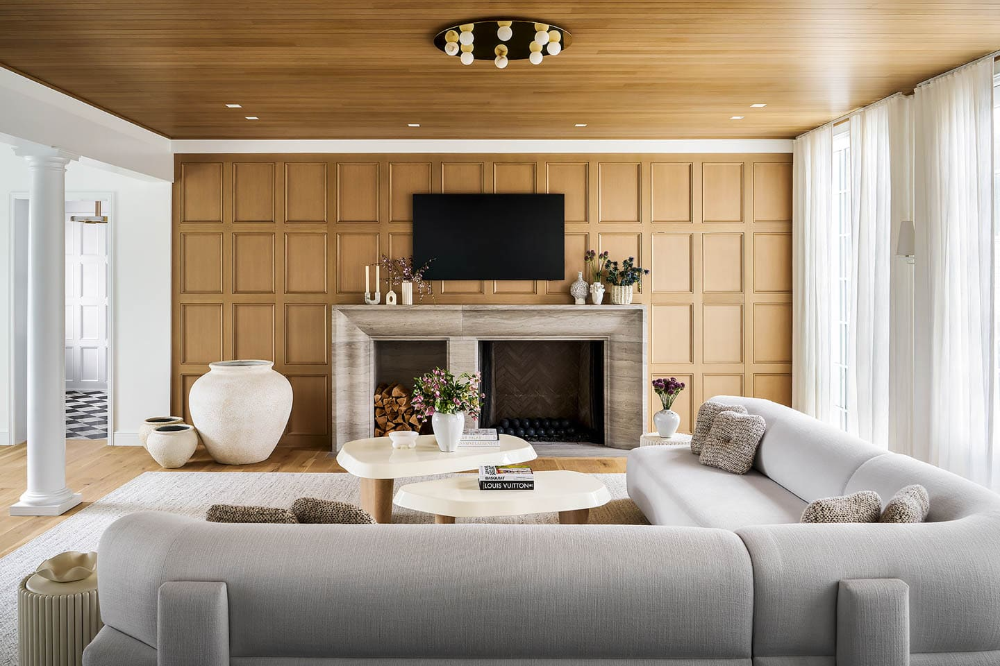
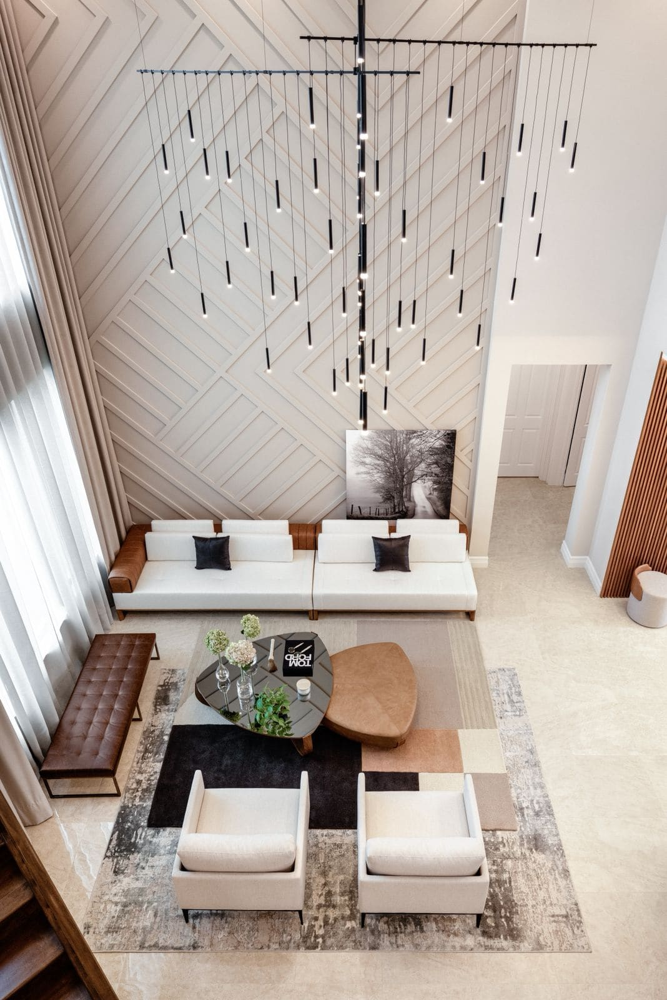
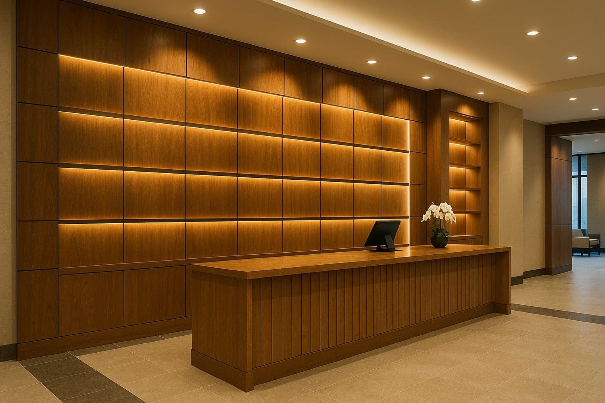
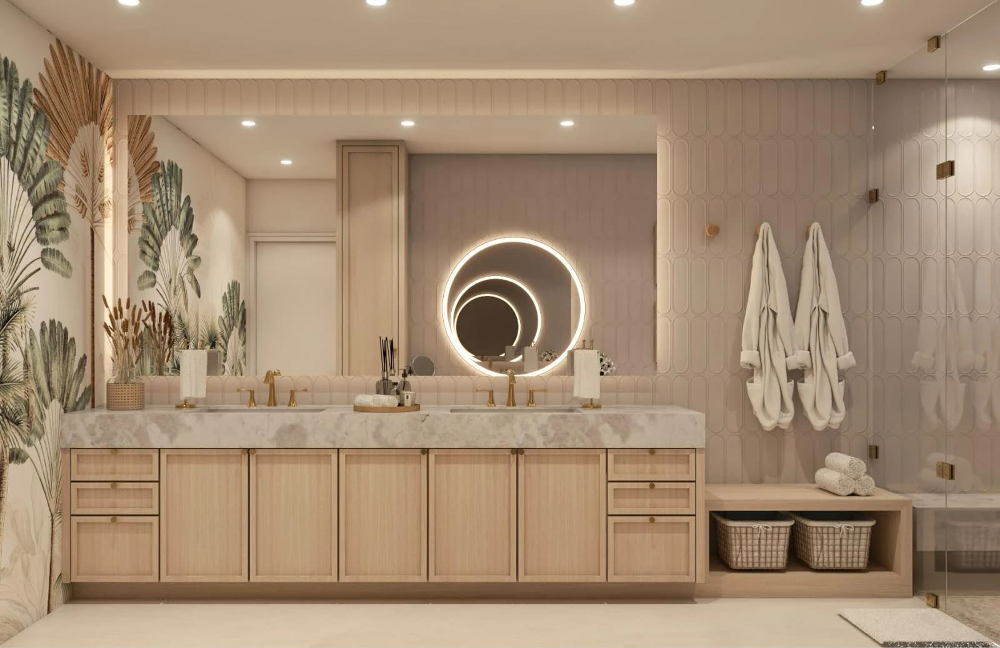
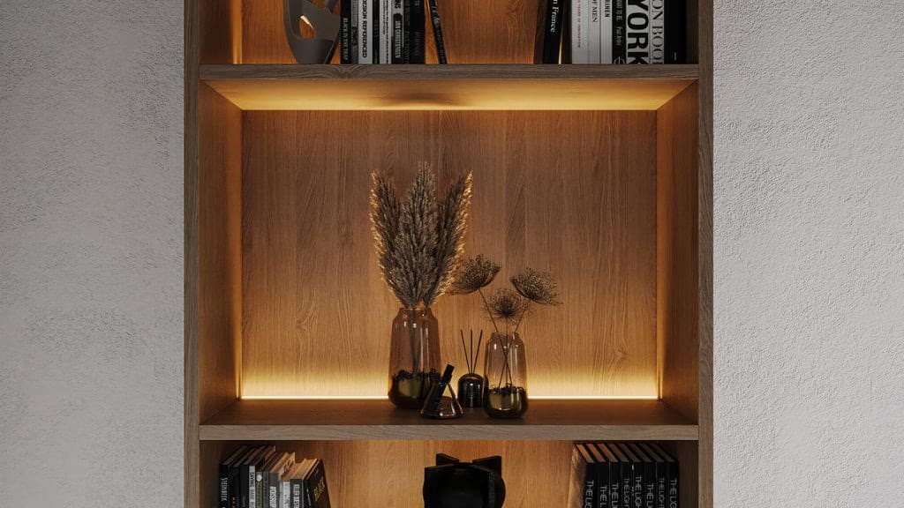

Custom Millwork in Miami Interior Design: Built-In Solutions That Elevate High-End Projects.

by Paula Ambrosio

@paulaambrosio_

Jan 29, 2026

-

4 min read

Custom Millwork in Miami: The Built-In Element That Elevates Interior Design to High-End

In interior design, there is a clear turning point between a beautiful project and a truly high-end one. That turning point is millwork.

Custom millwork is not decoration. It is architecture, functionality and identity combined into one exclusive solution. In markets like Miami, Brickell, Miami Beach and Sunny Isles, millwork is one of the most powerful tools to elevate residential, hospitality and restaurant interiors.

Millwork is where design becomes intentional and personal.

## Why Millwork Changes the Game in Interior Design

Millwork is built-in by nature. It is designed specifically for one space, one client and one lifestyle. Unlike loose furniture, it belongs to the architecture of the project.

In luxury residences in Coral Gables, Surfside and Bal Harbour, millwork defines walls, ceilings, transitions and storage. In hotels and restaurants across Downtown Miami, Brickell and Boca Raton, it shapes the guest experience and reinforces brand identity.

When millwork is added to a project, the space stops feeling generic and starts feeling designed.

## Built-In, Custom and Exclusive by Definition

True millwork is never standard. It is always custom.

Each project requires a deep understanding of proportions, circulation, materials and use. A millwork solution for a private residence in Parkland is completely different from a boutique hotel in Miami Beach or a restaurant in West Palm Beach.

That is why millwork is considered an exclusive service. It is designed, detailed and executed specifically for each client. No two projects are the same.

This level of customization is what defines high-end interior design today.

## Panels, Textures and Architectural Impact

Panels are one of the most expressive millwork elements. Wood panels add depth, rhythm and texture to spaces that would otherwise feel flat.

Vertical panels can increase the perception of height. Horizontal compositions can expand a space visually. Fluted or textured panels introduce movement and softness. Flat panels bring calm and elegance.

In Miami interiors, panels are often used to balance glass, stone and metal. In hospitality projects, they guide guests and define zones. In restaurants, they enhance acoustics and atmosphere.

Millwork panels are never just visual. They are functional and architectural.

## Color and Material Choices in Millwork

Color and texture play a major role in millwork design. Natural wood tones bring warmth and timelessness. Neutral finishes allow millwork to blend seamlessly into the space. Darker tones can add drama and sophistication when used intentionally.

In Brickell and Downtown Miami, lighter woods often complement modern, urban architecture. In Coral Gables, Boca Raton and Parkland, warmer and richer tones can feel more residential and inviting.

The key is balance. Millwork should enhance the space, not dominate it.

## Millwork in Residences, Hotels and Restaurants

In residential projects, millwork creates organization, flow and comfort. Custom closets, kitchens, media walls and built-ins improve daily life and elevate the home experience.

In hotels, millwork defines lobbies, guest rooms, corridors and common areas. It reinforces the concept and supports durability and function.

In restaurants, millwork shapes ambiance, seating zones, bars and acoustics. It is essential for creating a memorable dining experience.

Across all typologies, millwork is what makes a project feel cohesive and intentional.

## Why Millwork Defines High-End Interior Design in Miami

In competitive design markets like Miami, Sunny Isles and Miami Beach, millwork is a clear signal of quality, planning and craftsmanship.

It shows that the project was not assembled, but designed from the inside out. For clients, developers and investors, this translates into perceived value, exclusivity and longevity.

Millwork is not an upgrade. It is a strategy.

## Final Thought

Millwork is where interior design becomes architecture. It is exclusive, built-in and deeply personal.

When millwork is designed with intention, it transforms spaces and elevates projects to a true high-end level.

That is what changes the game in interior design.

Paula Ambrosio.

## 

