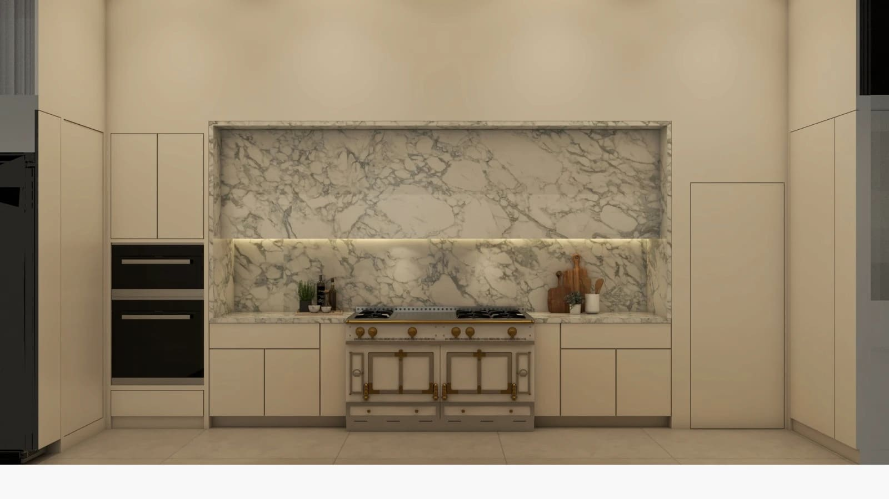
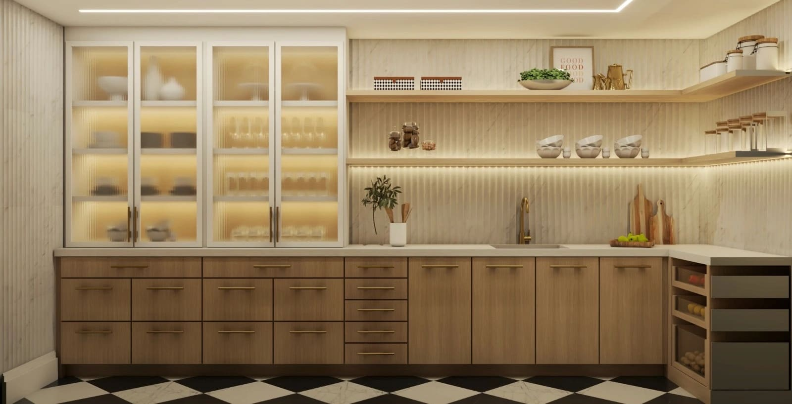
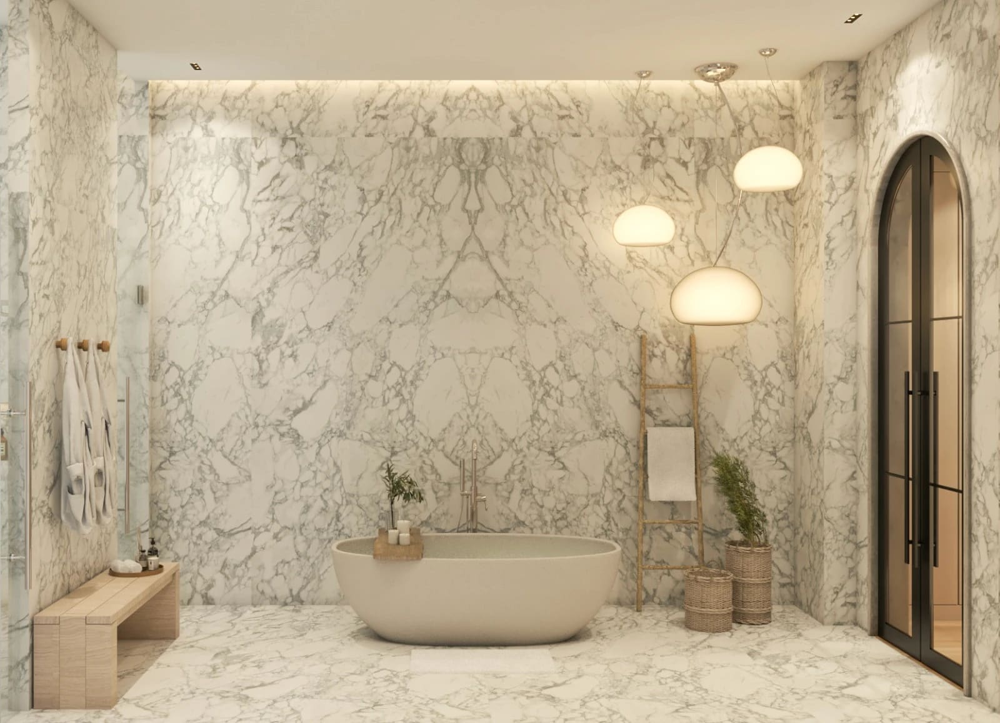
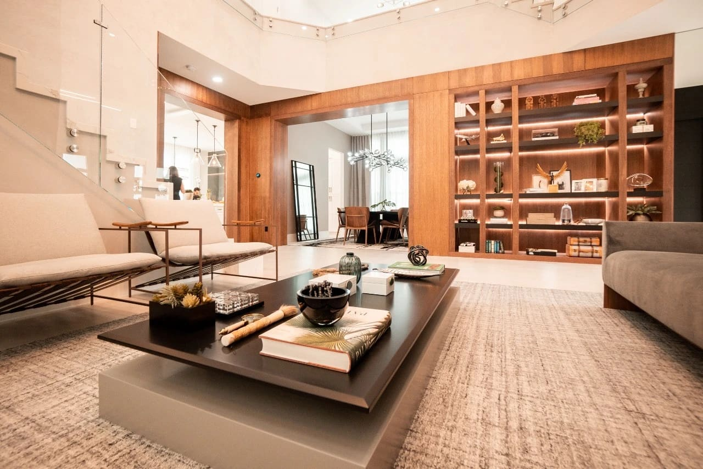
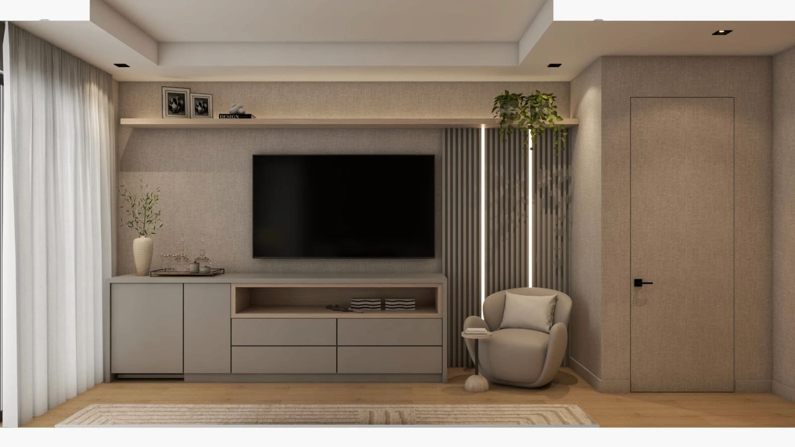
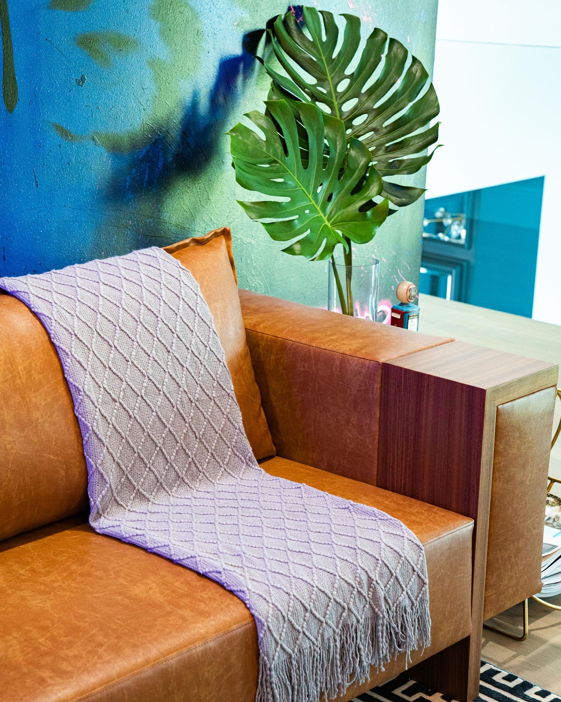
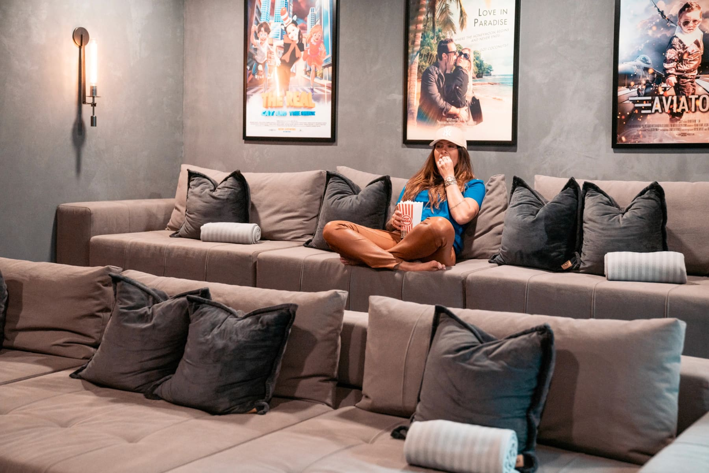

Design Decisions That Immediately Increase Property Value in Miami.

by Paula Ambrosio

@paulaambrosio_

Feb 23, 2026

-

2 min read

Design Decisions That Immediately Increase Property Value in Miami

In today’s competitive real estate market in Miami, design is no longer cosmetic. It is financial.

Across Brickell, Miami Beach, Sunny Isles Beach, Coral Gables, Bal Harbour and Boca Raton, buyers are sophisticated. They understand quality. They respond emotionally to spaces that feel intentional.

The right design decisions can increase perceived value instantly and significantly reduce time on market.

Here are the design moves that consistently increase property value.

## 1. Invest in Kitchen Design First

Kitchens sell homes.

A kitchen with cohesive materials, timeless cabinetry, layered lighting and a strong focal point island immediately communicates value. Buyers look at the kitchen as the heart of the home.

In Brickell high-rises, sleek modern kitchens with clean millwork and hidden appliances perform best. In Coral Gables and Boca Raton, warmer tones and layered natural materials often resonate more with family buyers.

The key is clarity. A kitchen must feel finished, not improvised.

## 2. Transform Bathrooms into Spa Spaces

Bathrooms are emotional selling points.

Replacing outdated tubs with large walk-in showers, integrating natural stone with matte finishes and adding soft lighting creates a spa-like atmosphere. Buyers associate wellness with luxury.

In Miami Beach and Sunny Isles, where lifestyle matters, spa-inspired bathrooms create immediate impact.

Wellness sells faster than square footage.

## 3. Add Custom Millwork

Custom millwork enhances architecture instantly.

Built-ins, paneling, media walls and tailored storage make a space feel designed rather than furnished. In luxury markets like Bal Harbour and Coral Gables, millwork signals craftsmanship and planning.

Loose furniture can be replaced. Millwork feels permanent and intentional.

That permanence increases perceived value.

## 4. Layer Lighting Strategically

Lighting changes everything.

Layered lighting creates depth and emotion. Recessed lighting alone is never enough. Add indirect LED, wall sconces and accent lighting to highlight texture and art.

In Downtown Miami and Brickell condos, lighting is one of the fastest ways to modernize and enhance a property without structural changes.

Buyers respond subconsciously to atmosphere.

## 5. Choose Timeless Flooring

Flooring is the foundation of value.

Matte porcelain, honed natural stone and warm wood floors create calm and sophistication. Glossy finishes and trend-driven patterns can reduce perceived luxury.

In Sunny Isles and Miami Beach, light natural tones perform best. In Boca Raton and Parkland, slightly warmer woods feel more residential and welcoming.

Timeless floors protect long-term value.

## 6. Create Cohesive Material Stories

Random finishes reduce value.

When materials flow seamlessly from room to room, the home feels larger and more curated. Cohesion communicates planning.

In Miami’s luxury market, buyers expect intentional transitions. Stone, wood, lighting and color palettes must speak the same language.

Consistency creates confidence.

## 7. Design for the Right Buyer Profile

Design should reflect the location and target audience.

A Brickell condo should feel urban and efficient. A Coral Gables home should feel layered and architectural. A Sunny Isles residence should embrace natural light and calm coastal tones.

Understanding lifestyle is essential to maximizing resale potential.

Design aligned with context sells faster.

## Final Thought

Interior design is one of the few investments that increases both emotional and financial value.

In Miami’s competitive real estate landscape, properties that feel complete, calm and intentional stand out immediately.

Design does not just make a home beautiful. It makes it desirable.

And desirable homes sell faster.

Paula Ambrosio.

Follow me : @paulaambrosio_

### 

