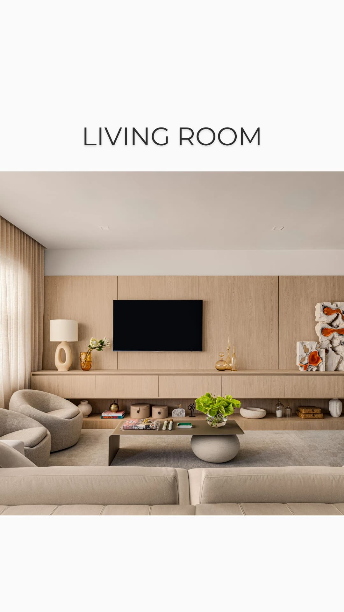
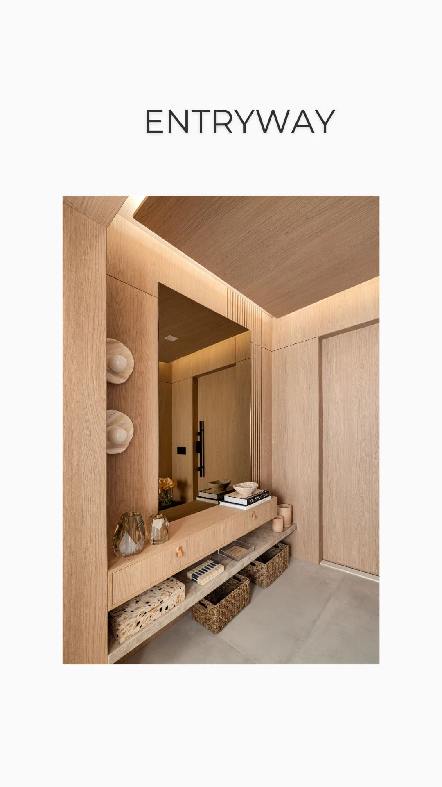
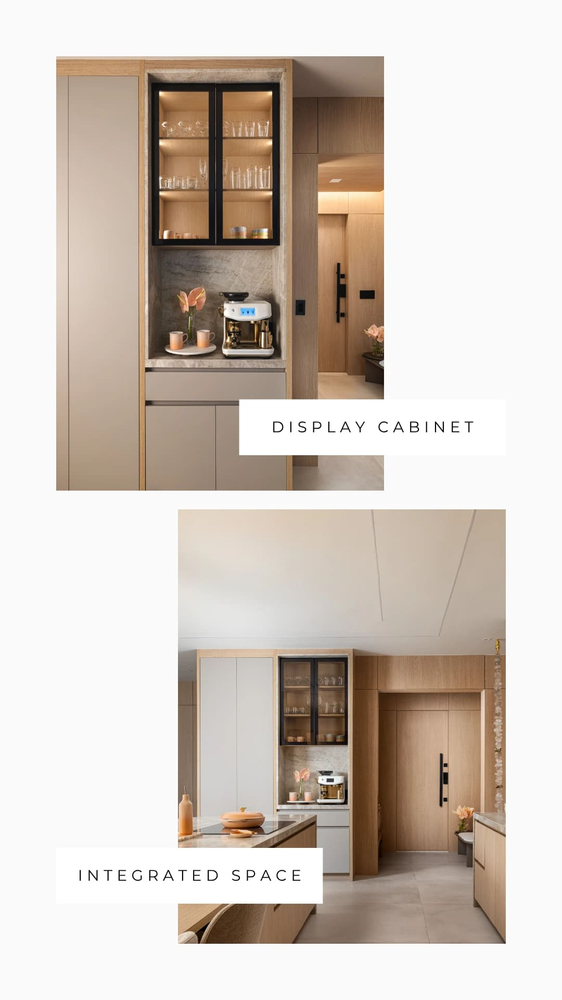
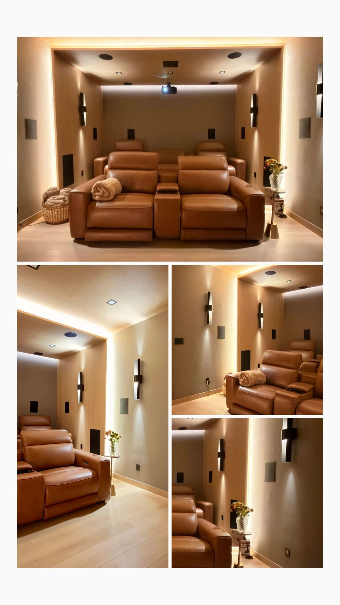

: A Guide for International Buyers and Investors

A client of ours bought a beautiful apartment in Aventura. Water on two sides, eleven foot ceilings, the kind of light you only get in Florida in January. She lives in São Paulo. She closed on a Tuesday and flew down that same weekend to start furnishing it.

She spent four days in showrooms. She flew home with a folder of quotes, three fabric samples, and nothing ordered, because she could not decide anything alone in a country whose delivery timelines, building rules and vendors she did not know. Six months later the apartment still had a mattress on the floor and two folding chairs.

That is not a story about a disorganized client. She runs a company. It is a story about a process that does not work when you live somewhere else.

There is a better way to do this, and it is the reason most of our clients never set foot in a furniture store during their entire project.

## The Real Cost of Furnishing a Home Yourself From Another Country

When you own property in Miami but live in Bogotá, Mexico City, Milan or São Paulo, your time in the city is the scarcest thing you have. Most international owners visit two or three times a year, for a week at a time.

Furnishing a home on your own means spending that week doing this:

Driving to Design District showrooms that close at six. Waiting on quotes that arrive after you have already flown home. Discovering that the sofa you loved has a fourteen week lead time. Learning that your building requires a certificate of insurance from every vendor and a reserved elevator window booked three weeks in advance. Finding out the rug is the wrong scale only after it has been delivered and the return window has closed.

Then repeating the whole thing on your next visit.

The apartment is not the problem. The distance is not really the problem either. The problem is that furnishing a home properly requires being physically present, repeatedly, for months. That is not something a person with a life in another country can give.

So the work has to be handed to someone who is already here.

## What Turnkey Interior Design Actually Means

The phrase gets used loosely, so it is worth being precise.

Turnkey means you approve a design, and later you receive keys to a finished home. Not a partly furnished home. Not a home waiting on three deliveries. Finished.

That includes the furniture, the lighting, the rugs, the window treatments, the art on the walls, the bed made with real bedding, towels in the bathroom, glassware in the cabinet, a lamp on the nightstand that actually turns on.

You walk in with a suitcase and you live there that night.

What it does not mean: a generic package pulled off a shelf. Every home we deliver is designed around the specific people who will use it, the specific architecture of the unit, and the specific light that comes through those specific windows at four in the afternoon.

## How the Remote Process Works, Step by Step

The whole system is built on one principle: you make decisions, we handle execution. Nothing gets ordered until you have seen it and said yes.

### 1. A conversation, not a questionnaire

We start with a video call. How do you actually use this home? Is it a family base, a winter escape, a rental, a place your adult children will use? Do you cook? Do you host twelve people for dinner or two people for wine? Do you want to feel like you are at the beach, or do you want to forget the beach exists the moment you walk inside?

This call shapes more of the final result than any style label ever could.

### 2. We visit the property so you do not have to

We walk the unit, measure everything, photograph it, check the light at different hours, and note every practical constraint: outlet locations, ceiling heights, door widths, the awkward column nobody mentions in the listing, what the building will and will not allow.

You get that walkthrough as a video, so you see your own home through our eyes before we design a thing.

### 3. You see the home before it exists

We present floor plans, renderings, a material and color palette, and real furniture selections with real photographs. Not vague inspiration images. The actual pieces.

Everything is presented remotely, on a call, in your language. You ask questions, you push back, we adjust. Nothing is purchased until the full vision is approved.

### 4. We execute the entire thing

This is the invisible part, and it is where twenty years of relationships in South Florida matter most.

Procurement across dozens of vendors. Freight coordination. A receiving warehouse where every piece is unboxed and inspected for damage before it ever reaches your building, because a scratched credenza discovered on installation day is a four week problem. Insurance certificates for every trade. Elevator reservations. HOA and building management approvals. Delivery scheduling. Assembly. Installation crews.

You hear from us with progress updates. You do not hear from us about problems, because solving them without involving you is the job.

### 5. Installation and styling

The final phase happens over a few days. Furniture placed, art hung, beds dressed, kitchen and bath stocked, everything cleaned and styled.

Then we send you photographs of your finished home, and you plan your flight.

## The Part Almost Nobody Warns You About: Timing

Furniture in the United States does not work the way people expect. Some pieces ship in two weeks. Others take four to six months, especially imported upholstery, custom case goods and made to order dining tables.

This is the single biggest reason self managed projects stall. An owner orders room by room as they decide, and the last decision made becomes the last delivery received, which means the home is not usable for the better part of a year.

We work backward from your arrival date. Long lead items are identified and ordered first, in the very first wave, before anything else. Faster items are timed to land in the same window. The schedule is designed so that everything converges, rather than trickling in over nine months.

Most fully furnished residences we deliver are completed in roughly forty days from design approval. That is not a marketing number. It is what happens when sequencing is done properly by people who already know every lead time in the market.

## For Investors and Rental Owners

If the property is an investment rather than a residence, the brief changes completely, and it should.

A home designed for a family and a home designed to generate income are two different disciplines. Income properties need durability that survives constant turnover, a look that photographs exceptionally well because listing photos are the entire sales pitch, and a level of comfort that produces five star reviews rather than complaints about the mattress.

For investors buying multiple units, we build tiered furniture packages that hold one consistent aesthetic standard while remaining repeatable and predictable to install across a building. Developers use the same approach for model residences and furnished delivery programs.

The design question for an investment property is never only "is this beautiful". It is "does this earn".

## Why Language Matters More Than People Think

We work in Portuguese, English and Spanish, and this is not a line on a website for us.

When you are making significant decisions about a property in another country, being able to say exactly what you mean, in your own language, to the person actually running your project, changes the entire experience. Nuance survives. Concerns get raised early instead of being softened into politeness. Nothing important gets lost in a translation layer.

Our clients in Brazil, Colombia, Mexico, Argentina and Europe are not passed to an assistant. They talk to us.

## Four Mistakes We See International Buyers Make

Buying furniture on visits, piece by piece.** Individually attractive pieces rarely assemble into a coherent room. Scale, proportion and palette have to be planned together from the beginning.

Underestimating building rules.** Miami condo associations have real requirements around insurance, delivery hours, service elevators and contractor approval. Learning them mid project costs weeks.

Shipping furniture from home.** Buyers often plan to send pieces from their country of origin. Once freight, customs, delays and the risk of damage are accounted for, it very rarely makes sense, and the scale is frequently wrong for the space.

Leaving the styling for later.** A furnished apartment without lamps, art, textiles and the small final layer does not feel like a home. It feels like a showroom that closed. That last ten percent is what creates the feeling people are actually paying for.

## Frequently Asked Questions

Can you design and furnish my Miami home if I never visit during the project?** Yes. This is the majority of our international work. Everything is presented and approved remotely, and we manage execution on the ground in South Florida.

How long does a fully furnished turnkey project take?** Most residences are delivered in approximately forty days from design approval, depending on scope and furniture lead times. Projects involving renovation require a longer schedule, which we map out before starting.

What languages do you work in?** Portuguese, English and Spanish, directly with you.

Which areas do you serve?** Miami, Miami Beach, Coral Gables, Coconut Grove, Key Biscayne, Surfside, Bal Harbour, Bay Harbor Islands, Sunny Isles Beach, Aventura, Hallandale Beach, Hollywood, Fort Lauderdale, Delray Beach and Boca Raton.

Do you handle building approvals and delivery logistics?** Yes. Insurance certificates, HOA and management approvals, elevator scheduling, receiving, inspection and installation are all handled by our team.

Do you work with investors and short term rental properties?** Yes, including tiered furniture packages for multiple units and design specifically planned for rental performance.

## Arrive to a Home That Is Already Yours

The best version of owning property in another country is simple: you land, you open the door, and everything is exactly as it should be. No boxes. No missing pieces. No week of your life spent in a warehouse in Doral.

That is the entire point of how we work.

Book your complimentary consultation →**

Paula Ambrósio Interior Design. Miami, Florida. Serving South Florida and international clients in English, Portuguese and Spanish.

Photos by: Gabriel Matarazo

