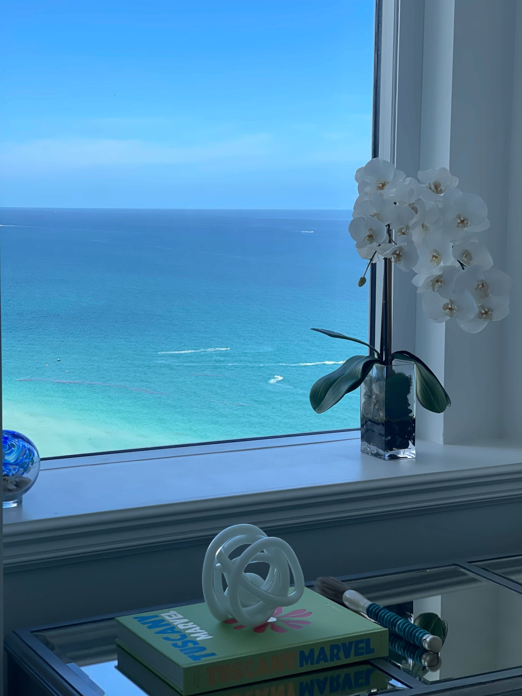
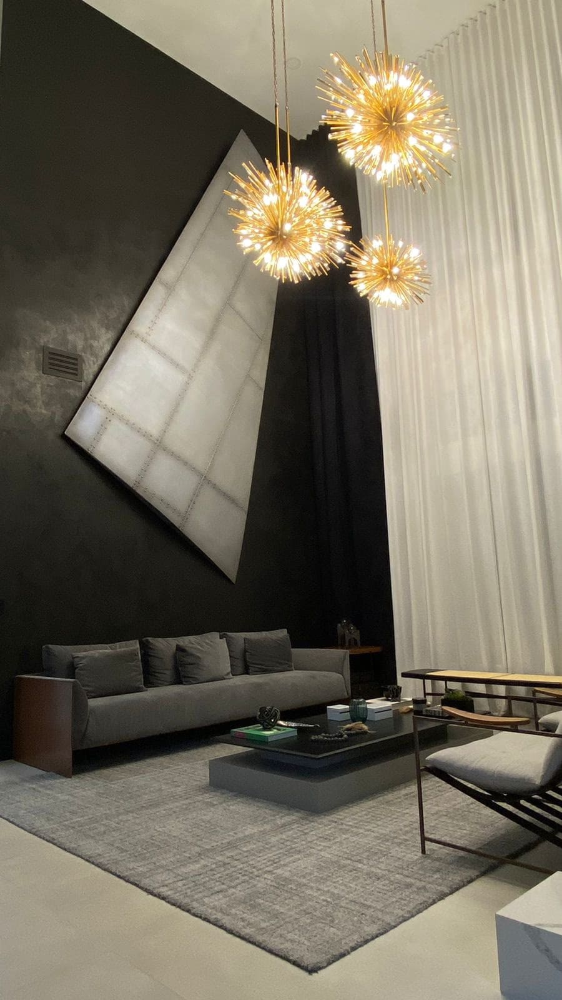
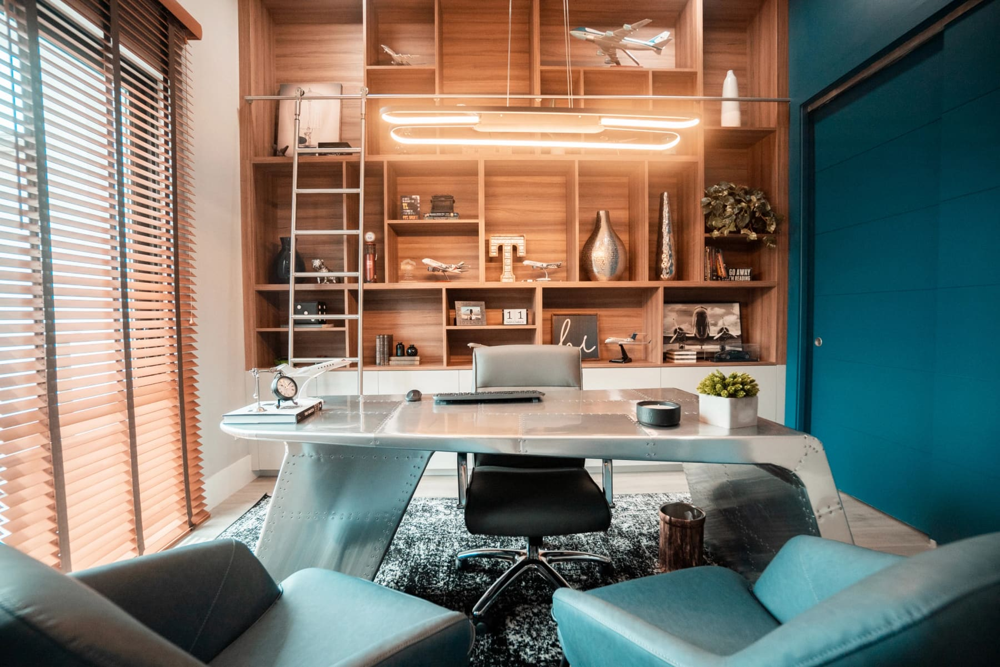
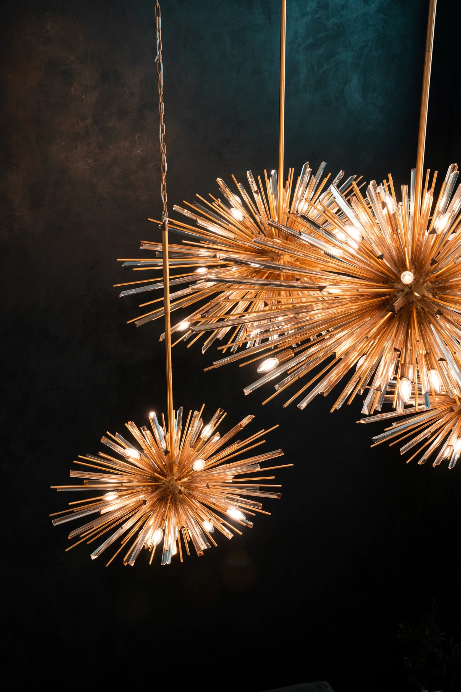
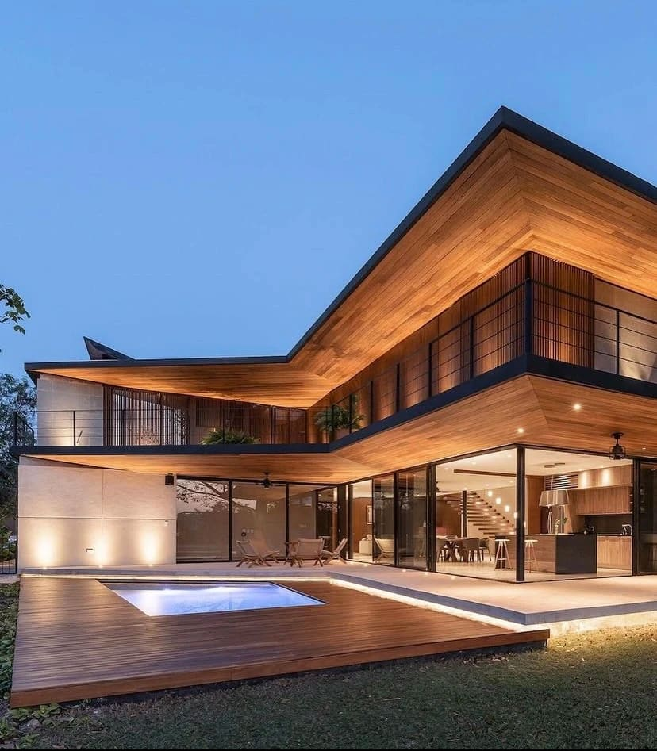

Why High-End Interior Design Is an Investment, Not a Cost in Miami.

by Paula Ambrosio

@paulaambrosio_

Mar 23, 2026

-

2 min read

Why High-End Interior Design Is an Investment, Not a Cost in Miami**

When people think about interior design, many still see it as an expense.

But in reality, especially in markets like Miami, Brickell, Miami Beach, Sunny Isles, Bal Harbour, Coral Gables and Boca Raton, high-end interior design is one of the most strategic investments you can make.

Design is not about decoration.

It is about value, experience and long-term return.

Design Increases Property Value Immediately**

A well-designed home is perceived differently from the first moment.

Buyers don’t analyze every detail logically. They feel the space. They respond to light, materials, flow and atmosphere.

In competitive areas like Brickell and Miami Beach, a property with thoughtful interior design can stand out instantly and command stronger offers.

Design enhances perception.

Perception drives value.

Faster Sales, Stronger Returns**

Properties with intentional interior design sell faster and more efficiently.

In markets like Sunny Isles Beach and Bal Harbour, where buyers are international and visually driven, first impressions happen online.

A well-designed home photographs beautifully, creates emotional connection and reduces time on market.

Time saved is money preserved.

Avoiding Costly Mistakes**

One of the biggest hidden costs in any project is rework.

Wrong materials, poor lighting decisions, incorrect layouts or trend-driven choices can lead to expensive corrections. These are mistakes that often happen when design is not guided professionally.

An experienced interior designer prevents these issues before they happen.

Design is not an added cost.

It is cost control.

Strategic Material Selection**

High-end design is built on materials.

Natural stone, custom millwork, layered lighting and timeless finishes create durability and elegance. These materials age well and maintain value over time.

In Coral Gables and Boca Raton, where homes are long-term investments, material selection plays a critical role in how a property performs years later.

Cheap choices cost more in the long run.

Lifestyle Value: The Experience of Living**

Beyond financial return, interior design transforms daily life.

A well-designed home supports routines, creates calm and enhances comfort. Lighting adapts to the day. Spaces flow naturally. Materials feel right.

In Miami, where lifestyle is everything, this experience becomes part of the home’s value.

Luxury today is not excess.

It is how a space makes you feel.

Design as a Competitive Advantage**

In a saturated market, differentiation is everything.

A property without design blends in. A property with design stands out.

In areas like Brickell, Miami Beach and Sunny Isles, where buyers have many options, interior design becomes the deciding factor.

Design is not just about beauty.

It is about positioning.

Working With a Professional Changes Everything**

Hiring an interior designer brings clarity, structure and vision.

From concept to execution, every decision becomes intentional. Materials align. Lighting is layered. Spaces feel complete.

The result is a home that performs both emotionally and financially.

This is where design becomes investment.

Final Thought**

High-end interior design is not about spending more.

It is about investing smarter.

In Miami’s luxury market, design protects value, enhances lifestyle and accelerates results.

The question is no longer can you afford to hire a designer?

The real question is can you afford not to?

