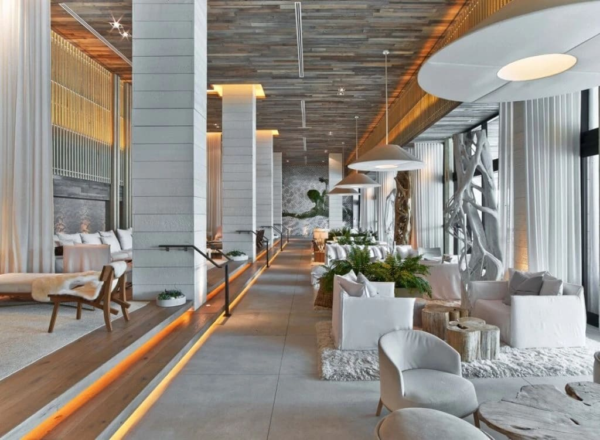
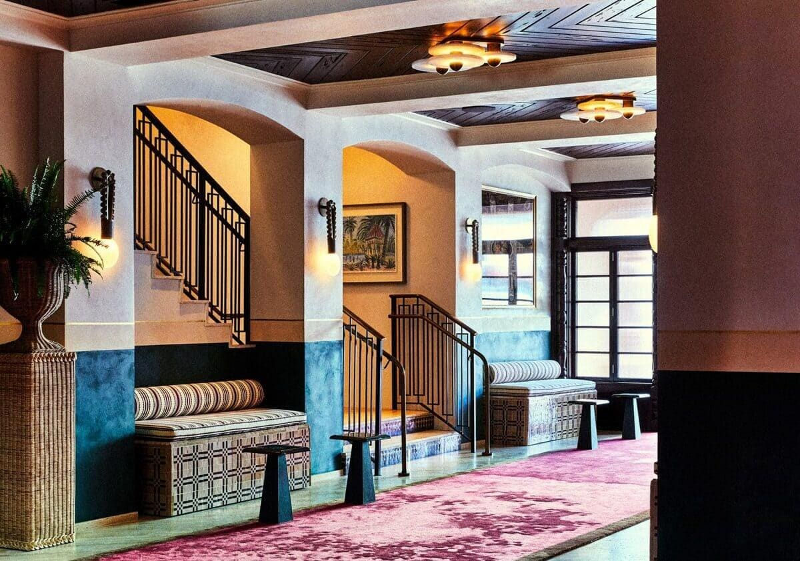
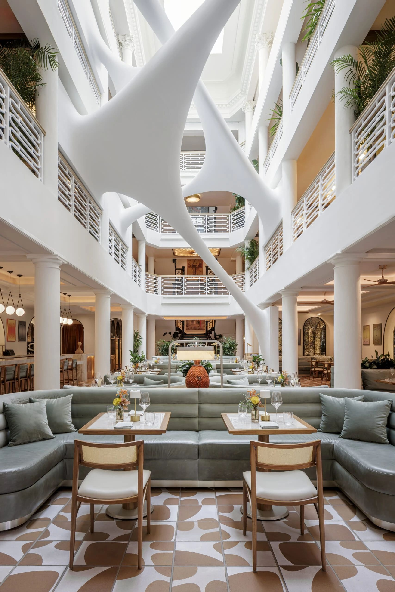

Hotel Interior Design in Miami: Materials, Design Layers and the Art of Creating Experiences

Interior design for hotels in Miami goes far beyond aesthetics. In a city driven by tourism, lifestyle and global culture, hotel design is about experience, emotion and memory. Guests do not come only to sleep. They come to feel, to disconnect, to be inspired.

Designing hotels in Miami and surrounding cities such as Brickell, Sunny Isles Beach, Coral Gables and Boca Raton requires a deep understanding of lifestyle, climate, cultural diversity and guest behavior.

Hospitality interior design is not about personal taste. It is about strategy.

## Why Hotel Interior Design Is About Experience First

When guests choose a hotel in Miami, they are choosing an atmosphere. They are choosing how they want to feel during their stay. Relaxed. Energized. Sophisticated. Inspired.

A successful hotel interior designer understands that every space must tell the same story, from the lobby to the rooms, from the restaurant to the corridors. Design becomes a silent host, guiding guests through the experience without words.

In competitive markets like Miami Beach, Brickell and Sunny Isles, experience-driven design is what differentiates one hotel from another.

## Material Selection in Hotel Interior Design

Material selection is one of the most critical decisions in hospitality projects. In hotel design, materials must balance beauty, durability and maintenance.

In Miami hotels, designers often work with natural stone, wood, textured wall finishes, performance fabrics and architectural metals. These materials respond well to the climate while maintaining a sense of luxury.

A professional interior designer selects materials not only for visual impact, but for longevity and guest comfort. Materials must age well, resist high traffic and still feel refined years after opening.

This is where expertise truly matters.

## The Design Layers That Shape Hotel Interiors

Hotel interiors are built in layers, and each layer contributes to the overall guest experience.

The architectural layer defines flow and first impressions. Lobbies, reception areas and circulation spaces must feel intuitive and welcoming. In urban areas like Brickell, this layer often feels sleek and modern. In Coral Gables or Boca Raton, it may reference architectural heritage and classic proportions.

The furniture layer balances comfort with durability. Every piece must support long-term use while reinforcing the hotel’s identity. Scale and layout are essential to create comfort without overcrowding.

Lighting is one of the most powerful layers in hotel design. It sets mood, enhances materials and transforms spaces throughout the day. From dramatic lobby lighting to warm, calming light in guest rooms, lighting defines emotion.

Walls, textures and finishes add depth. Wall coverings, paneling and custom details prevent spaces from feeling flat. Finally, art and styling bring personality and brand identity, creating moments guests remember and photograph.

## Designing Hotels for Different Miami Lifestyles

Each area of Miami tells a different story, and hotel design must reflect that.

Hotels in Sunny Isles often embrace a resort-inspired lifestyle, with light palettes, ocean influenced textures and a sense of relaxation. Brickell hotels lean toward an urban, international aesthetic, reflecting the fast-paced metropolitan lifestyle. Coral Gables hospitality design respects architectural tradition while introducing contemporary layers. Boca Raton hotels often reflect refined, timeless luxury with a residential feel.

Understanding these nuances is essential for successful hotel interior design in South Florida.

## Functionality Behind the Beauty

Hotel interiors must be beautiful, but they must also function flawlessly. Back of house circulation, staff flow, storage, acoustics and safety are integral to the design process.

A hospitality interior designer works closely with operators, architects and developers to ensure that design supports daily operations. Good design improves efficiency, guest satisfaction and long-term profitability.

## Why Interior Design Is a Strategic Investment for Hotels in Miami

In a city as competitive as Miami, interior design directly impacts occupancy rates, guest reviews and brand recognition. Well-designed hotels attract attention, generate organic marketing through social media and encourage repeat stays.

Interior design is not an expense. It is a strategic investment.

Hotels that invest in thoughtful, layered design stand out in Miami’s hospitality market.

## Final Thought

Hotel interior design is about creating places guests remember long after they leave. Through careful material selection, layered design and a deep understanding of lifestyle and culture, hotels become experiences rather than just destinations.

That is the essence of hospitality interior design in Miami.

Paula Ambrosio.

