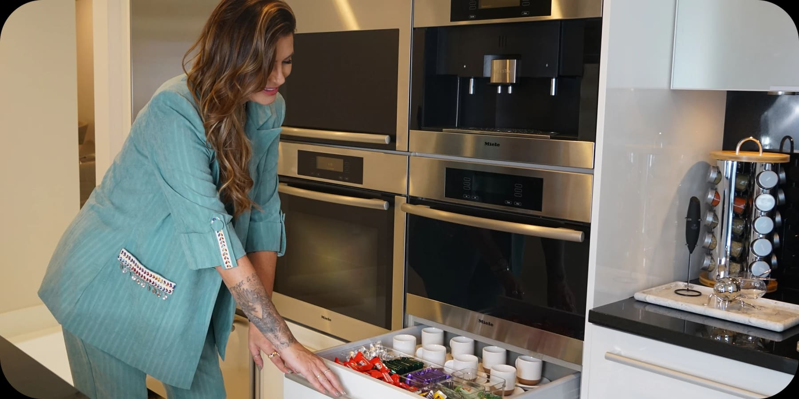
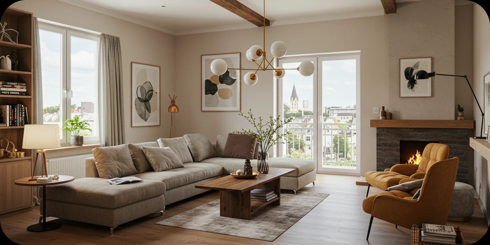
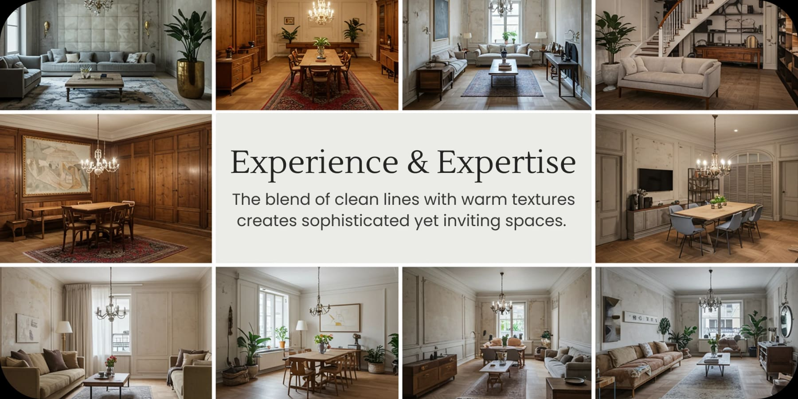

Hiring an interior designer is a crucial step in transforming your space and increasing your property’s value. However, the wrong choice can lead to wasted time, money, and frustration. What factors should you consider before trusting a professional with your project?

### What to Look for When Choosing an Interior Designer

### Portfolio & Style:

Every designer has a unique approach. Review their portfolio to see if their past projects align with your vision and expectations.

### Recommendations & Reviews

Research client reviews and ask for references. A reputable designer will have positive testimonials and success stories to share.

### Work Process & Communication

Understand how the designer manages projects, from concept to completion. Do they provide 3D visualizations to preview your project? How do they handle unexpected challenges?

### Budget & Transparency

Request a detailed estimate and assess the cost-benefit ratio. A great designer knows how to balance quality and budget without compromising the final result.

### Common Mistakes When Choosing an Interior Designer

🚨 Focusing Only on the Lowest Price: Cheap can be costly! Experienced designers bring long-term value and high ROI.

🚨 Not Checking Past Work: A designer may make big promises, but only a solid portfolio proves their skills.

🚨 Failing to Align Expectations Before Signing: Clarify timelines, style, and budget upfront to avoid unexpected surprises.

### Why Hiring a Professional Interior Designer Is Worth It

📈 Increases Property Value: Well-designed spaces boost market value and attract buyers and renters faster.

💡 Maximizes Space & Functionality: Professionals create smart solutions to make your home both stylish and practical.

🎨 High-End Finishes & Timeless Design: From concept to material selection, every detail is carefully curated for sophistication and durability.

🚀 Want to ensure a flawless project? Contact us today and discover how we can transform your space with strategic and elegant design!

