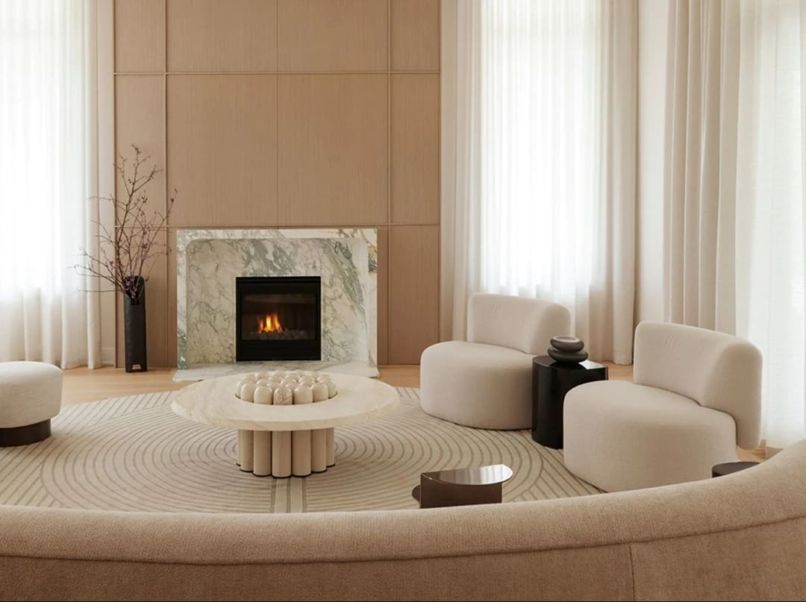
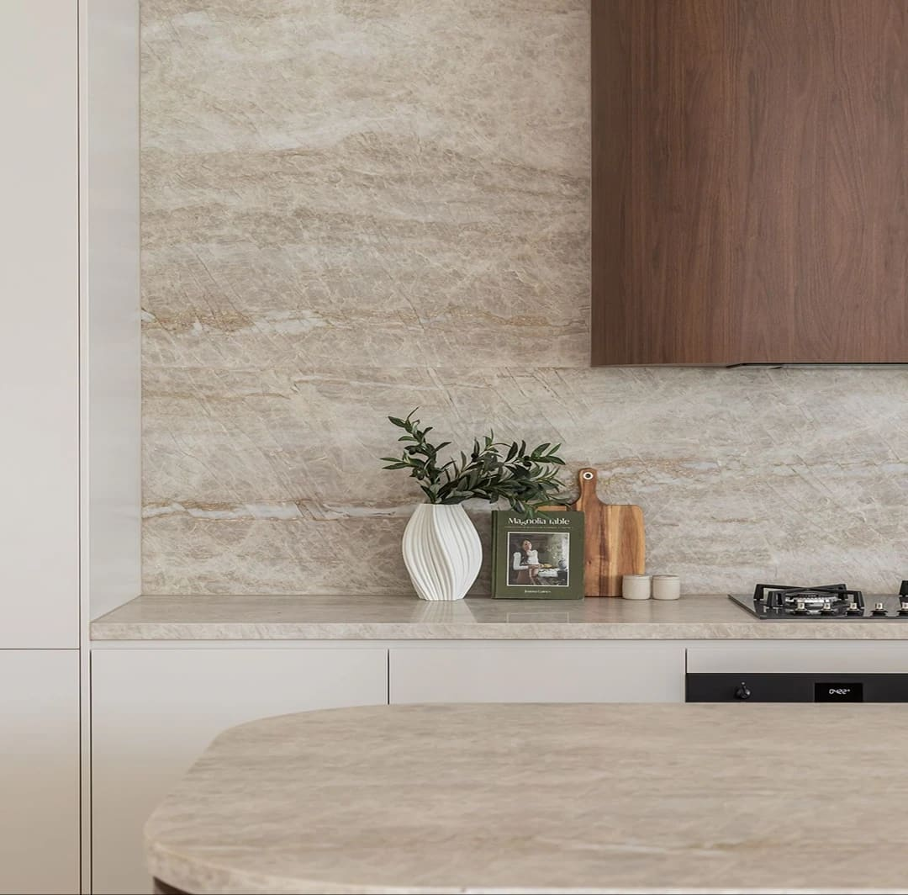
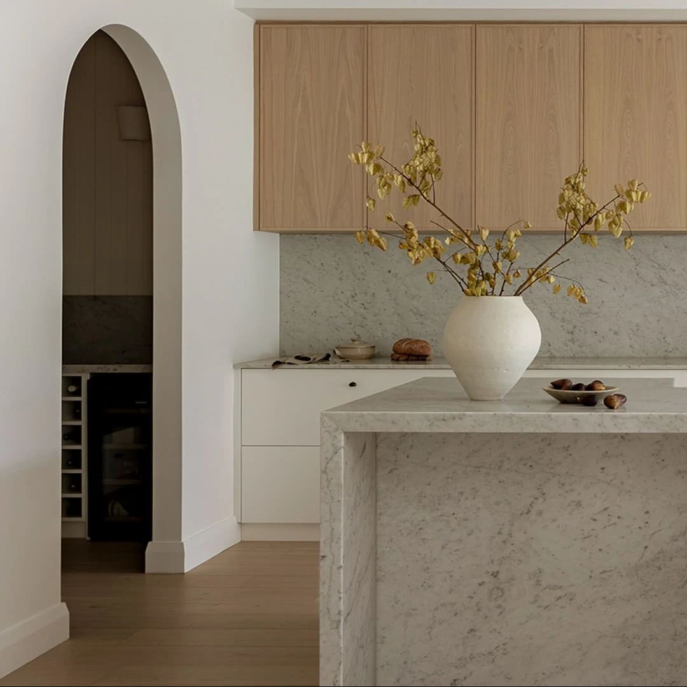
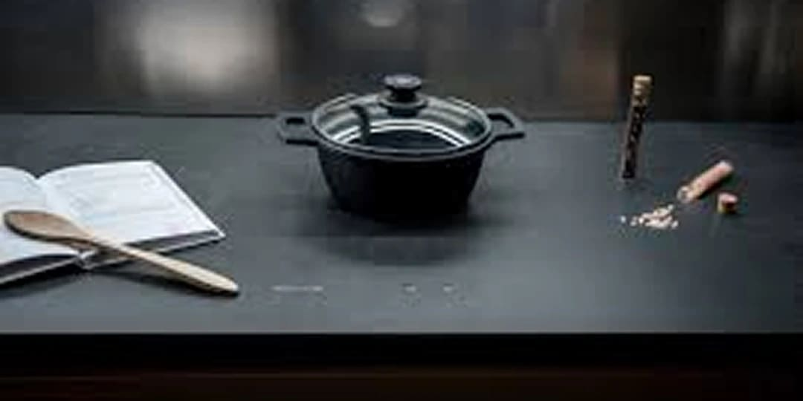
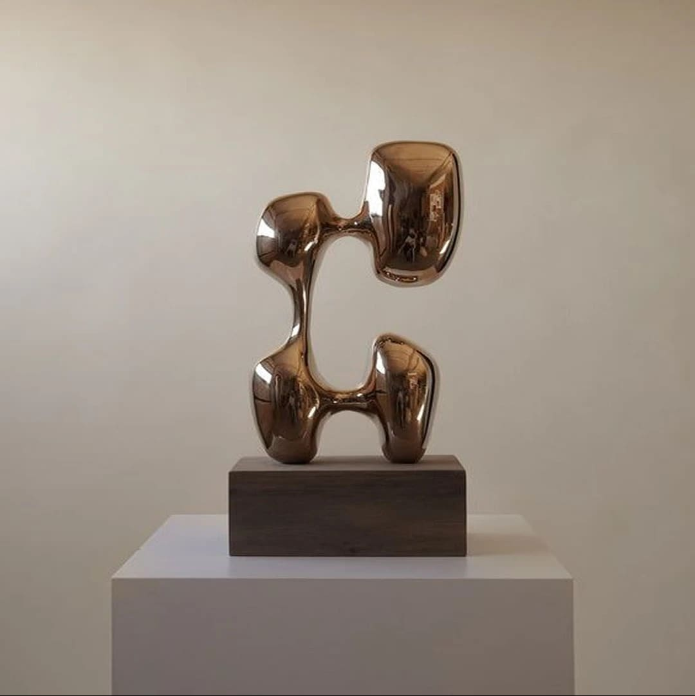
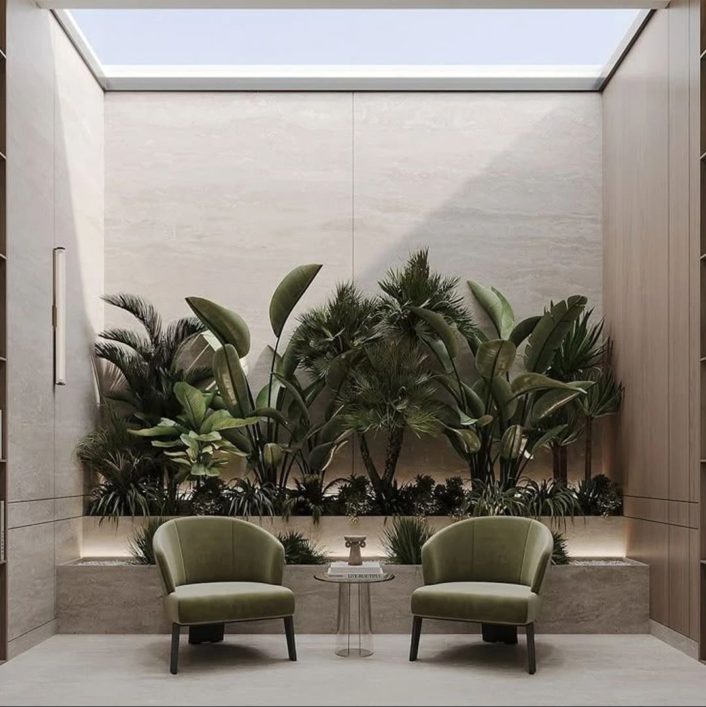
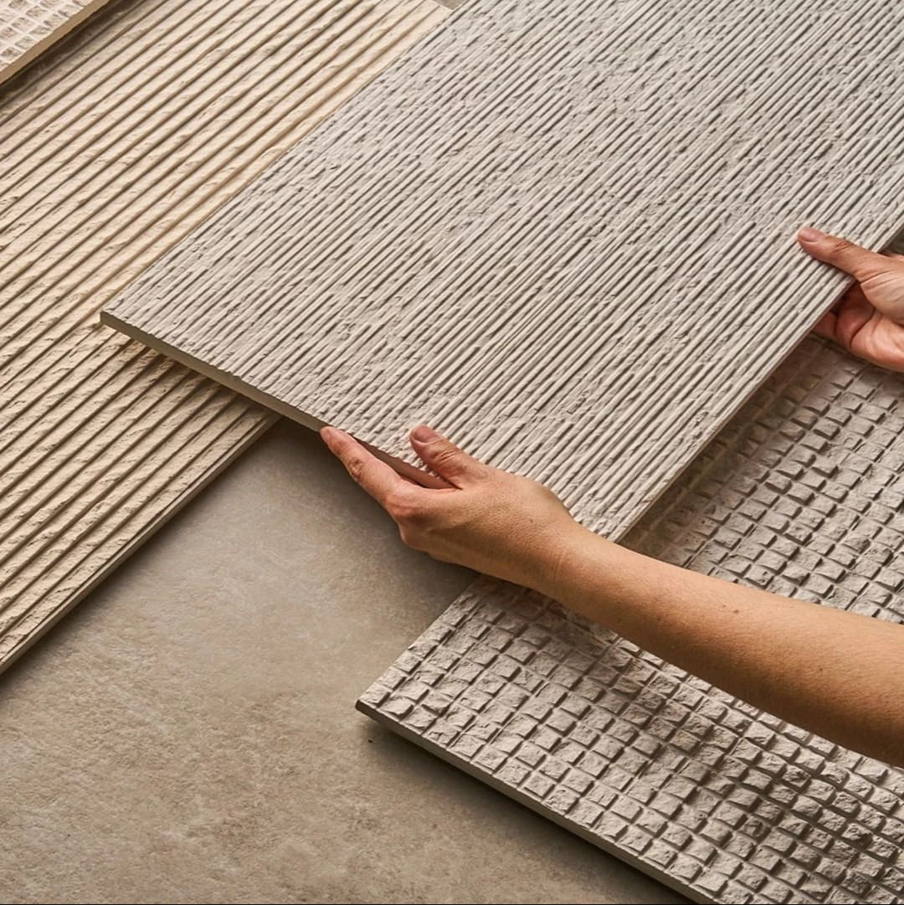
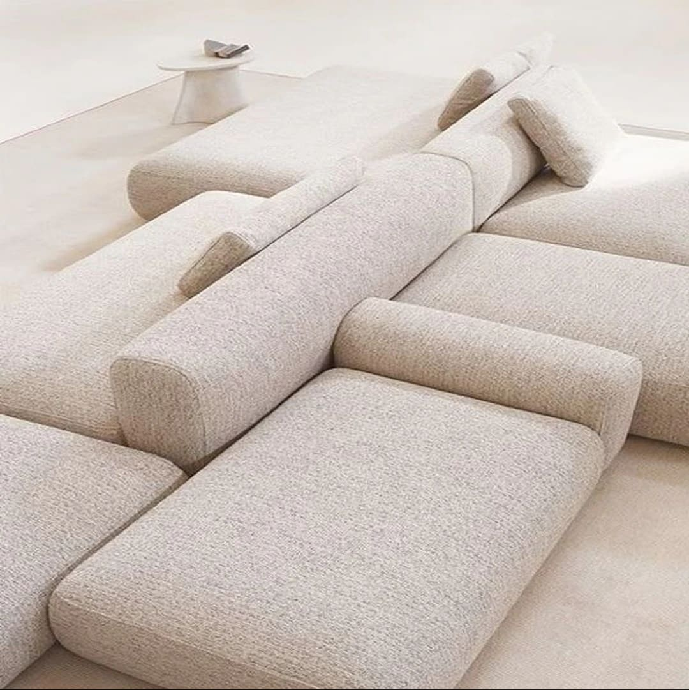

Interior Design Trends for 2026: Paula Ambrósio’s Curated Vision for Timeless Living in Miami

by Paula Ambrosio

@paulaambrosio_

Dec 17, 2025

-

4 min read

While interior designer Paula Ambrósio** is known for her refined and timeless aesthetic, staying aware of current design movements is key to creating spaces that feel fresh, relevant, and beautifully balanced.

For 2026, Paula highlights a selection of trends that enhance interiors without falling into what is purely “fashionable.” These are modern directions that blend naturally with her signature approach: elegance, harmony, and longevity.

Below, Paula shares the trends she recommends for the year ahead and how to incorporate them with intention.

## 1. Soft Minimalism & Visual Comfort**

2026 embraces a softer take on minimalism  one that prioritizes warmth, calmness, and livability. Instead of stark lines, the focus shifts to gentle curves, cozy textiles, and a palette that invites serenity. Paula often incorporates this approach to create spaces that feel uncluttered yet emotionally comforting.

## 2. Refined Natural Materials**

Natural elements continue to dominate, but in their most refined forms**. Expect to see warm woods, richly veined stones, and organic finishes that add depth and authenticity. For Paula, this trend aligns perfectly with her philosophy: materials that stand the test of time, both aesthetically and functionally.

## 3. Sophisticated Earth Tones & Modern Neutrals**

The earthy palette remains strong in 2026, but with a more polished interpretation. Think terracotta softened with beige, taupe paired with graphite, and creams that lean towards warm stone undertones. These tones bring a grounded, timeless elegance  a hallmark of Paula’s work.

## 4. Invisible Technology**

Technology plays a bigger role in design than ever before, but the trend for 2026 is all about discretion.

Hidden speakers, integrated lighting, smart climate control, and built-in systems that disappear into the architecture allow homes to feel both modern and beautifully uncluttered. Paula sees this as the perfect balance between innovation and aesthetic purity.

## 5. Sculptural Statement Pieces**

In 2026, decorative impact comes from form**, not excess. Furniture and lighting with sculptural silhouettes add an artistic presence to spaces, acting as focal points without overwhelming the room.

Paula incorporates these pieces strategically, ensuring harmony between bold design and timeless appeal.

## 6. Refined Biofilia**

Natural greenery evolves into a more sophisticated expression: curated plants, organic shapes, and materials that evoke a quiet connection to nature. Rather than filling a room with plants, Paula prefers subtle touches that enhance well-being while maintaining visual elegance.

## 7. Sensory Texture Layering**

Texture becomes a key tool in creating emotional warmth. Bouclé, linen, raw silk, stone, matte metals, and tactile wallpapers combine to form spaces that are visually rich and comforting to the touch. For Paula, layering textures is a refined way to create depth without relying on loud patterns or fleeting trends.

## 8. Intelligent Modular Furniture**

Flexibility becomes essential for modern living. Modular sofas, adaptive shelving, and multifunctional pieces make interiors more dynamic and efficient. Paula recommends this approach especially for urban homes, where space needs to adapt to different moments and lifestyles.

### Final Thoughts**

For Paula Ambrósio, true design excellence lies in the harmony between timelessness and contemporary relevance. The trends of 2026 are not about chasing novelty they are about selecting what enhances comfort, beauty, and longevity in every project.

Thoughtful choices. Refined materials. Spaces that age beautifully.** That remains the heart of Paula’s design vision.

