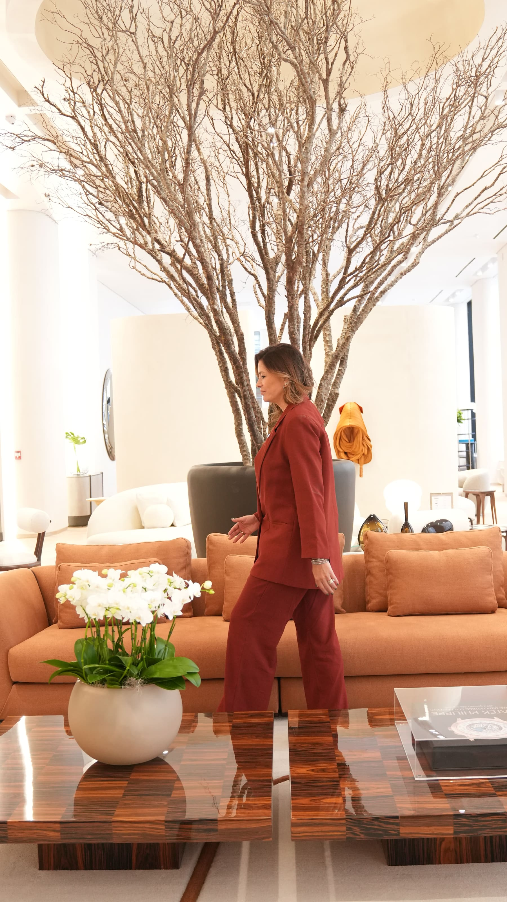
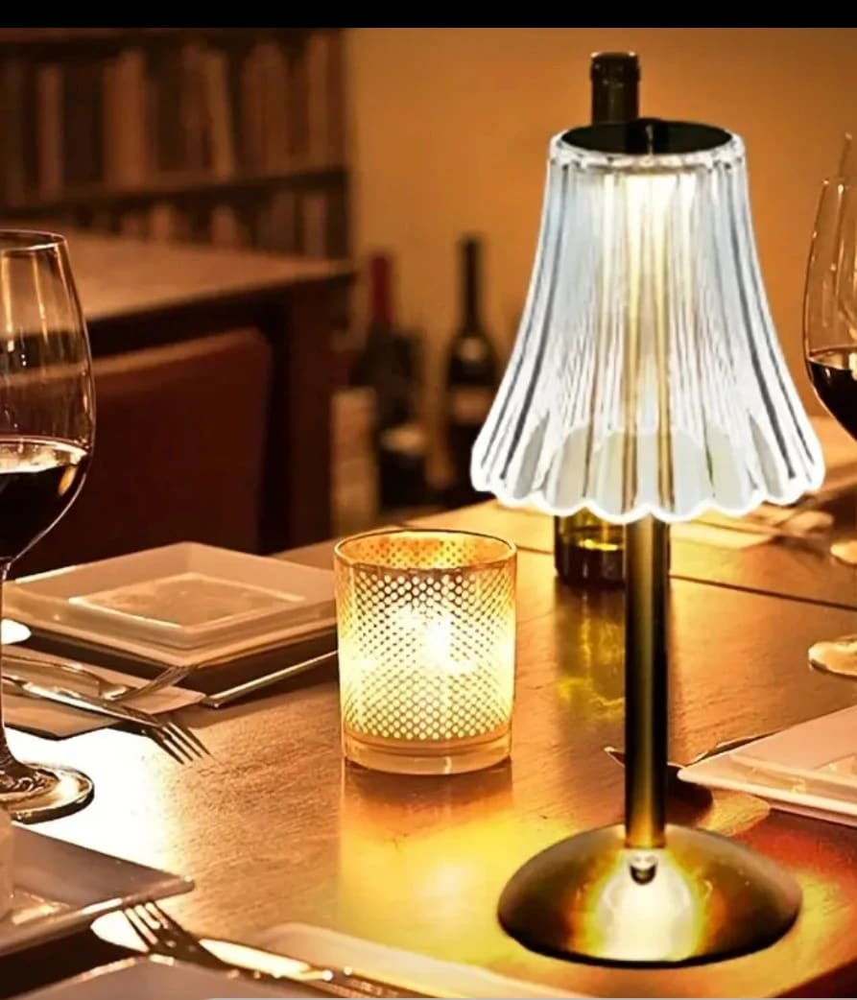
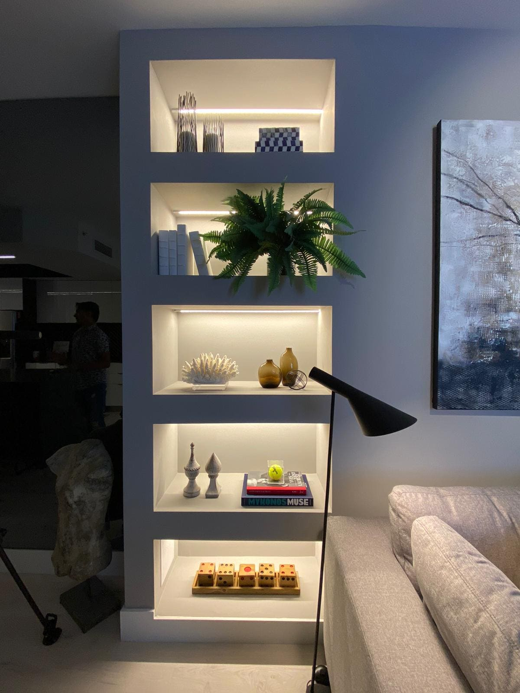
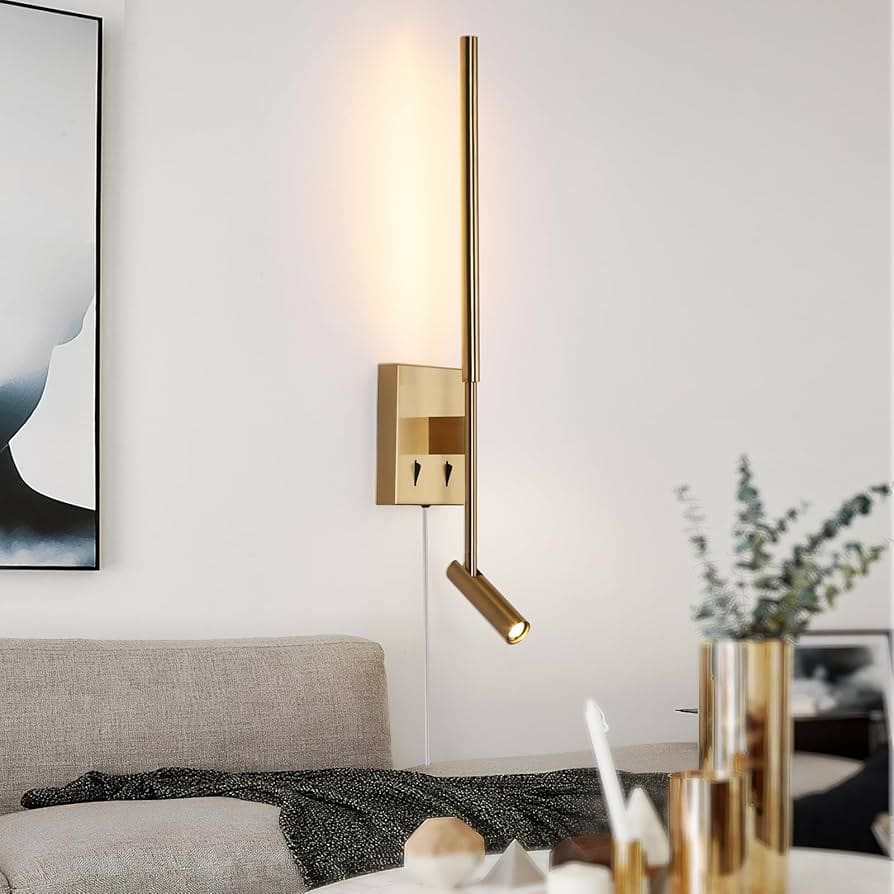
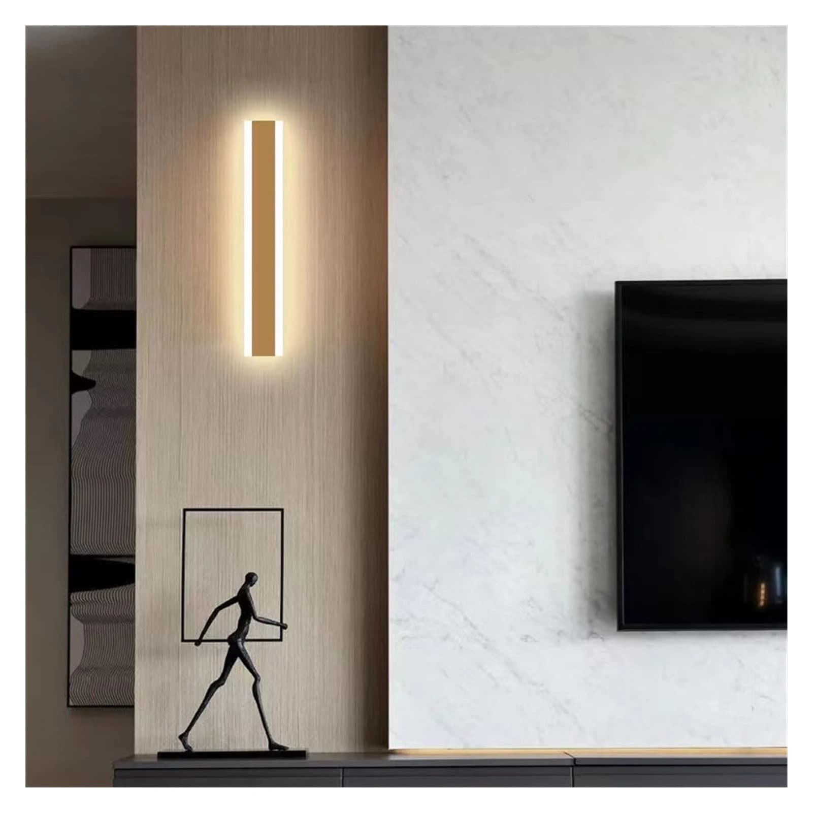
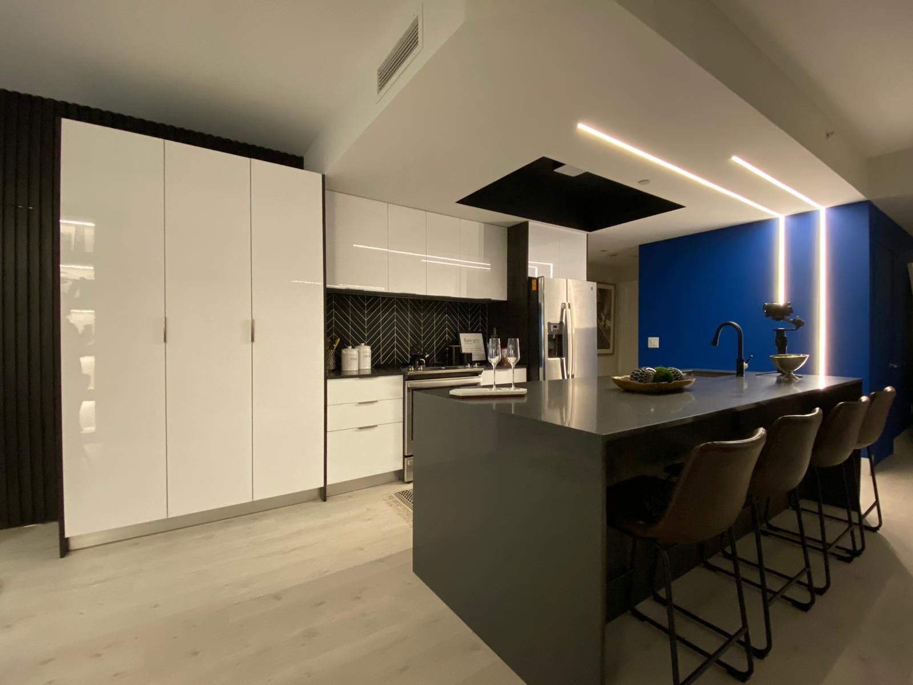

Lighting Design in Miami Interior Design: Layers, LED and Architectural Light.

by Paula Ambrosio

@paulaambrosio_

Feb 5, 2026

-

2 min read

Lighting Design in Miami: How Light Layers Transform Interior Design

Lighting is not just about visibility. In high-end interior design, lighting defines mood, depth and emotion. It shapes how we experience a space and how we feel inside it.

Across Miami, Brickell, Miami Beach, Sunny Isles, Bal Harbour, Coral Gables and Boca Raton, lighting design has become one of the most important layers of a project. When lighting is done right, everything else looks better. When it is done wrong, even the best materials lose their impact.

Light is design.

## Why Lighting Is a Layer, Not a Fixture

One of the most common misconceptions is treating lighting as a single decision. A beautiful fixture alone does not create atmosphere.

Good lighting design is layered. It combines different types of light, each with a purpose. These layers work together to create comfort, balance and flexibility throughout the day.

In Miami interiors, where natural light is abundant, artificial lighting must complement daylight, not fight it.

## Recessed Lighting: Clean and Architectural

Recessed lights are the foundation of modern lighting design.

They provide general illumination without visual clutter. When placed correctly, they create an even wash of light and allow other layers to shine.

In Brickell and Downtown Miami condos, recessed lighting is essential for clean ceilings and contemporary architecture. However, too many recessed lights can flatten a space. Balance is key.

Recessed lighting should support the space, not dominate it.

## LED Strip Lighting: Soft, Indirect and Elegant

LED strip lighting is one of the most powerful tools in interior design today.

Used under cabinetry, behind mirrors, inside coves and along architectural details, LED lighting creates softness and depth. It highlights textures without glare.

In luxury homes across Sunny Isles and Miami Beach, indirect LED lighting transforms walls, ceilings and millwork into subtle design features.

LED light should be felt, not seen.

## Stretch Ceiling Lighting: Light as Architecture

Stretch ceilings have become increasingly popular in high-end interiors.

They allow light to be integrated directly into the ceiling, creating a uniform glow. This solution is ideal for modern spaces where minimalism and clean lines are essential.

In Miami luxury apartments and penthouses, stretch ceiling lighting creates an immersive environment with no visible fixtures. The ceiling becomes light itself.

This is lighting as architecture.

## Wall Lights and Sconces: Atmosphere and Comfort

Wall lights add warmth and intimacy.

They bring light closer to the human scale, making spaces feel more welcoming. Wall sconces are perfect for hallways, bedrooms, bathrooms and living areas.

In Coral Gables and Boca Raton homes, wall lighting often adds a layer of classic elegance. In modern interiors, minimalist sconces create rhythm and visual interest.

Walls should glow, not glare.

## Task Lighting: Function Without Harshness

Task lighting is essential in kitchens, bathrooms and workspaces.

Under-cabinet lighting, vanity lighting and focused fixtures ensure functionality without compromising comfort. The goal is clarity without harsh contrast.

In Miami kitchens and bathrooms, task lighting must be carefully positioned to avoid shadows and glare.

Function can still feel soft.

## Choosing the Right Light Temperature

Light temperature affects mood.

Warm light creates calm and relaxation. Cooler light supports focus and activity. In luxury interiors, warm and neutral tones are preferred for living spaces and bedrooms.

Lighting should follow the rhythm of the day. Bright and energizing in the morning. Soft and warm in the evening.

Smart lighting systems allow this transition naturally.

## Lighting as Part of the Interior Design Layers

Lighting must work with materials, textures and finishes.

Natural stone looks richer under soft light. Wood feels warmer with indirect lighting. Art becomes more powerful when illuminated intentionally.

In Miami interior design, lighting connects floors, walls and ceilings into one cohesive experience.

Lighting does not decorate. It reveals.

## Final Thought

Lighting is what gives life to a space.

When layered thoughtfully, light creates comfort, beauty and emotional balance. It enhances materials, supports well-being and defines luxury without excess.

In Miami interior design, mastering lighting design is mastering the atmosphere of living.

### Paula Ambrosio.

Follow me: @paulaambrosio_

