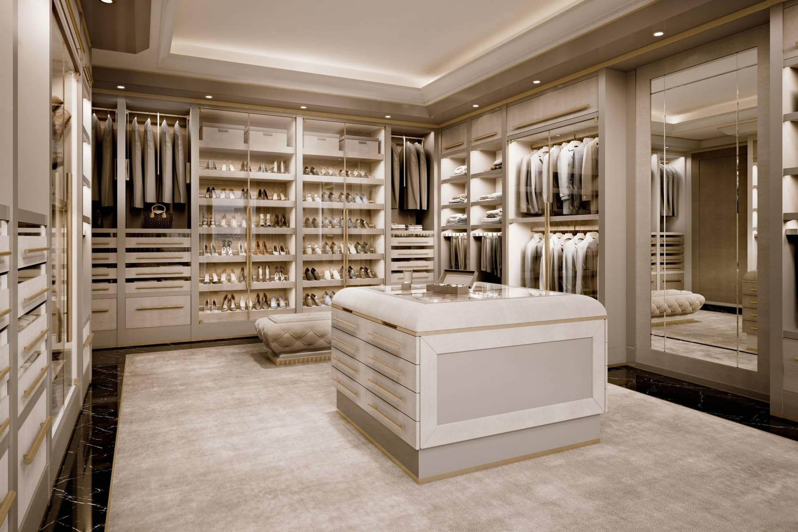
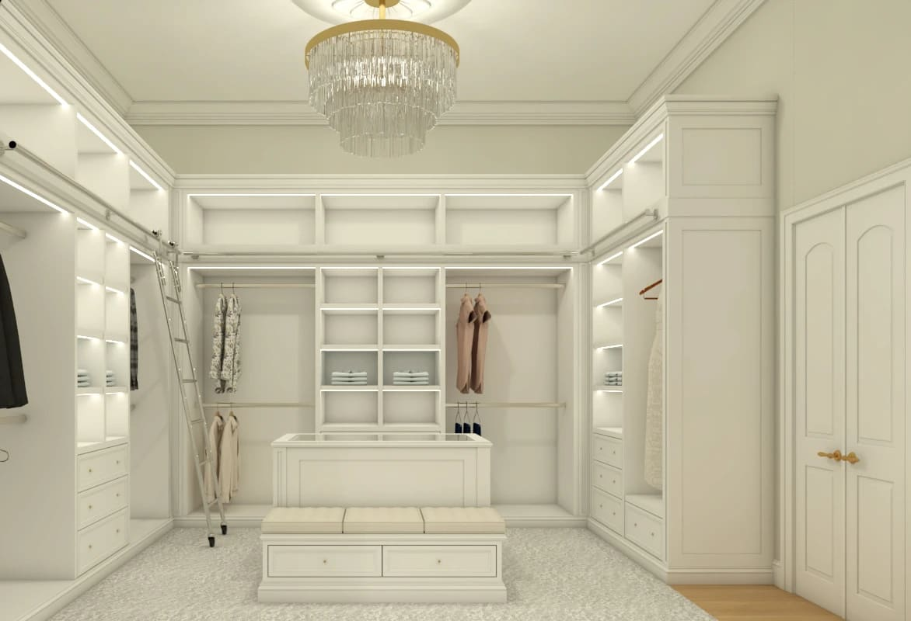

Luxury Closet Design in Miami: Custom Storage That Increases Property Value

by Paula Ambrosio

@paulaambrosio_

Feb 25, 2026

-

1 min read

Luxury Closets in Miami: Custom Design That Enhances Lifestyle and Property Value

In today’s luxury real estate market in Miami, closets are no longer secondary spaces. They are lifestyle statements.

Across Brickell, Sunny Isles Beach, Coral Gables, Bal Harbour and Boca Raton, buyers expect more than storage. They expect experience.

A well-designed closet increases daily comfort and significantly impacts perceived home value.

## Closets as a Reflection of Lifestyle

Closets reveal how someone lives.

They should be intuitive, organized and tailored to the client’s wardrobe and habits. A luxury closet is not about size alone. It is about proportion, lighting, materiality and flow.

When closets feel chaotic or improvised, it affects the entire bedroom experience.

Order creates calm.

## Custom Millwork Makes the Difference

Loose shelving systems reduce value. Custom millwork increases it.

Built-in solutions designed specifically for the space maximize every inch. Integrated drawers, hidden compartments, jewelry displays and vertical organization create functionality without clutter.

In luxury Miami homes, custom closets are expected.

Built-in design communicates permanence and quality.

## Lighting Is Essential in Closet Design

Lighting defines luxury in closets.

Layered lighting includes recessed ceiling lights, integrated LED strips inside cabinetry and soft illumination inside drawers and shoe displays.

Lighting must be warm and flattering. Harsh lighting distorts color and diminishes the experience.

In high-end residences across Miami Beach and Sunny Isles, closet lighting is designed to feel boutique-like.

Light transforms storage into experience.

## Closet Islands and Spatial Flow

In larger homes in Coral Gables and Boca Raton, closet islands add functionality and elegance.

Islands provide additional drawers, display surfaces and visual balance. They anchor the space and create circulation around them.

A closet should feel like a room, not a storage box.

## His and Hers Closets

Separate zones or dual closets are increasingly common in luxury properties.

Each side can reflect individual needs while maintaining cohesive design language. Organization, proportions and materials must remain balanced.

Closet design should support lifestyle, not complicate it.

## Material Selection for Timeless Closets

Timeless materials perform best.

Matte finishes, warm woods, neutral tones and subtle textures age beautifully. Glossy laminates and trend-driven colors often feel dated quickly.

In Brickell condos, lighter finishes may feel modern and refined. In Parkland and Boca Raton homes, warmer woods often create comfort.

Material consistency reinforces luxury.

## Closets and Real Estate Value

Buyers notice closets immediately.

Well-designed closets photograph beautifully and signal thoughtful planning. In competitive Miami markets, this detail can influence offers and time on market.

Closets are no longer hidden rooms. They are selling features.

## Final Thought

Luxury closet design is about daily experience.

When closets are intentional, layered and custom-built, they enhance both lifestyle and property value.

In Miami interior design, even storage deserves strategy.

### By Paula Ambrosio.

Follow me: @paulaambrosio_

