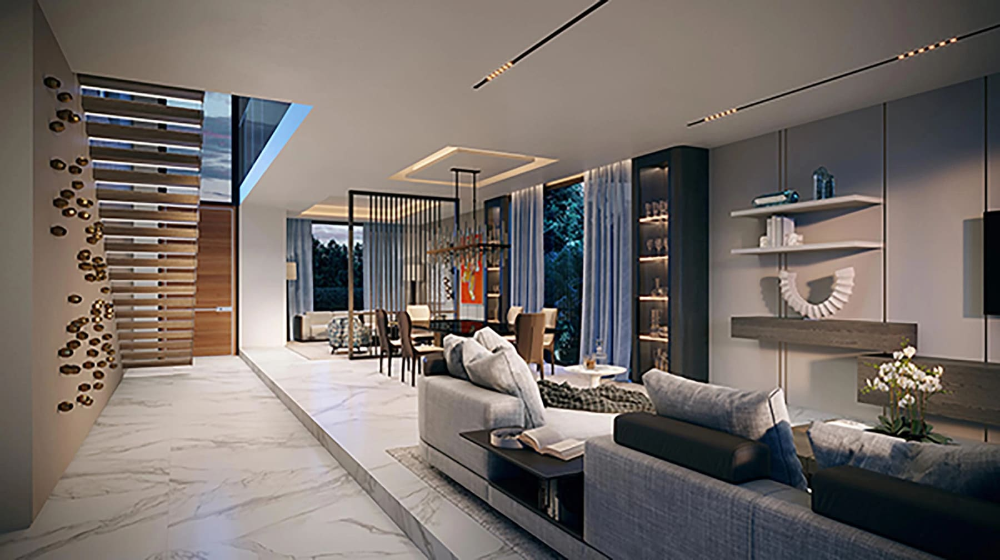
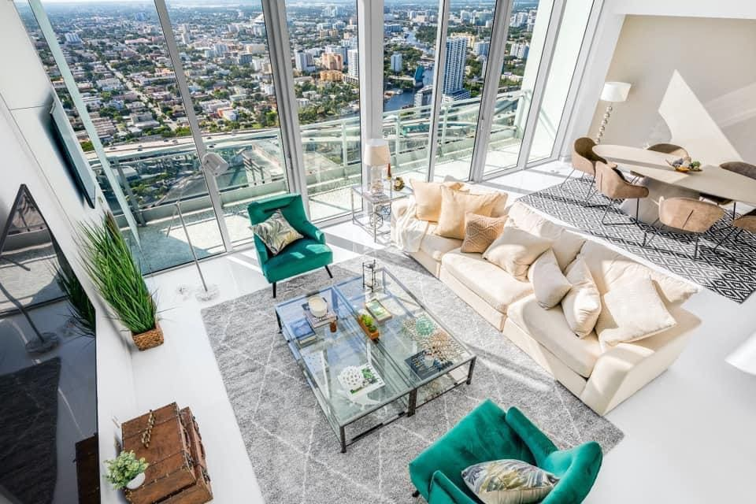
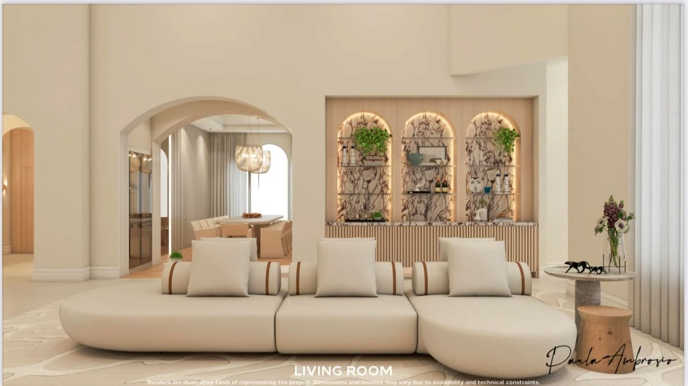
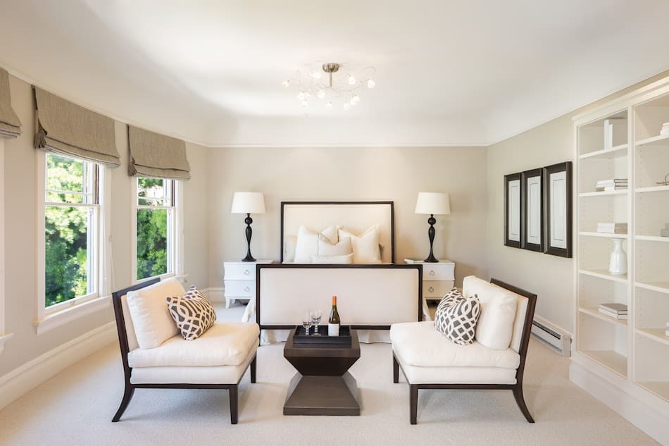
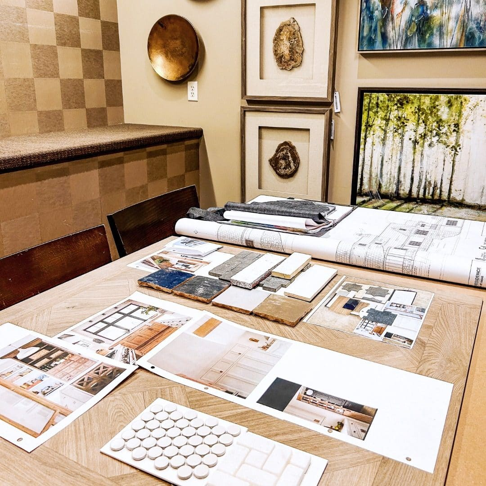

Why Investors Win When Interior Design Is Treated as a Strategic Team in Miami

In competitive real estate markets, design is no longer a decorative layer. It is a strategic asset. Investors who understand this early consistently outperform those who treat interior design as an afterthought.

In Miami and its surrounding cities, where luxury, lifestyle and international buyers intersect, a strong design team is often the difference between an average return and a winning investment.

## Design Is No Longer About Taste, It Is About Strategy

Today’s investors are not just buying square footage. They are buying experience, perception and positioning.

A well structured interior design team understands how to translate market expectations into spaces that sell faster, rent better and hold long term value. This goes far beyond aesthetics.

Design decisions influence price per square foot, buyer emotion, branding of the property and even how a space photographs for global marketing.

## How a Design Team Changes the Game for Investors

When investors work with a professional interior design team, the process becomes clear and controlled.

The designer leads material selection based on durability and market appeal. Space planning is optimized for functionality and lifestyle. Finishes are chosen to align with buyer expectations in each location. Lighting, wall treatments and furniture are layered to enhance perception without unnecessary cost.

This coordinated approach eliminates guesswork, reduces mistakes and protects the investment.

Design becomes part of the financial strategy.

## Understanding Local Markets Makes All the Difference

Miami is not one single market. Each city has its own rhythm, buyer profile and design language.

### Brickell

Urban investors in Brickell demand modern layouts, efficient spaces and a polished metropolitan feel. Design here must be sleek, intelligent and globally appealing.

### Sunny Isles Beach

In Sunny Isles, international buyers expect resort style living. Design focuses on light, flow, comfort and a luxury vacation mindset that still feels refined.

### Coral Gables

Heritage and architecture guide design choices. Respecting structure while updating interiors for modern living is essential.

### Boca Raton

Timeless elegance and long term value define the market. Design decisions prioritize longevity, quality materials and understated sophistication.

A design team that understands these nuances protects the investor from misaligned choices.

## Design as a Tool for Faster Sales and Higher Returns

Properties designed with intention consistently perform better. They photograph stronger, attract qualified buyers and create emotional connection.

For investors, this means reduced time on market, stronger negotiation power and higher perceived value. Design becomes a silent salesperson working around the clock.

## Why Investors Should Think in Teams, Not Vendors

Winning projects are not built by isolated decisions. They are built by teams.

When interior designers collaborate with architects, developers, contractors and brokers, the project gains alignment. Budget is respected. Timelines are clearer. Design supports the business plan, not the other way around.

This is where experienced interior designers bring the most value. They understand both the creative and financial language of a project.

## Final Thought

In Miami’s competitive real estate landscape, investors who treat interior design as a strategic partner consistently win.

A strong design team does not just make spaces beautiful. It makes investments smarter.

That is how the game is played and won.

