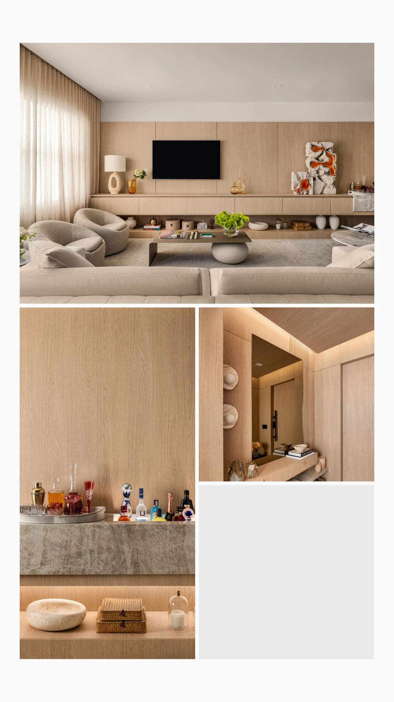
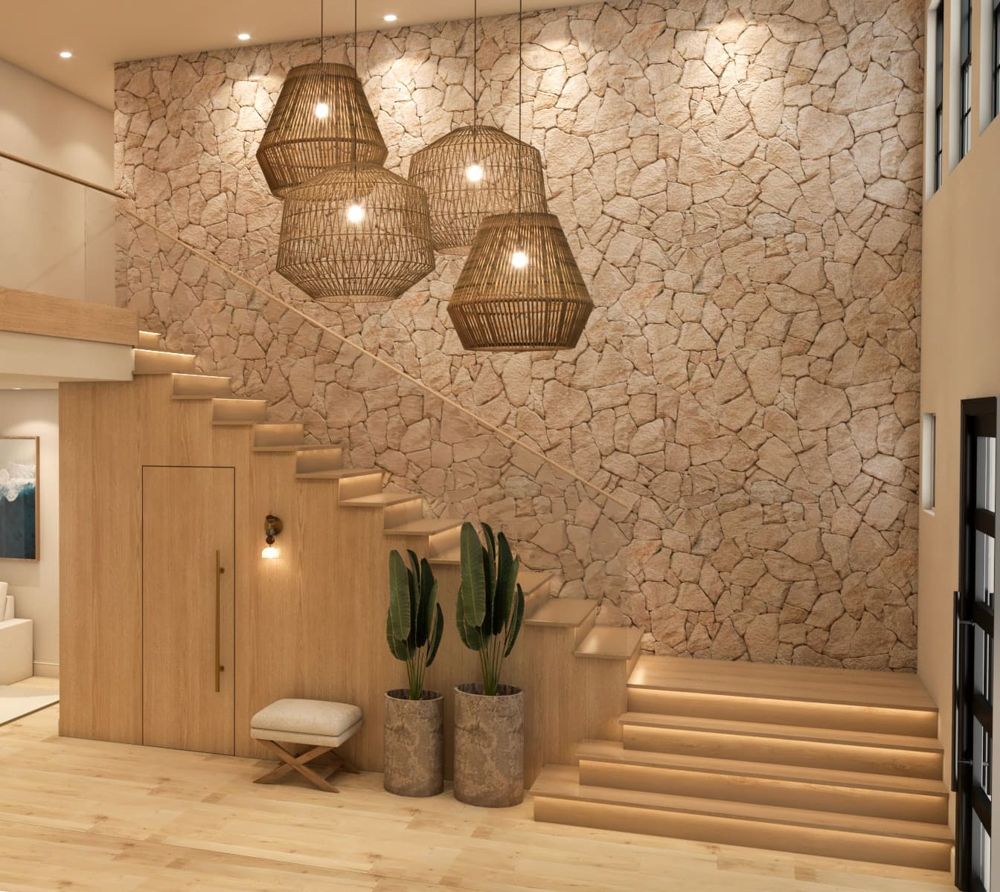
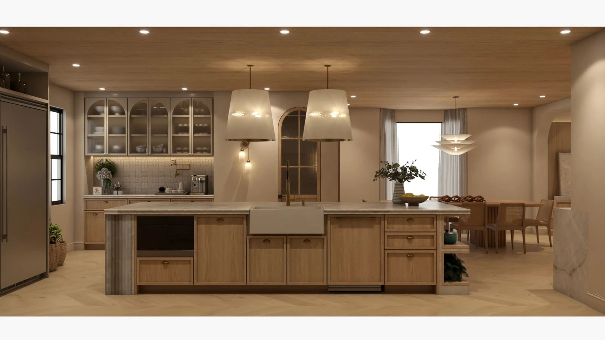
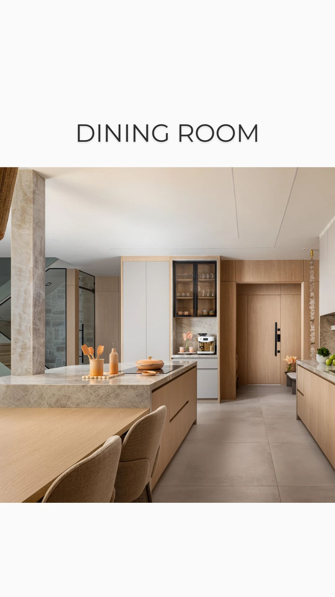

Luxury Interior Design in Miami, Coral Gables, Surfside, Boca Raton & Beyond

by Paula Ambrosio

@paulaambrosio_

Aug 12, 2026

-

2 min read

Luxury Interior Design in Miami and South Florida: From Coral Gables to Boca Raton

There is a moment that happens in almost every project. The client walks in for the first time after installation, stops in the doorway, and goes quiet. Not because of a chandelier or a marble slab. Because the room finally feels like them*.That moment is the entire point of what we do.

Photo: Gabriel Matarazzo   **                              |    Real photos     Living room | Foyer | Bar **

Paula Ambrósio Interior Design is a Miami based studio founded by two sisters, Amanda and Paula Ambrósio, with nearly two decades of work in high-end residential interiors, boutique commercial spaces and hospitality. We design across South Florida Miami, Coral Gables, Coconut Grove, Key Biscayne, Surfside, Bal Harbour, Sunny Isles Beach, Aventura, Hollywood, Fort Lauderdale, Delray Beach , Palm beach and Boca Raton  for homeowners, international buyers, investor, hospitality s and developers.

And because South Florida is not one place but a collection of very different worlds, the design has to know where it is standing.

## South Florida Is Not One Market. It Is Twelve.

People outside the region talk about "Miami style" as if the entire coast shared one look. Anyone who actually lives and works here knows better.

A Coral Gables residence and a Sunny Isles penthouse are two different conversations. A Surfside beach apartment and a Boca Raton family home have almost nothing in common beyond the zip code prefix. The light is different. The ceiling heights are different. The buyer is different. The way people entertain is different.

Designing well here means reading the specific building, the specific street, the specific way that family lives  and then making choices that will still look right in ten years.

Here is how we think about each of the areas we serve.

## Miami: Brickell, Edgewater, Downtown & Coconut Grove

Miami proper is vertical, fast and international. Brickell and Edgewater are full of glass towers with generous water views and floor plans that reward restraint. When the window is already the most dramatic element in the room, the furniture does not need to compete with it.

Our work in Miami condos tends toward low, clean silhouettes, warm neutrals, natural stone and layered texture  linen, boucle, walnut, brushed brass. Enough softness that the space feels like a home and not a hotel lobby, enough discipline that the view stays the star.

Coconut Grove **asks for something different. It is greener, older, more relaxed. Ceilings are often lower, the light comes through trees rather than off the water, and the homes have more character to work with. We lean into that  deeper woods, more pattern, a little more soul.

## Surfside, Bal Harbour & Bay Harbor Islands: Coastal Without the Cliché

This stretch of coast is quiet, walkable and extremely well-heeled. Surfside has a village feel. Bal Harbour is polished and international. Bay Harbor Islands is full of thoughtful newer boutique buildings with beautiful proportions.

The mistake people make on the beach is going literal  the nautical stripes, the driftwood, the shell motifs. It reads dated within two years.

We do coastal differently: a palette pulled from the actual environment rather than from a beach-house catalog. Sand, bone, oatmeal, pale oak, weathered plaster, the specific soft blue-grey the ocean turns in the afternoon. Materials chosen to survive salt air and humidity, because in an oceanfront unit, that is not an aesthetic question, it is a maintenance question.

Many of our Surfside and Bal Harbour clients are part-time residents. Their apartments need to be able to sit closed for two months and be ready to live in the hour they land. We design and specify with exactly that in mind.

## Aventura, Sunny Isles Beach & Hallandale: The International Buyer's Corridor

This corridor is where a huge share of Latin American and European buyers land, and it is where turnkey service matters most.

The typical situation: a client purchases from São Paulo, Bogotá, Mexico City or Milan. They visit twice a year. They do not want to spend those visits at showrooms and tile warehouses. They want to arrive to a finished, styled, fully functioning home  beds made, glassware in the cabinet, art on the wall.

That is our turnkey model, and it is the reason a large part of our client base never sets foot in a store during the entire project. We handle concept, selection, procurement, logistics, installation and final styling. The client approves the vision and receives the keys to a finished home.

Being trilingual  Portuguese, English and Spanish  is not a marketing line for us. It is why a client in Brazil can call at 8pm and be understood immediately, in their own language, by the person actually running their project.

## Fort Lauderdale, Las Olas & Hollywood: More Space, More Freedom

North of the Miami Dade line, the properties open up. More waterfront single-family homes, more dockage, more room to design generously. Las Olas has a lively, social character. Hollywood offers value and a slower pace that attracts young families and second-home buyers.

These projects often involve indoor-outdoor living as a genuine priority rather than an afterthought  covered terraces, summer kitchens, pool decks that get used year-round. We design those spaces with the same rigor as the living room, because that is where the family actually spends its evenings.

## Delray Beach & Boca Raton: Refined, Established, Family-Oriented

Boca Raton is polished and confident, with a strong tradition of gracious, well-appointed homes. Country club communities, generous lot sizes, formal entertaining, multi-generational families. Delray has a more artistic, boutique energy  Atlantic Avenue gives the whole city a walkable, creative pulse.

Our Boca and Delray clients often want something we describe as "quietly expensive": nothing shouting, everything correct. Deep upholstery you can actually sit in. Dining rooms that seat twelve without feeling like a banquet hall. Kitchens designed for a family that genuinely cooks. Bedrooms for grandchildren who visit for a month every summer.

> This is design for real life at a high level  and real life is the harder brief.**

Contact Us. info@paulaambrosio.com

Thank you Paula.

