The Cultural Diversity That Shapes Interior Design in Miami

by Paula Ambrosio

@paulaambrosio_

Jan 25, 2026

-

2 min read

The Cultural Diversity That Shapes Interior Design in Miami

Miami is not just a city. It is a convergence of cultures, lifestyles and stories from all over the world. This diversity is what makes interior design in Miami so unique and so complex. Designing here means understanding people before choosing finishes.

From the relaxed elegance of beachside living to the fast paced energy of a global metropolis, Miami and its surrounding cities demand a design approach that is flexible, intuitive and deeply cultural.

## A City Influenced by the World

Miami brings together Latin American roots, European sophistication, North American functionality and Caribbean warmth. Every project reflects a mix of backgrounds, traditions and expectations.

An interior designer working in Miami must understand how different cultures experience space. Some clients value openness and social flow. Others prioritize privacy, formality or tradition. Good design listens first.

This cultural richness transforms interiors into personal narratives rather than generic spaces.

## Boca Raton: Refined Elegance and Timeless Living

Boca Raton reflects a more classic and refined lifestyle. Interiors here often balance coastal inspiration with timeless sophistication.

Homes tend to feature neutral palettes, layered textures, natural materials and a sense of quiet luxury. Design in Boca Raton is not about trends. It is about longevity, comfort and understated elegance.

Clients here value craftsmanship, proportion and harmony.

## Coral Gables: Architecture, Heritage and Character

Coral Gables is deeply rooted in architectural identity. Mediterranean influences, historic details and lush landscapes shape interior design decisions.

Designing in Coral Gables means respecting the soul of the architecture while adapting it to modern living. Interiors often combine traditional elements with contemporary layers, creating spaces that feel both classic and current.

Here, walls, ceilings and details matter just as much as furniture.

## Brickell: Urban Metropolis and Modern Lifestyle

Brickell represents Miami’s metropolitan heartbeat. High rise living, global professionals and an urban rhythm define this area.

Interior design in Brickell is sleek, modern and intentional. Clean lines, curated materials and smart layouts are essential. Spaces must feel efficient but still warm.

Design here reflects movement, ambition and city life. It is where minimalism meets sophistication.

## Sunny Isles Beach: Resort Living and International Lifestyle

Sunny Isles is international by nature. With residents from Europe, South America and beyond, the design language here is global.

Interiors often blend resort inspired comfort with luxury finishes. Ocean views influence color palettes, textures and layouts. Light, flow and relaxation guide every decision.

Designing in Sunny Isles means creating homes that feel like permanent vacations without losing elegance.

## Why Cultural Awareness Defines Interior Design in Miami

Miami does not have one single design style. That is its strength.

A successful interior designer in Miami understands how to translate different lifestyles into cohesive spaces. Design here is not about imposing a signature look. It is about interpreting culture, rhythm and daily life.

That is what transforms a project into a home.

## Final Thought

Interior design in Miami is a reflection of the world living in one city. Beach and city. Tradition and innovation. Calm and energy.

When design embraces cultural diversity, spaces become meaningful, personal and timeless.

That is the true essence of interior design in Miami.

Paula Ambrosio

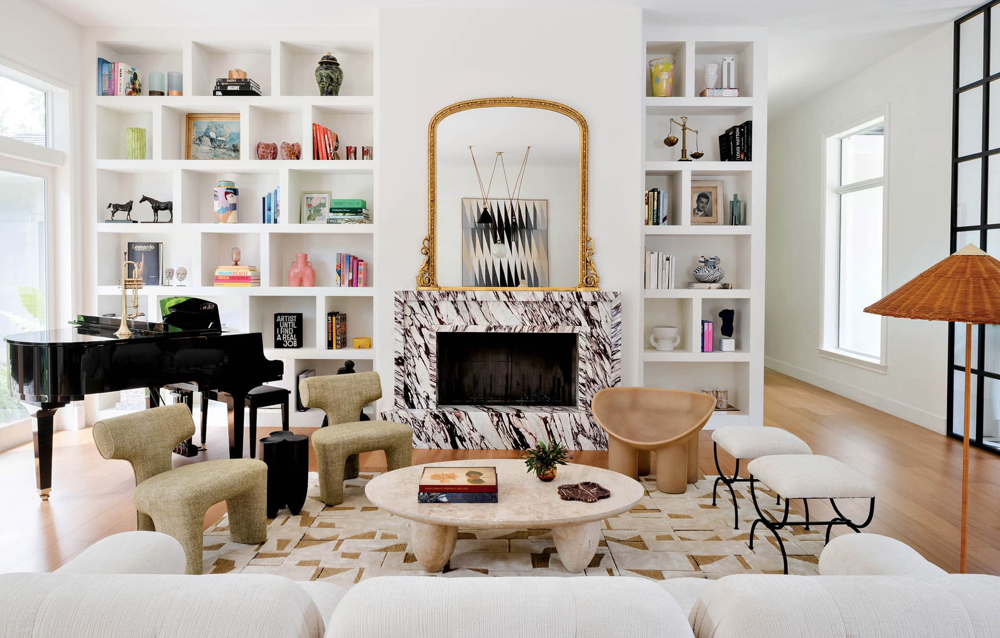

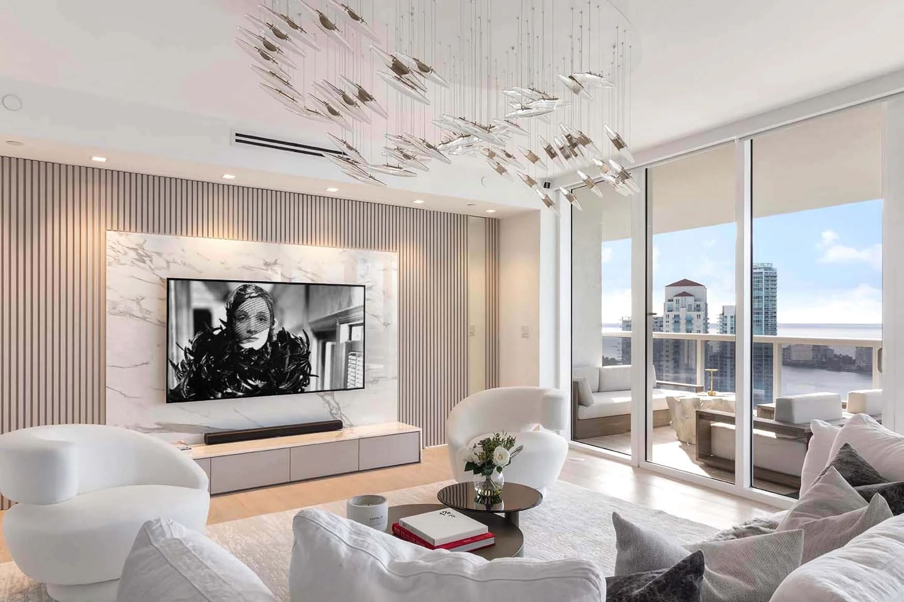

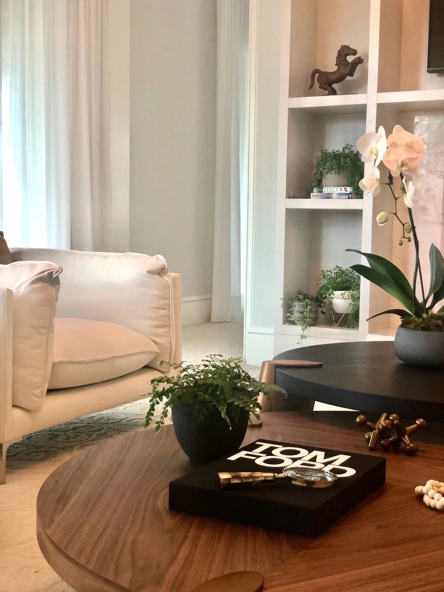

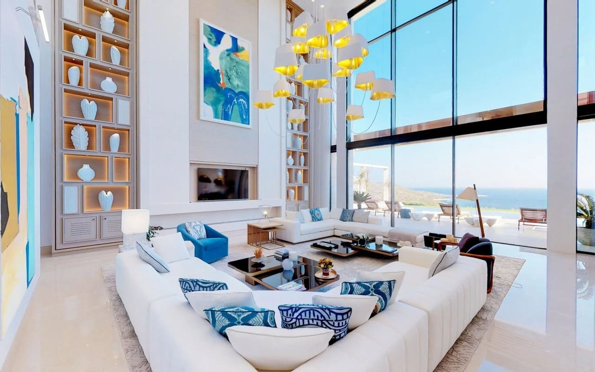

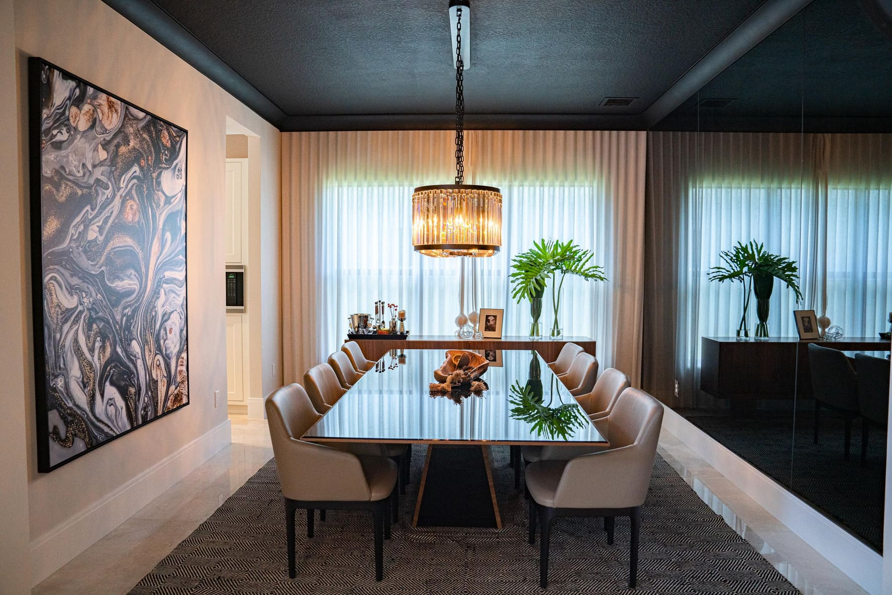

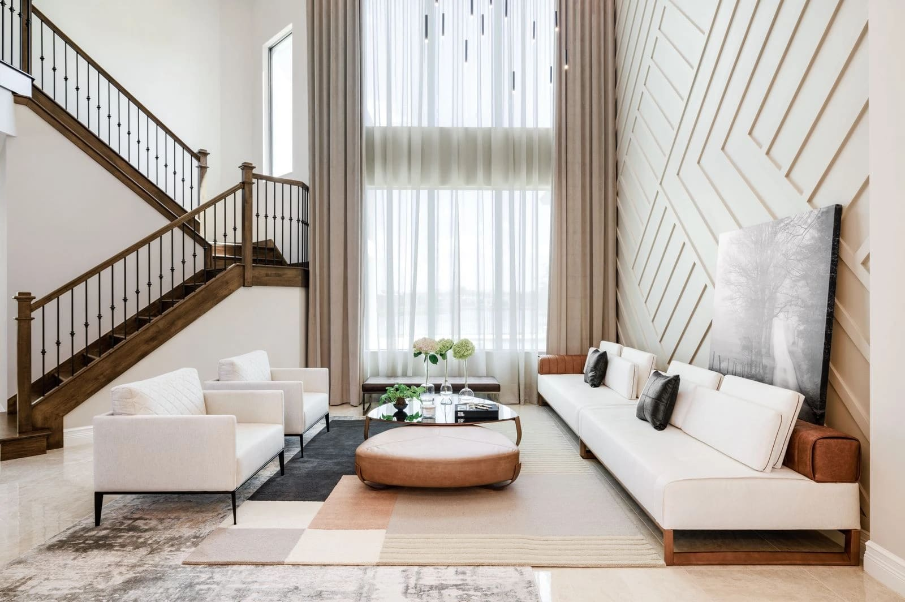

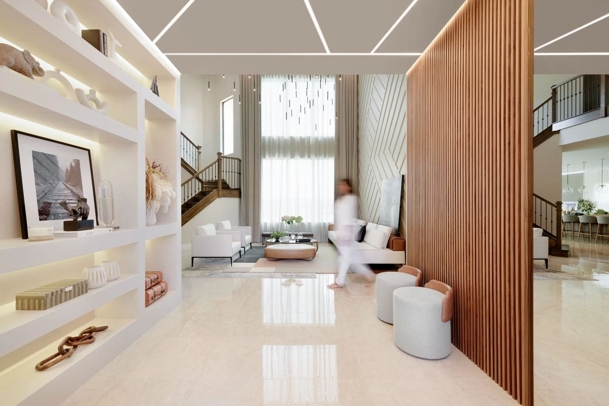

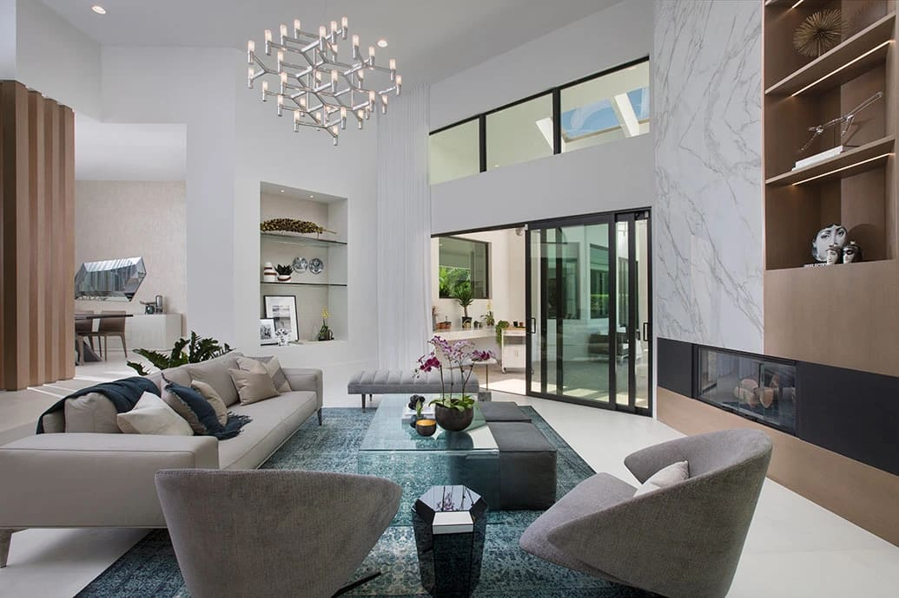

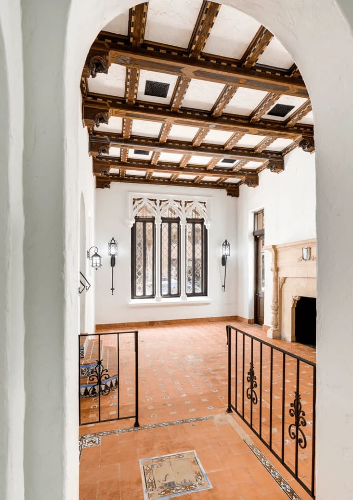

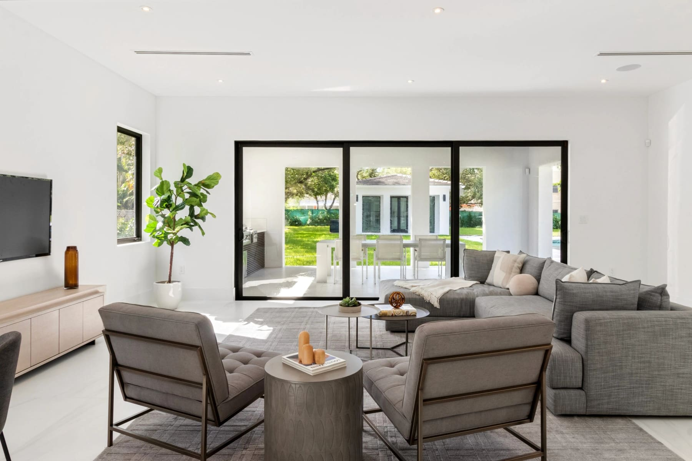

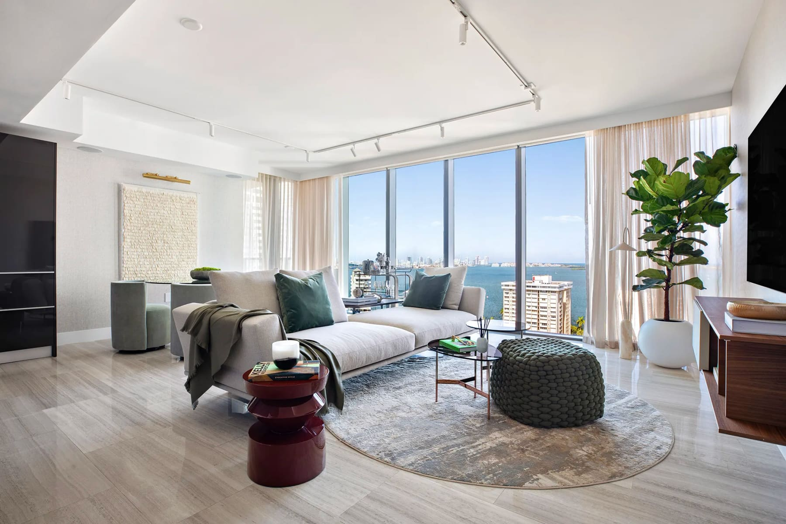

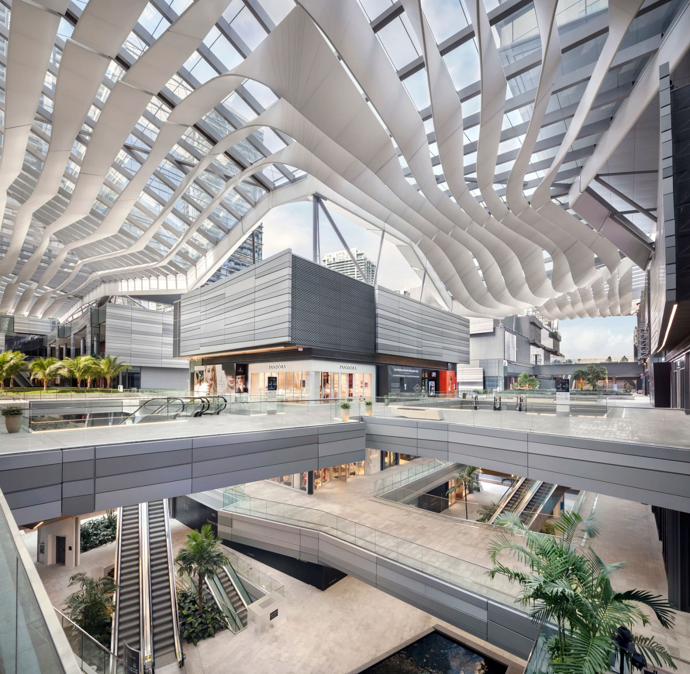

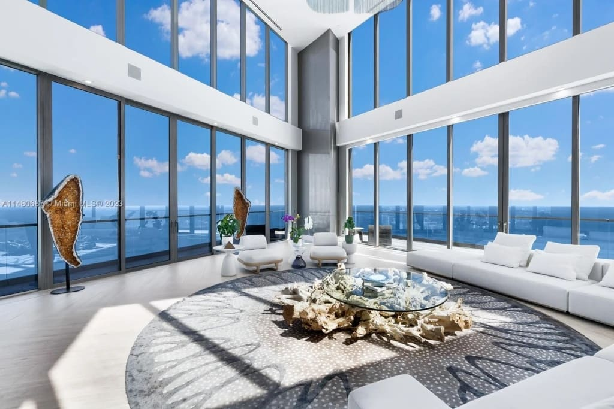

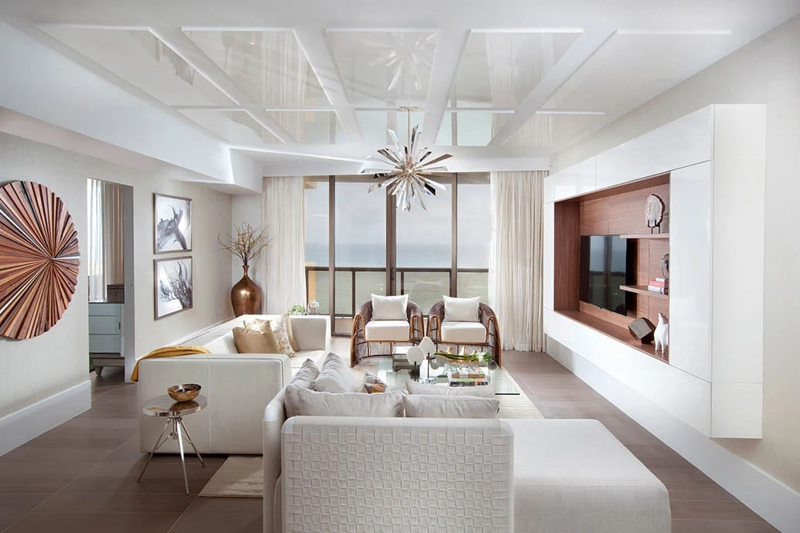

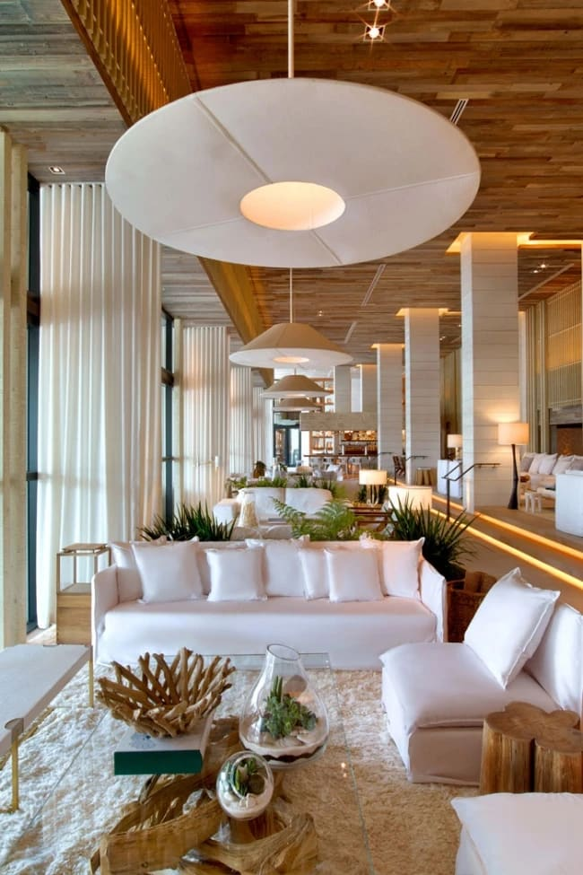
