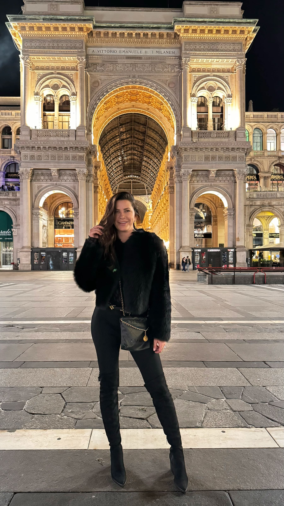
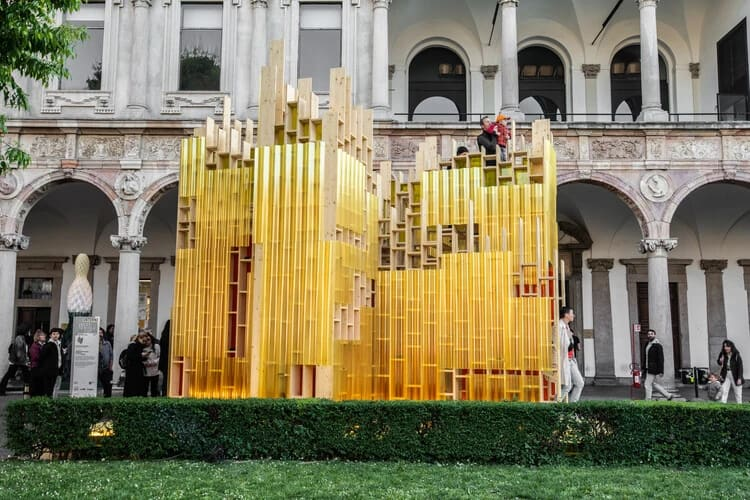
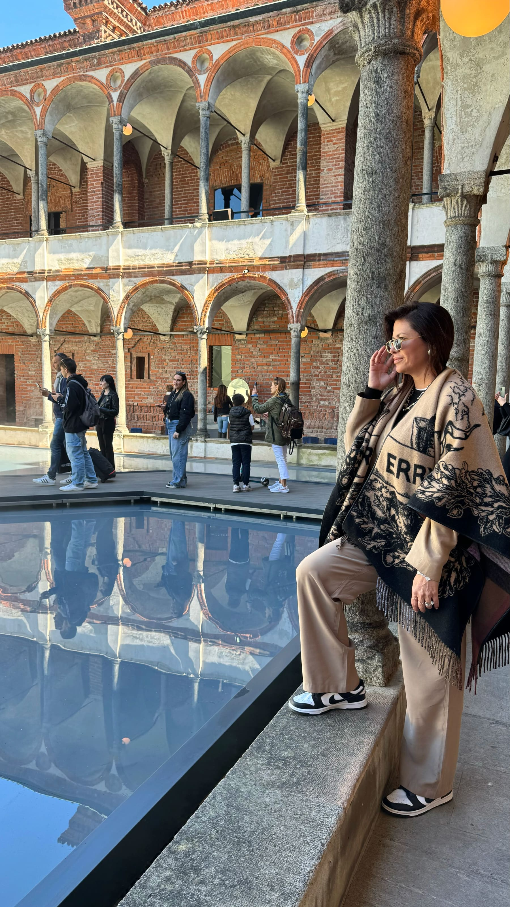
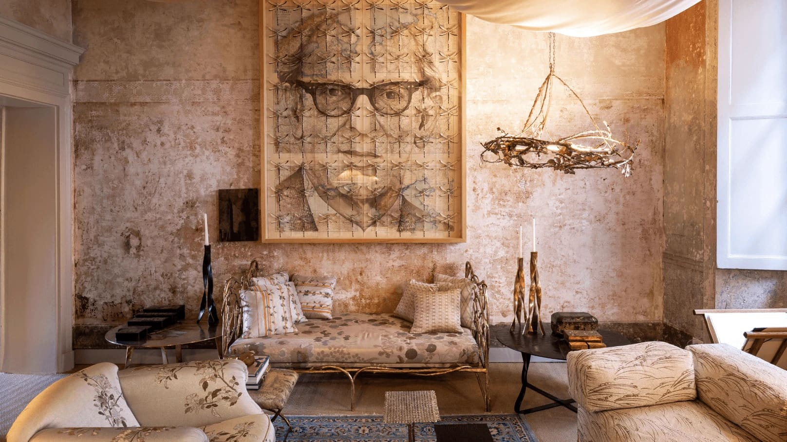
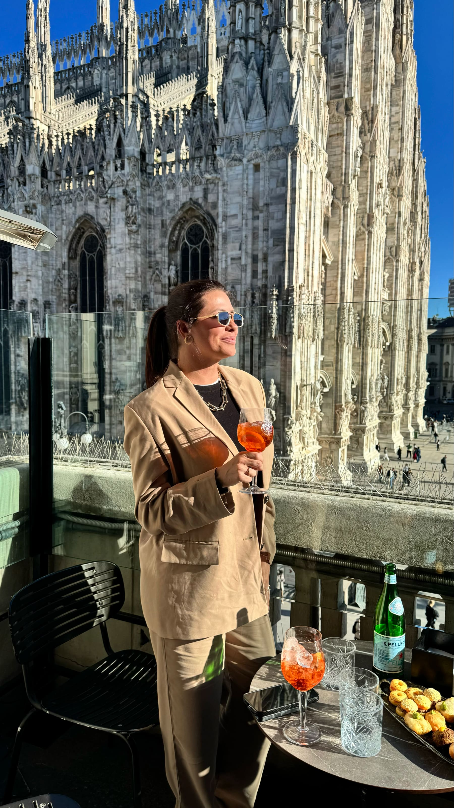
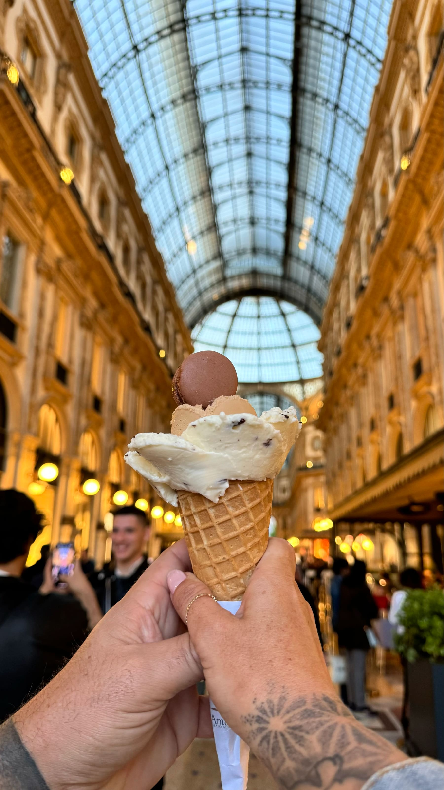
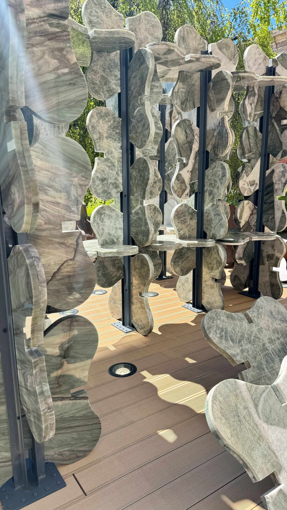
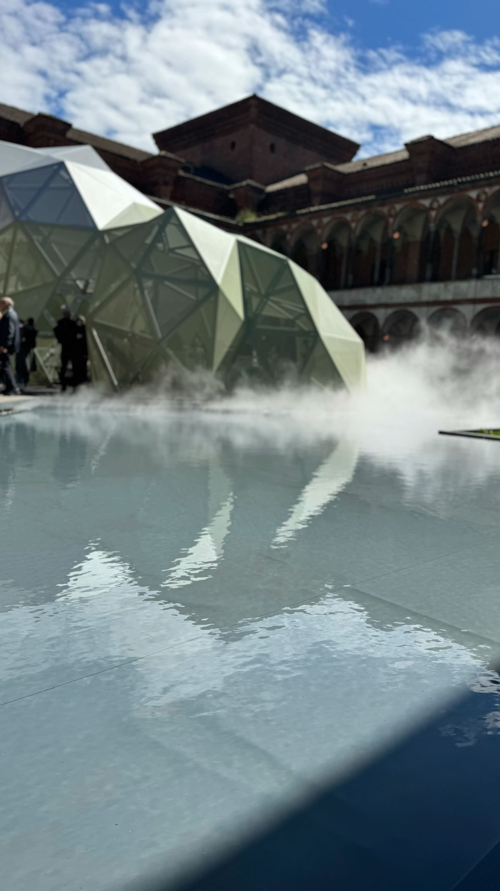

How to Find Inspiration in Interior Design: From Milan Design Week to Miami Living

by Paula Ambrosio

@paulaambrosio_

Apr 1, 2026

-

2 min read

How to Find Inspiration in Interior Design: From Milan Design Week to Miami Living**

Inspiration in interior design does not come from copying what already exists. It comes from observing, feeling and translating experiences into spaces.

Every April, the world of design turns its attention to Milan. During Milan Design Week, ideas are not just presented. They are experienced.

For an interior designer, this is where vision expands.

Inspiration Begins with Experience, Not Trends**

True inspiration is not found in catalogs or trends. It is found in how a space makes you feel.

In Milan, design is immersive. Light, texture, materials and movement are carefully curated to create emotion. Walking through installations is not about looking. It is about sensing.

This is what separates inspiration from imitation.

A designer does not bring Milan back to Miami.

They bring the feeling.

What Milan Teaches About Materials**

One of the strongest lessons from Milan is material honesty.

Natural stone, wood, fabrics and metals are presented in their purest forms. Finishes are matte, textures are tactile and everything feels intentional.

This aligns perfectly with high-end interior design in Miami Beach, Sunny Isles Beach and Coral Gables, where natural materials create timeless interiors.

Inspiration here is not about new materials.

It is about using them better.

Lighting as Emotion**

In Milan, lighting is never just functional.

It is sculptural, soft and layered. Light is used to guide the eye, create intimacy and highlight textures. Nothing feels harsh. Everything feels intentional.

This approach translates directly into Miami interiors, especially in Brickell and Downtown Miami, where modern architecture benefits from warmth and softness.

Light is one of the most powerful tools a designer brings back from Milan.

Color Palettes That Whisper**

Milan does not scream with color.

Neutral palettes dominate. Warm tones, earthy hues, soft contrasts. Color is used with restraint.

Subtle accents replace bold statements. The result is timeless.

In Miami interior design, especially in luxury markets like Bal Harbour and Boca Raton, this approach creates homes that feel calm and elevated.

Color should support, not compete.

Translating Global Inspiration into Local Design**

The role of an interior designer is not to replicate Milan. It is to interpret it.

A penthouse in Brickell requires a different translation than a waterfront home in Sunny Isles. A family residence in Coral Gables needs a different approach than an investment property in Miami Beach.

Inspiration must adapt to lifestyle, architecture and climate.

That is where design becomes intelligent.

Why Global Inspiration Adds Value**

Clients today are global.

They travel, they experience design worldwide and they expect that level of sophistication in their homes.

An interior designer connected to international design events brings a broader vision. This translates into better material choices, refined spaces and stronger property value.

Global inspiration creates local advantage.

Final Thought**

Inspiration is not about what you see.

It is about what you feel and how you translate it.

From Milan to Miami, great design is not copied. It is interpreted, refined and adapted to life.

That is what creates interiors that are both timeless and personal.

Let’s go if me to Milan design week April 2026.

