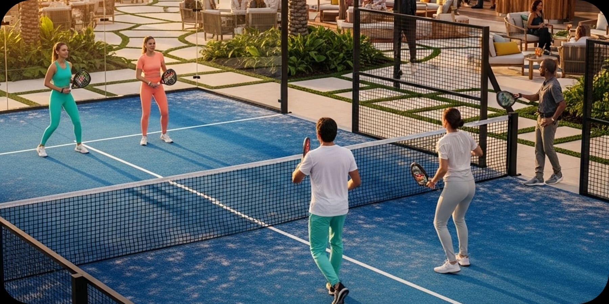

Padel in Miami: The Sport Redefining Leisure and Networking Spaces

by Paula Ambrosio

@paulaambrosio_

Sep 2, 2025

-

1 min read

Padel,often called the “humanized racket sport”,has quickly become one of Miami’s fastest-growing activities, not only for fitness but also as a networking opportunity.

Luxury hotels and residential communities are investing in padel courts integrated into high-end landscaping, turning recreation into a design-driven experience.

Beyond the game itself, hospitality interior design is introducing exclusive lounges, hydration areas with organic design, and stylish social hubs, transforming padel into a complete lifestyle statement.

