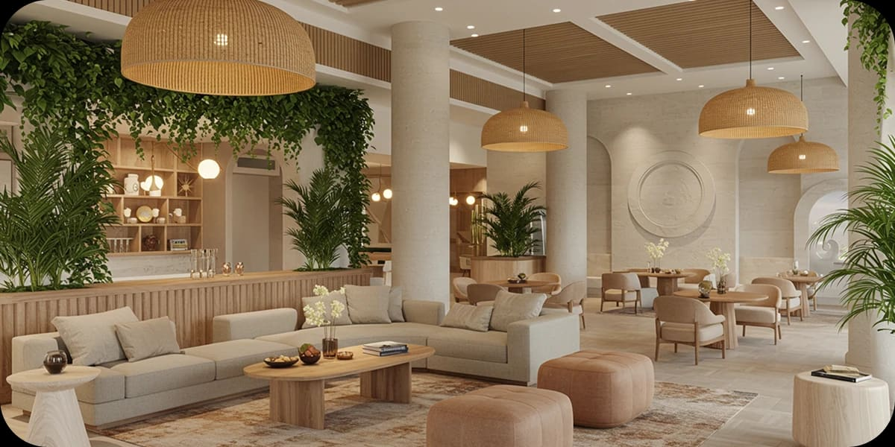

Quality of Life: How Interior Design Transforms Hospitality into Experience

by Paula Ambrosio

@paulaambrosio_

Sep 2, 2025

-

1 min read

In Miami, hospitality goes beyond flawless service. It is about delivering a memorable lifestyle experience. Interior design plays a crucial role in this transformation by curating spaces that inspire balance, connection, and authenticity.

Hotels and private residences are embracing open layouts, natural textures, biophilic design, and curated furniture to promote a sense of harmony. By combining wellness-inspired amenities with high-end interiors, hospitality in Miami is shifting toward a new standard: luxury that feels personal, holistic, and meaningful.

