Real Estate Investment and Interior Design in Miami: Why Designed Homes Sell Faster.

by Paula Ambrosio

@paulaambrosio_

Feb 7, 2026

-

2 min read

Real Estate Investment and Interior Design in Miami: Why Designed Homes Sell Up to 39% Faster

Before

Project by Paula Ambrosio

Project by Paula Ambrosio.

In today’s real estate market, location is no longer the only factor that determines value. Design has become a decisive investment strategy. Homes with thoughtful interior design don’t just look better, they sell faster, attract stronger offers and create emotional connection.

Well-designed properties can sell up to 39% faster** than homes without design strategy. In competitive markets like Miami, that difference is everything.

## Design Is No Longer Decoration, It Is Positioning

Interior design is often misunderstood as decoration. In real estate, design is positioning.

A designed home communicates lifestyle, quality and intention the moment a buyer walks in or scrolls through photos online. It answers an unspoken question immediately: Can I see myself living here?*

In Miami, where buyers are international, busy and visually driven, that emotional response happens in seconds.

## Why Design Makes Homes Sell Faster

Buyers don’t buy square footage alone. They buy feeling.

A well-designed home feels organized, calm and aspirational. It photographs better, shows better and stays memorable longer. Properties without design often feel empty, confusing or emotionally flat.

In areas like Brickell, Miami Beach and Sunny Isles Beach, where inventory moves quickly, design becomes a competitive advantage.

Design shortens decision time. Faster decisions mean faster sales.

## The Emotional Power of Interior Design

Interior design works on a subconscious level.

Materials, lighting, layout and flow influence how buyers feel in a space. A home with layered lighting, natural materials and clear circulation feels more valuable, even if the square footage is the same.

Design removes friction. Buyers don’t need to imagine potential. They see it immediately.

Emotion closes deals.

## Design and Perceived Value

Perceived value often matters more than actual cost.

Two homes with the same layout can have very different outcomes depending on design. The one with cohesive materials, built-in solutions, proper lighting and thoughtful details will always feel worth more.

In Coral Gables, Boca Raton and Bal Harbour, design signals care, quality and long-term thinking. Buyers trust homes that feel designed.

Trust increases value.

## Design for the Right Buyer Profile

Good interior design is not generic.

A smart investment property is designed for its audience. A Brickell condo targets professionals and investors. A family home in Coral Gables or Parkland targets long-term living. A waterfront residence in Sunny Isles attracts international buyers seeking lifestyle.

Interior design aligns the property with its buyer. That alignment accelerates sales.

Design without strategy is decoration.Design with strategy is investment.

## Faster Sales Mean Lower Holding Costs

Selling faster is not just convenient. It is financially strategic.

Shorter time on market means lower holding costs, less negotiation pressure and stronger offers. Design reduces price drops and keeps momentum high.

For investors, developers and homeowners, interior design protects margins.

Time is money.

## What Design Elements Impact Sales the Most

Certain design decisions consistently improve performance.

Neutral, timeless flooring.Layered lighting.Well-designed kitchens and bathrooms.Built-in storage and millwork.Clean, calm wall treatments.Spaces that feel complete, not overdone.

These elements create clarity and confidence.

Buyers pay for confidence.

## Design as a Long-Term Asset

Interior design continues to add value beyond the sale.

Designed homes age better, photograph better for resale and attract higher-quality tenants in rental markets. Design is not consumed. It compounds.

In Miami’s evolving real estate landscape, design is no longer optional. It is part of the investment equation.

## Final Thought

A home with interior design does not just sell faster. It sells smarter.

When design is intentional, strategic and aligned with lifestyle, properties stand out, connect emotionally and move quickly. Up to 39% faster.

In Miami real estate, interior design is not a cost.It’s a competitive advantage.

### Paula Ambrosio

Follow me: @paulaambrosio_

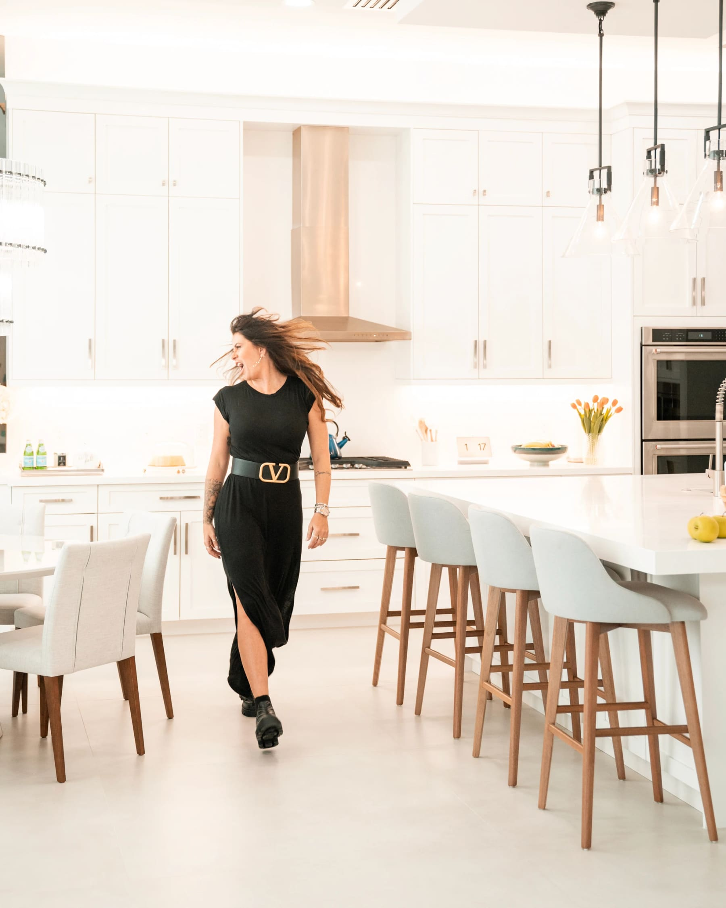

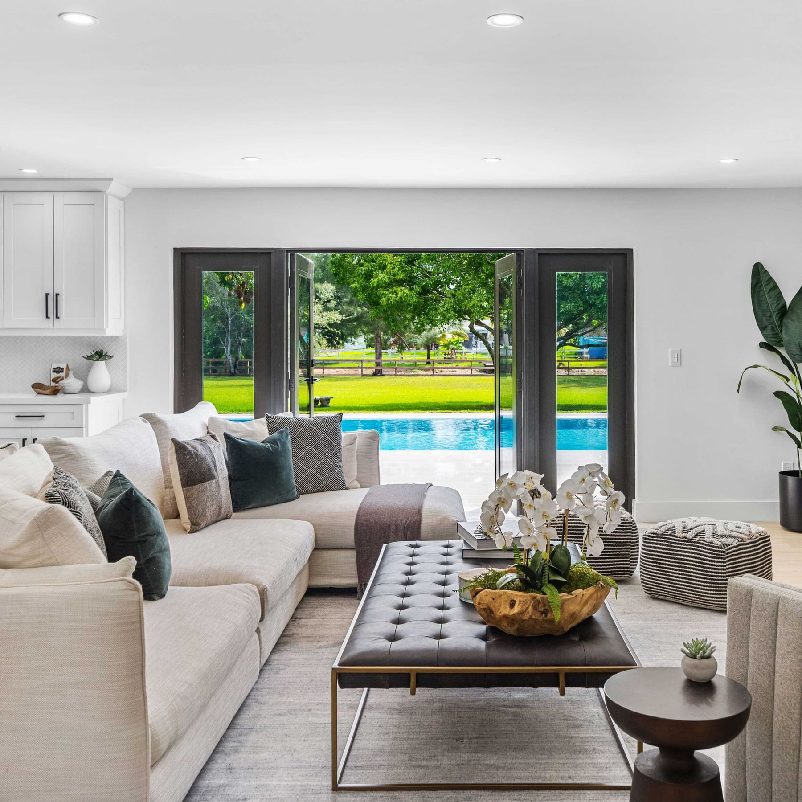

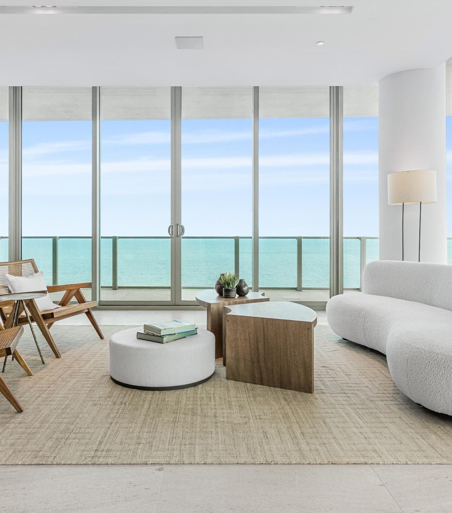

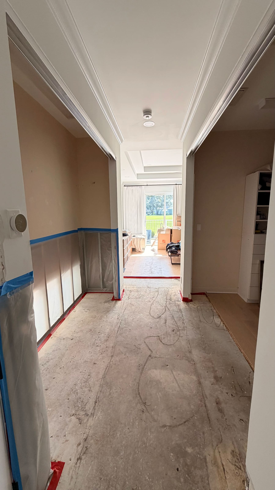

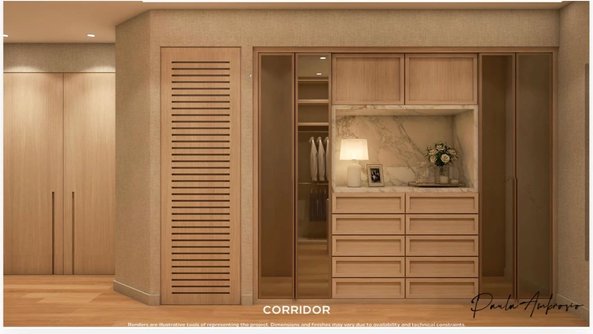

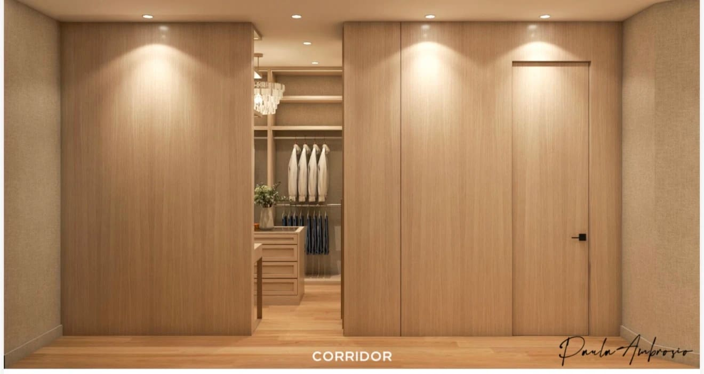

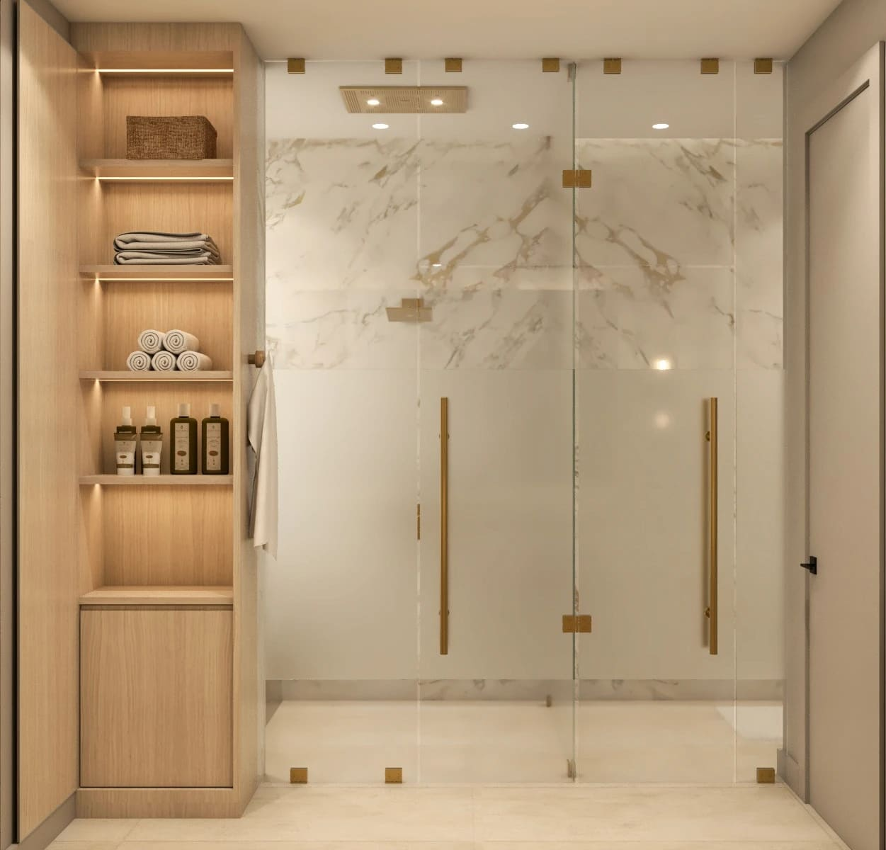

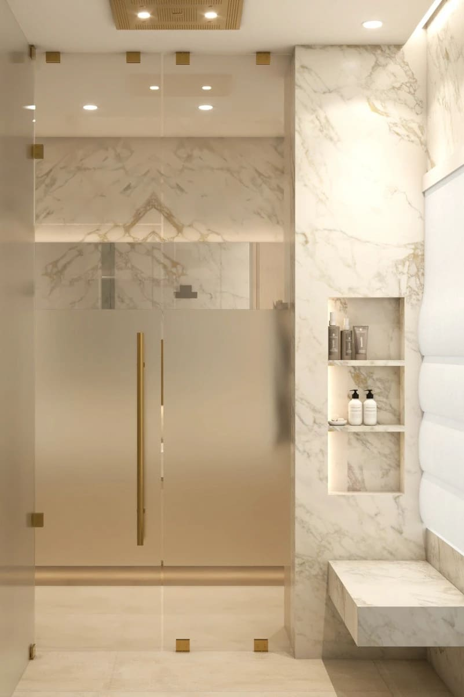

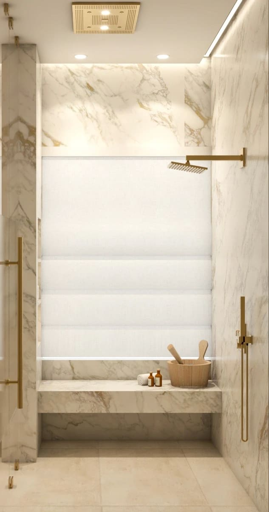

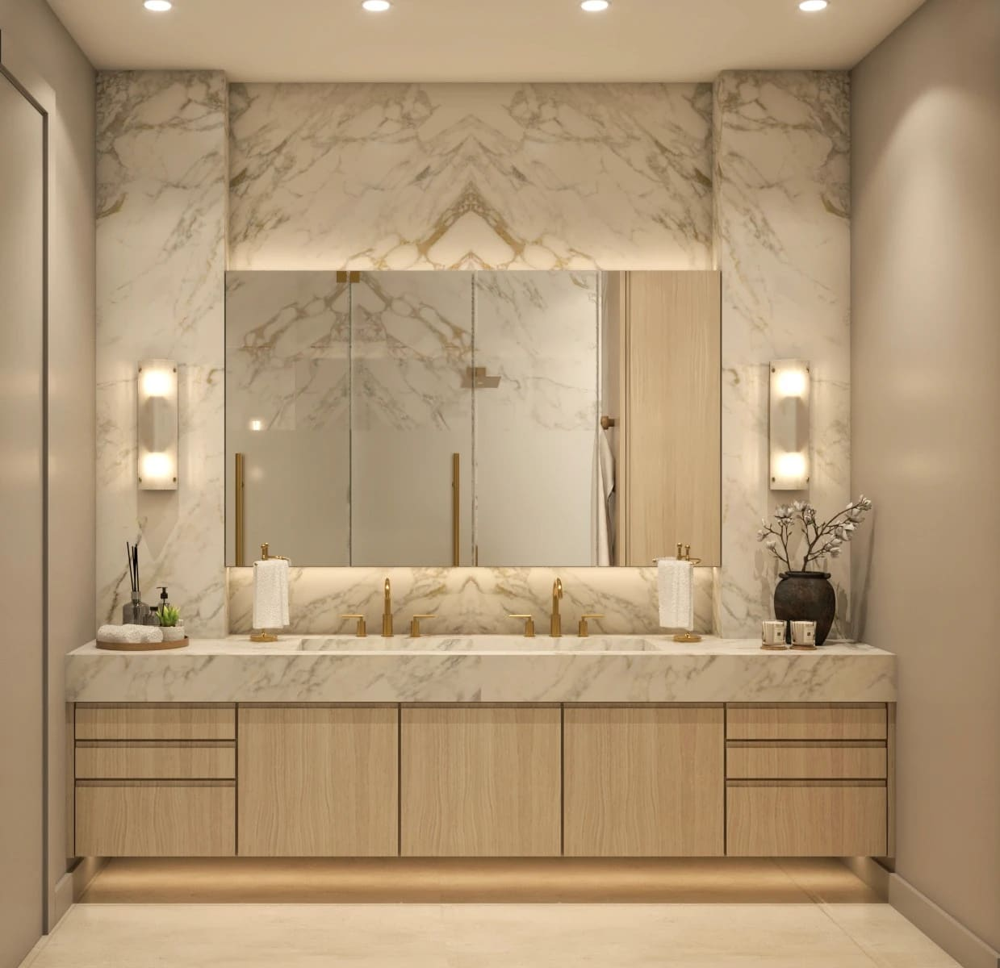

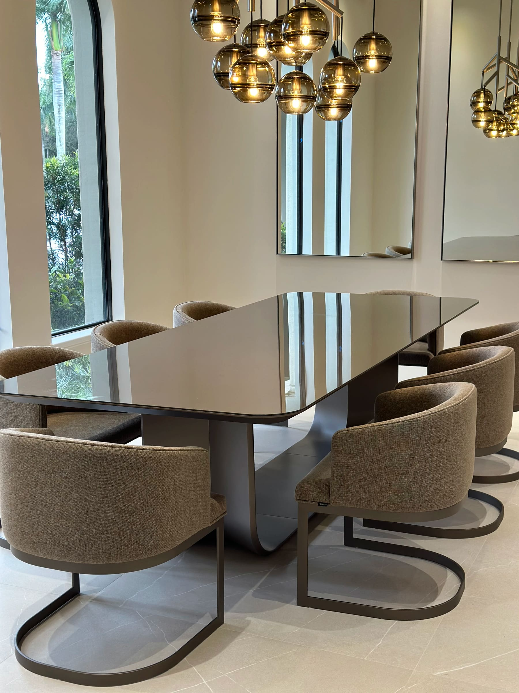

