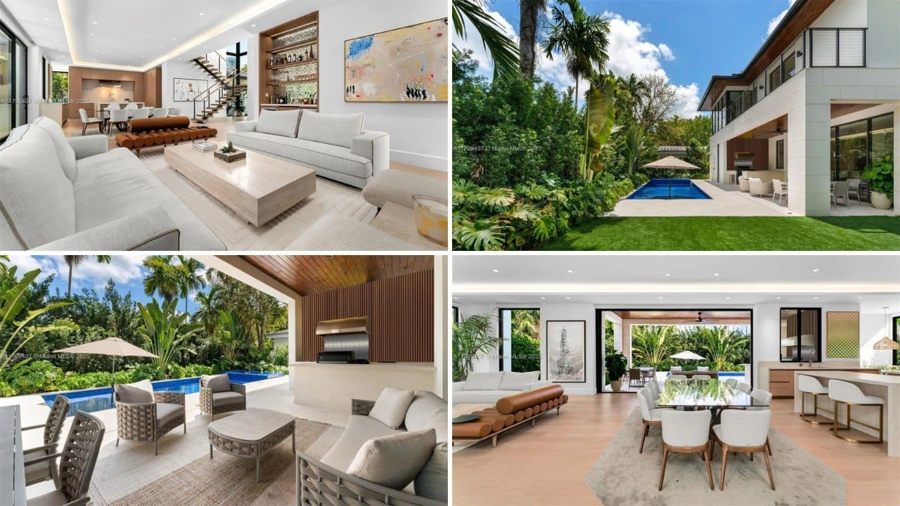
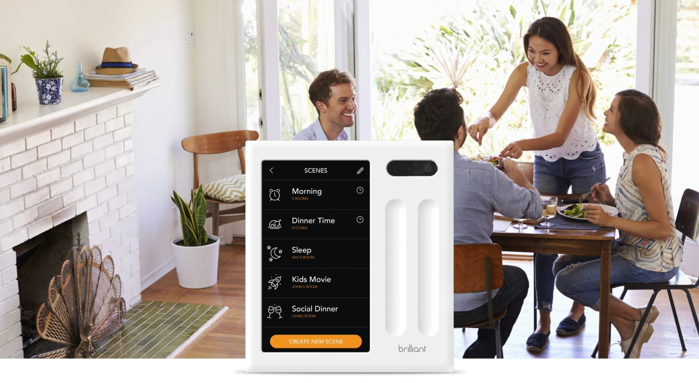
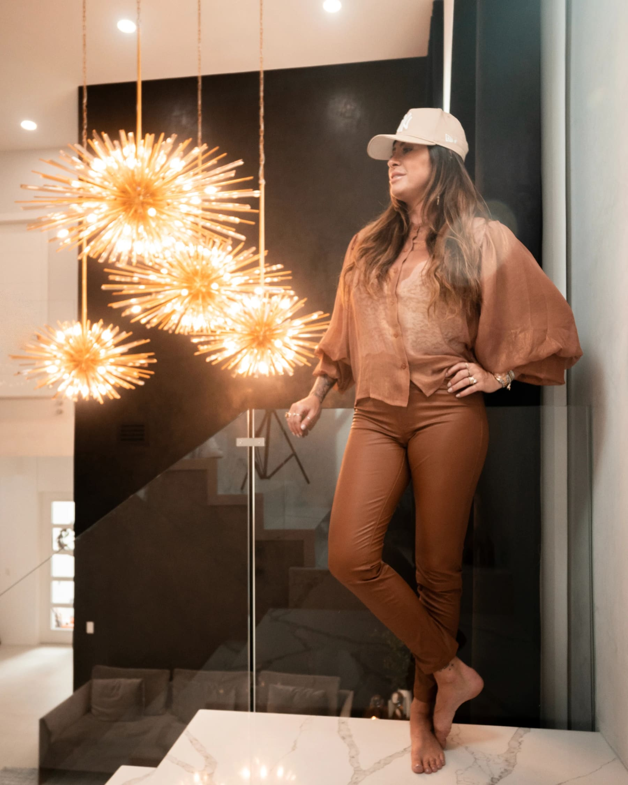
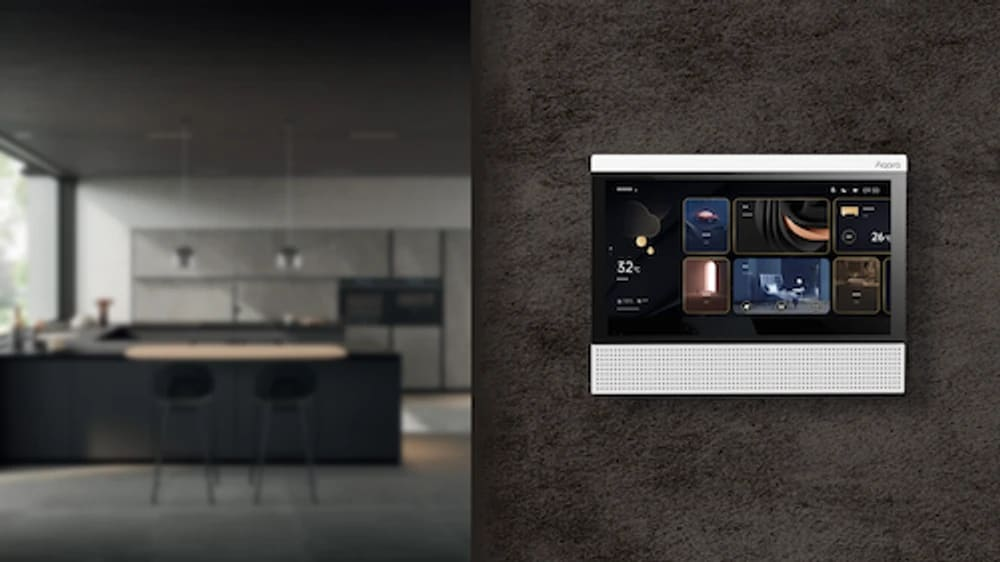
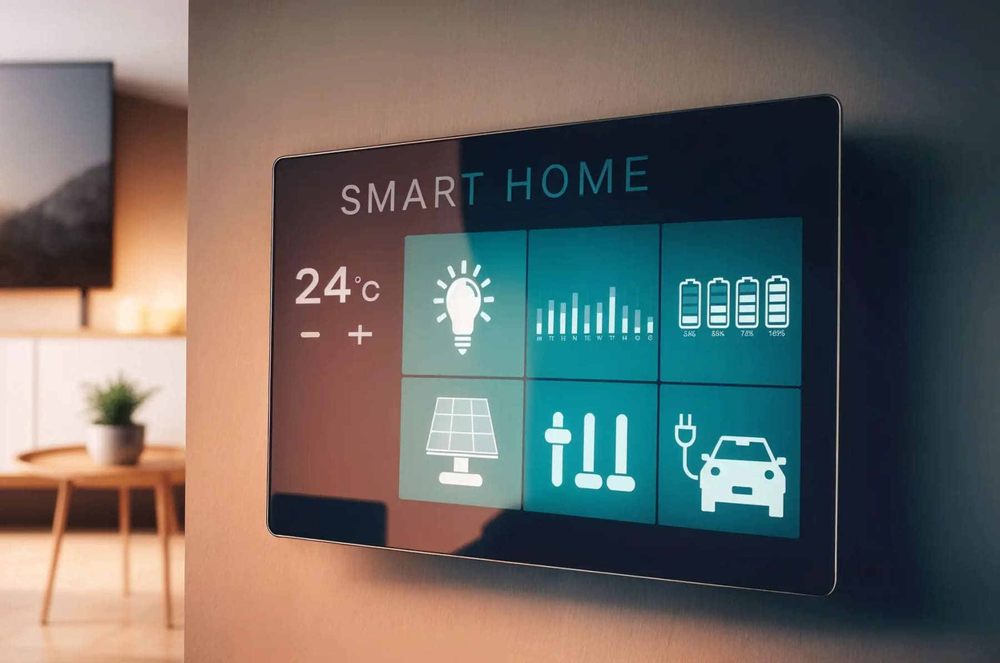
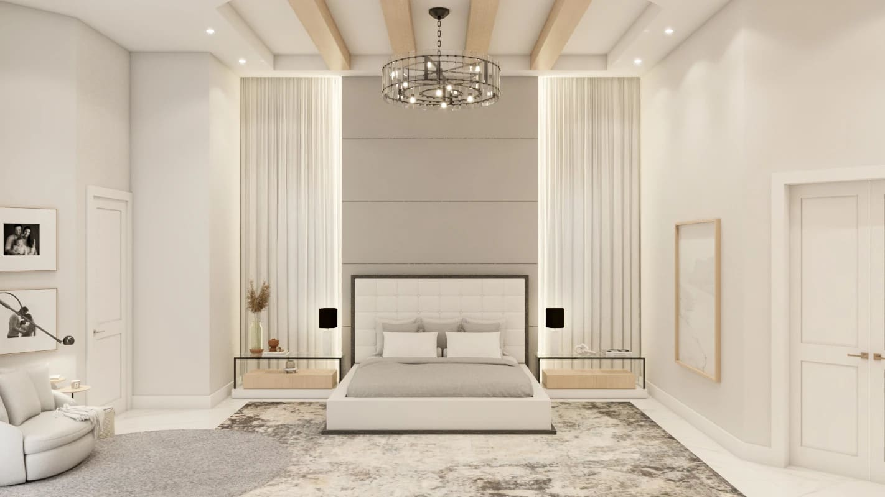
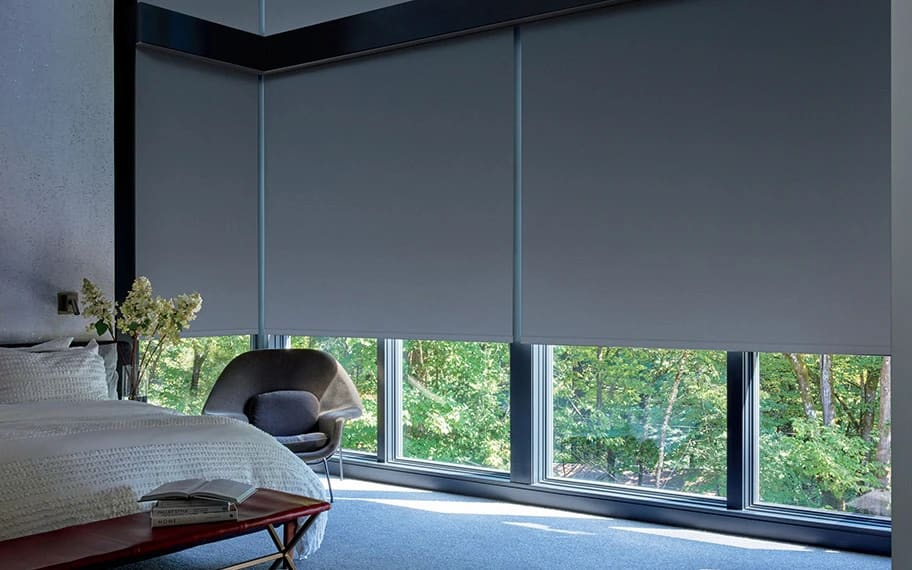
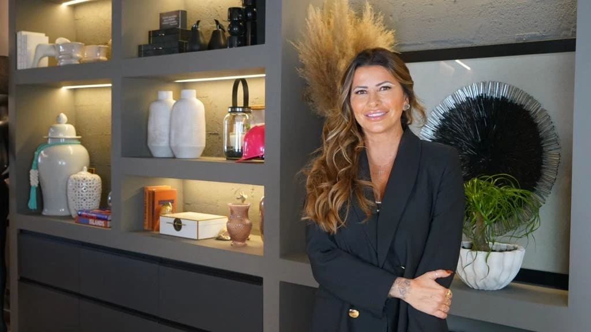
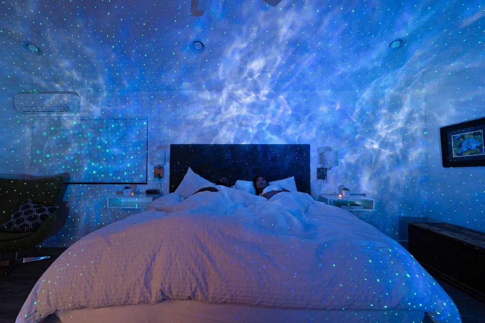

Smart Homes in Miami: Automation, Scenes and the Future of Interior Design

by Paula Ambrosio

@paulaambrosio_

Feb 3, 2026

-

2 min read

Smart Homes in Miami: How Automation and Smart Scenes Enhance Interior Design and Lifestyle

A smart home is no longer about technology alone. In high-end interior design, automation is about comfort, intuition and lifestyle. A truly smart home does not feel technical. It feels natural.

In residential and luxury projects across Miami, Brickell, Miami Beach, Sunny Isles, Bal Harbour, Coral Gables and Boca Raton, automation has become an essential layer of design, one that supports daily life, well-being and long-term property value.

When done right, technology disappears and the experience remains.

## What a Smart Home Really Means Today

A smart home is not about having many gadgets. It is about having systems that work together seamlessly.

Lighting, window treatments, climate control, sound, security and even scent can be automated and synchronized. The goal is simplicity. One touch, one command, one scene.

Interior design plays a critical role in this process. Technology must be integrated into the architecture, not added later as an afterthought.

## Creating Scenes: Design That Responds to Life

Scenes are the soul of smart homes.

A scene is a combination of lighting, shades, temperature and sound designed to support a specific moment. Morning, daytime, evening, entertaining, relaxing, sleeping.

In a Miami home, a “Morning Scene” may gently open shades, warm the lighting and set a calm temperature. An “Evening Scene” may dim lights, close curtains and create a cozy atmosphere. A “Hosting Scene” can activate accent lighting, music and visual highlights.

Scenes allow spaces to adapt emotionally throughout the day.

## Lighting Automation as a Design Tool

Lighting is one of the most powerful elements in automation.

Smart lighting allows designers to control intensity, temperature and mood. Warm light in the evening supports relaxation. Cooler light during the day enhances focus.

In luxury interiors across Brickell and Downtown Miami, layered lighting scenes transform open spaces without changing furniture or finishes. The same room can feel energetic or calm simply by changing the scene.

Lighting automation is design in motion.

## Automated Curtains and Light Control

Window treatments play a major role in smart homes.

Automated curtains and shades respond to time of day, sunlight and privacy needs. They protect interiors from heat and UV exposure while supporting sleep and well-being.

In high-rise buildings in Sunny Isles and Miami Beach, automation allows large windows to function beautifully without manual effort. Curtains become part of the architectural rhythm of the space.

Smart window solutions protect both the home and the people living in it.

## Climate, Sound and Comfort

Smart climate control adapts temperature room by room, improving comfort and energy efficiency. Sound systems can be integrated discreetly, filling spaces with music without visual clutter.

These systems work quietly in the background. The user experiences comfort, not technology.

In Coral Gables, Boca Raton and Bal Harbour homes, this level of integration defines modern luxury.

## Smart Homes and Property Value in Miami

In competitive real estate markets like Miami, smart homes stand out.

Automation increases perceived value, improves marketability and attracts international buyers. Well-integrated technology signals sophistication, planning and future-ready design.

However, poorly planned systems can have the opposite effect. That is why automation must be designed with the same intention as materials, layouts and finishes.

Interior design and smart technology must speak the same language.

## The Role of the Interior Designer in Smart Homes

An interior designer acts as the bridge between lifestyle and technology.

Designers ensure that automation enhances the space without overwhelming it. They coordinate with architects, engineers and automation specialists to create cohesive environments.

The result is a home that feels intuitive, elegant and effortless.

Technology should never lead. Design should.

## Final Thought

A smart home is not defined by what it does, but by how it makes you feel.

When automation is designed as part of the interior, homes become calmer, more responsive and more valuable. Spaces adapt to life instead of forcing life to adapt to them.

That is the future of interior design in Miami.

## 📸 Suggested Photo Direction (High-End Editorial)

Luxury smart homes should look serene, not technical.

Paula Ambrosio.

### 

