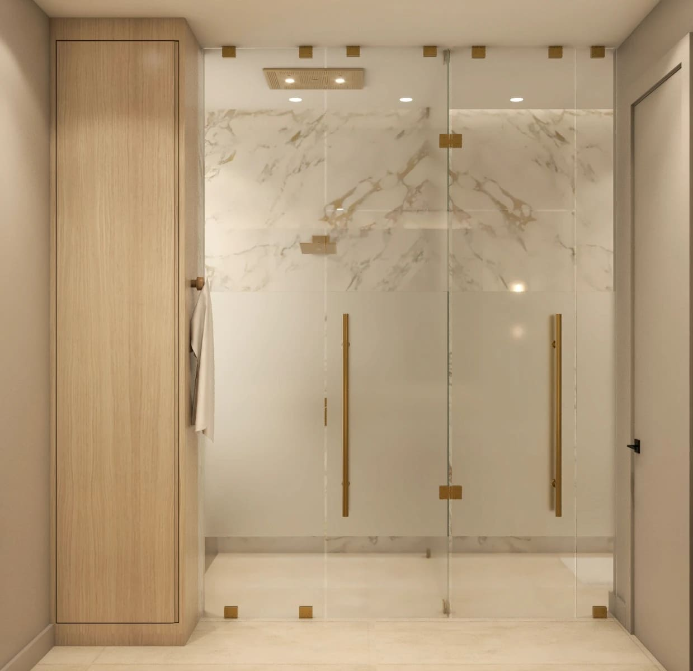
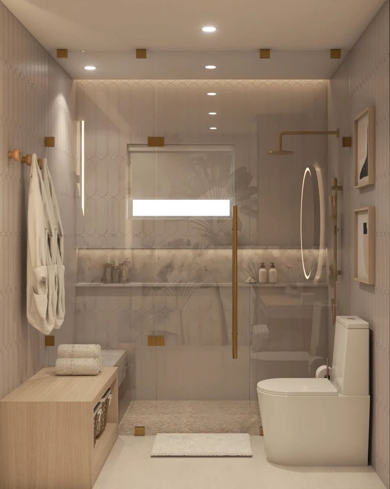
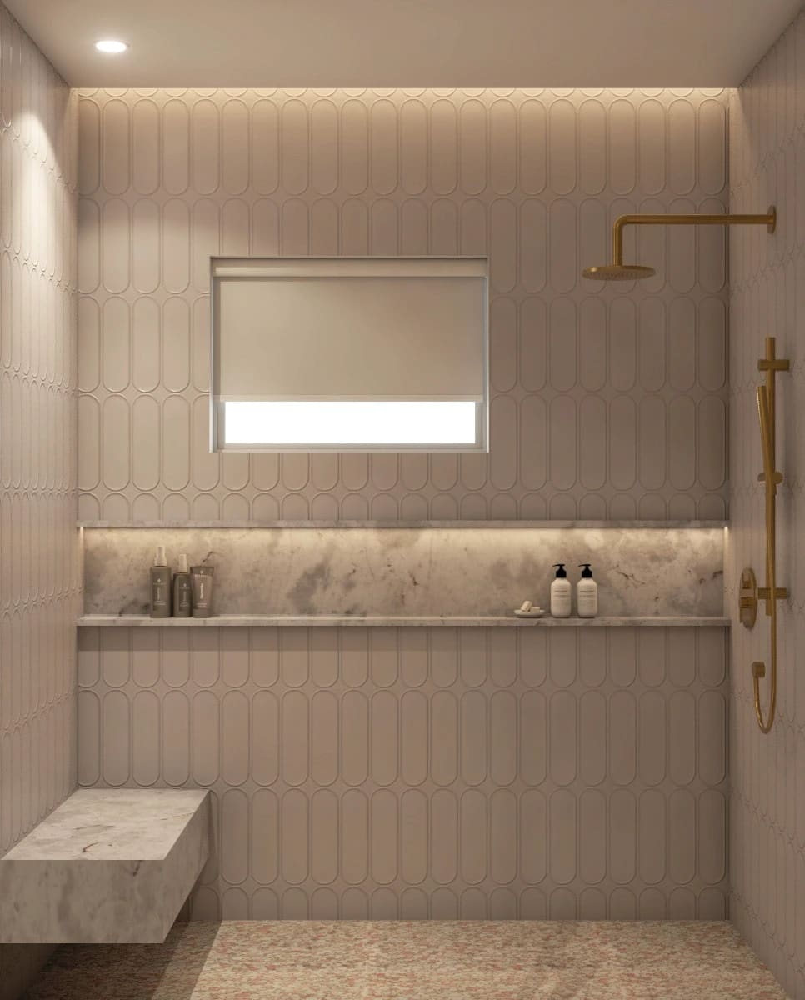
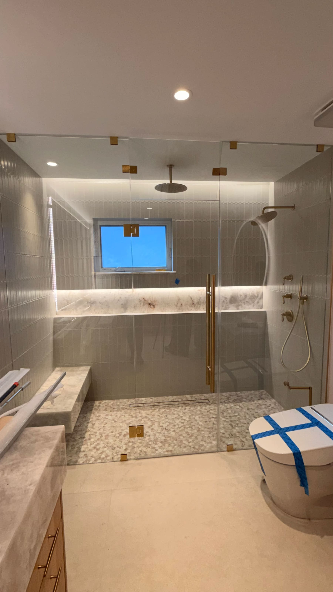
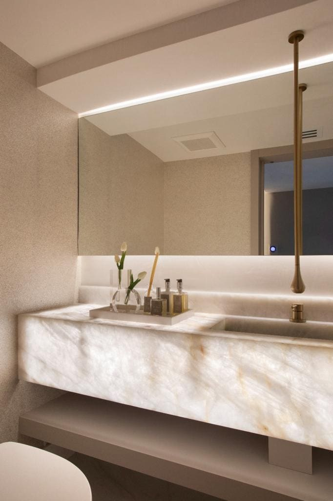
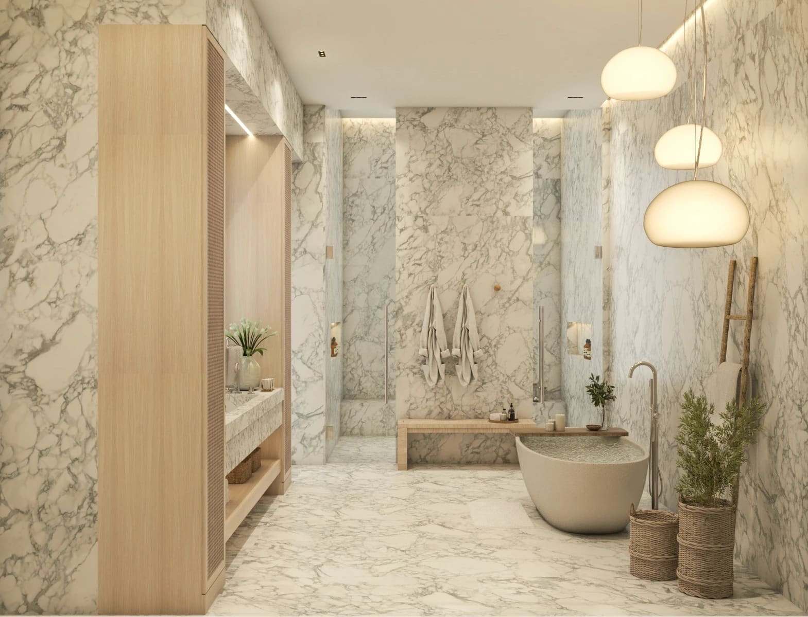
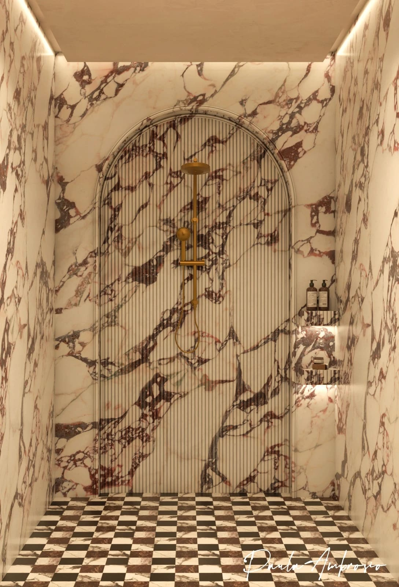
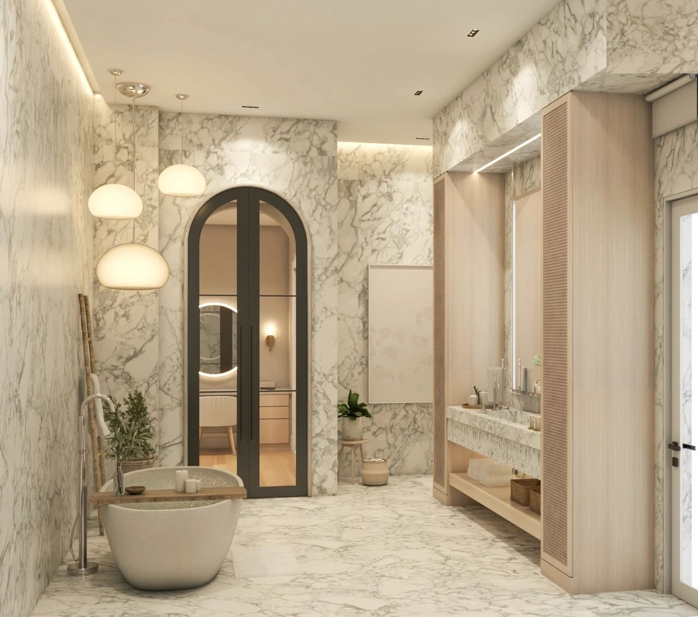
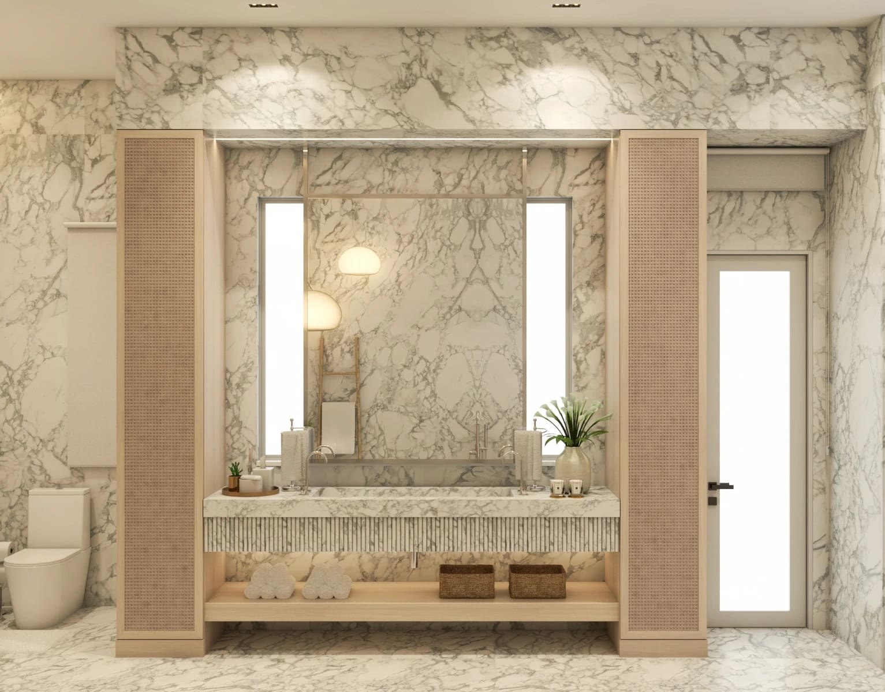

Bathrooms as Private Spas in Miami: How Wellness Design Is Redefining Luxury Homes

Bathrooms are no longer just functional spaces. In high end interior design, they have become private wellness retreats. Across Miami, Brickell, Miami Beach, Sunny Isles, Bal Harbour, Coral Gables and Boca Raton, more homeowners are choosing to transform traditional bathrooms into true spa experiences.

This shift is intentional. It reflects a new understanding of luxury: less excess, more well-being.

## Why Bathtubs Are Being Replaced by Spa Experiences

For years, bathtubs were seen as a symbol of luxury. Today, many of them are rarely used. What clients truly want now is comfort, functionality and daily ritual.

That is why I have been removing many bathtubs and replacing them with spacious walk-in showers, steam showers and integrated sauna solutions. These elements are used every day. They support relaxation, circulation, recovery and mental balance.

A spa bathroom is not about one dramatic piece. It is about how the space makes you feel every morning and every night.

## Showers as the New Luxury Statement

A luxury shower is immersive.

Large format slabs, minimal grout lines, built-in niches, benches and multiple water experiences transform the act of showering into a ritual. Rain showers, handhelds and body sprays create a sensory experience without visual overload.

In Miami homes, especially in Brickell and Downtown Miami, showers often replace bathtubs completely. In Coral Gables and Boca Raton, they coexist thoughtfully when space allows.

The focus is always flow, comfort and calm.

## Saunas Inside the Bathroom: Wellness at Home

Integrating a sauna into the bathroom has become one of the most requested wellness features.

Infrared or traditional saunas support detox, muscle recovery and relaxation. When designed correctly, they blend seamlessly into the architecture of the bathroom.

However, this requires technical knowledge. Ventilation, insulation and material selection are essential. A sauna should feel like part of the spa, not an added box.

Wellness design must be intentional to be successful.

## Natural Stone and Matte Finishes Only

My material philosophy for bathrooms is clear. Natural stone, matte finishes and timeless textures.

Glossy surfaces reflect light aggressively and create visual noise. Bathrooms should calm the senses, not stimulate them. Honed or leathered stone finishes feel softer and more sophisticated.

Natural stone brings grounding energy. Each slab is unique and authentic. It connects the body to nature, which is exactly what a spa environment should do.

Luxury is quiet.

## Wood in Bathrooms: Use With Intelligence

I love wood. But wood in bathrooms must be used wisely.

Solid wood or untreated panels in wet areas can swell, warp and lose integrity over time. That is why I never apply wood paneling indiscriminately in bathrooms.

Instead, I use engineered wood, wood look materials, treated veneers or wood accents placed strategically away from direct moisture. When detailed correctly, wood adds warmth without compromising durability.

Design is knowing not just what to use, but where and how to use it.

## Lighting That Supports Relaxation

Lighting defines the spa experience.

Bathrooms need layered lighting. Soft ambient light, indirect LED accents and focused task lighting where needed. Harsh ceiling lights destroy atmosphere.

In spa bathrooms across Sunny Isles and Miami Beach, indirect lighting highlights stone textures and creates a sense of calm. Dimmable systems allow the space to adapt from morning energy to evening relaxation.

Light should embrace, not invade.

## The Emotional Impact of a Spa Bathroom

A spa inspired bathroom changes daily life.

It slows you down. It creates moments of pause. It turns routine into ritual. This emotional value is what truly defines luxury today.

From a real estate perspective, spa bathrooms also increase property value. Buyers respond emotionally to spaces that feel restorative and intentional.

Wellness sells.

## Final Thought

Bathrooms are no longer secondary spaces. They are sanctuaries.

When designed with natural materials, thoughtful lighting and wellness in mind, they become the most personal room in the home.

In Miami interior design, the future of luxury lives in calm, balance and well-being.

Paula Ambrosio,

Follow me: @paulaambrosio_

