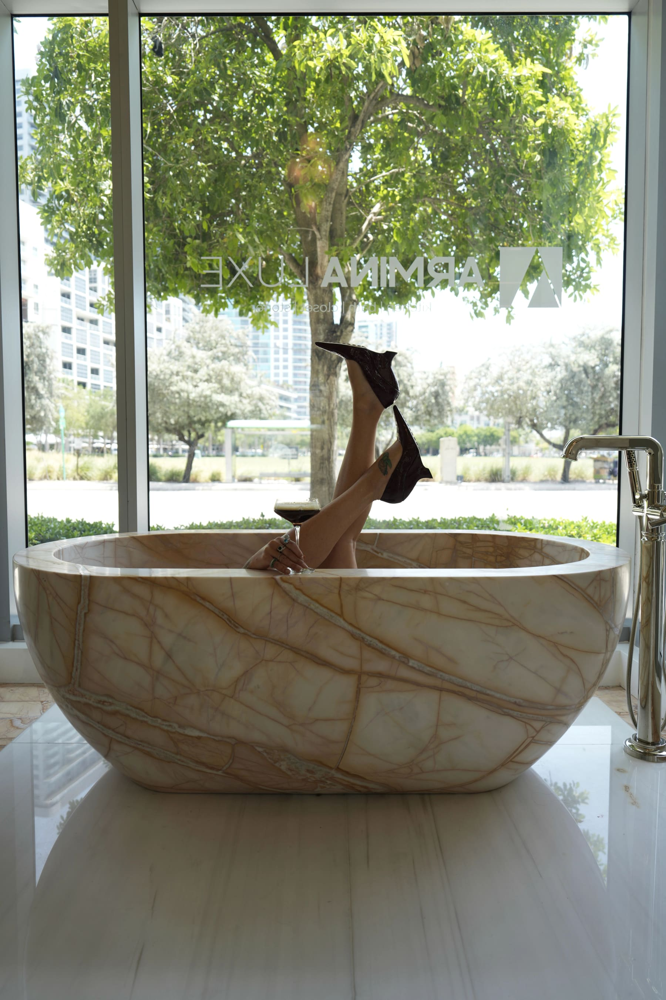
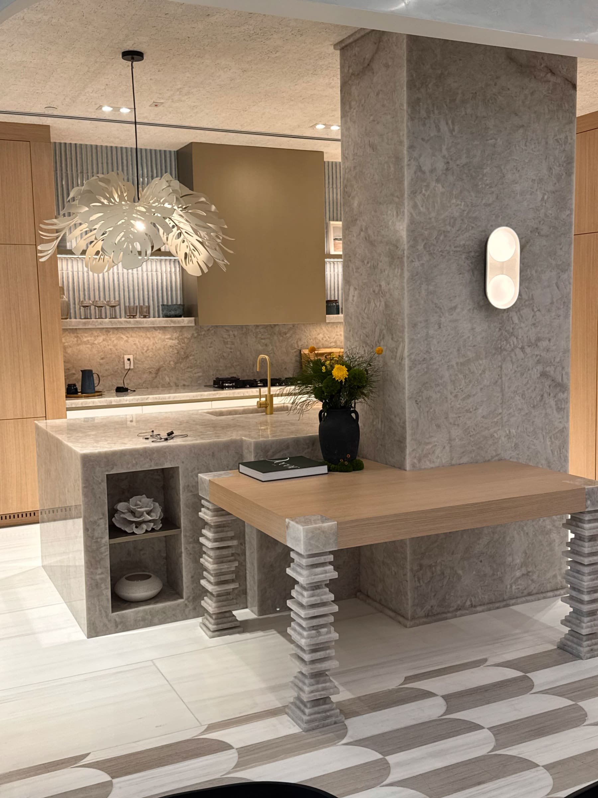
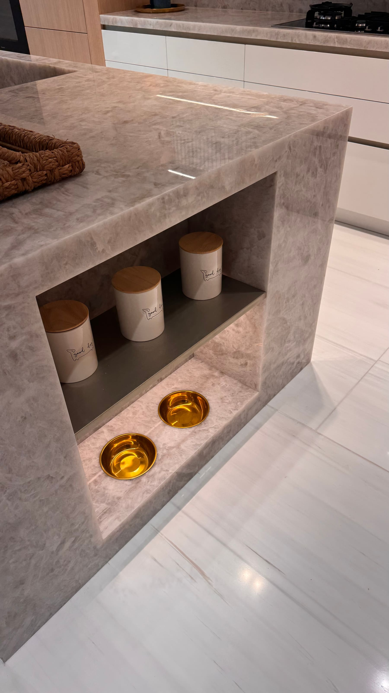
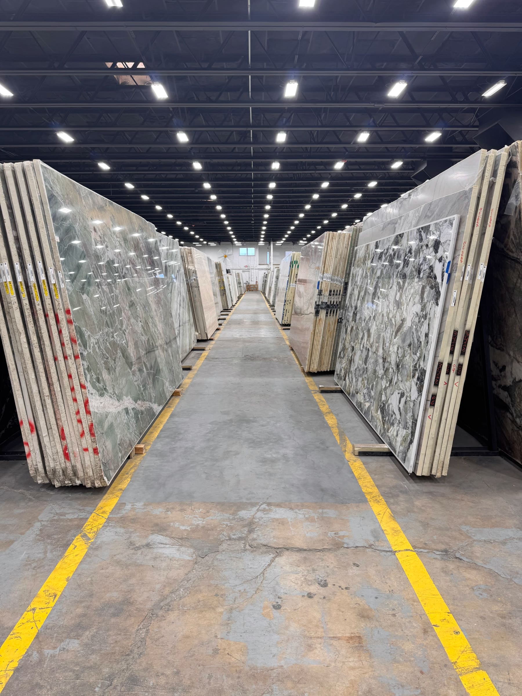
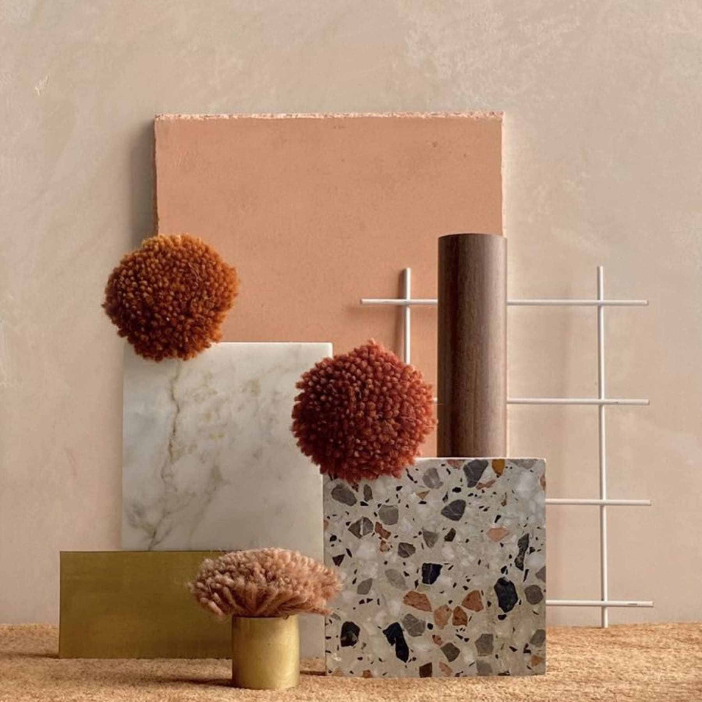
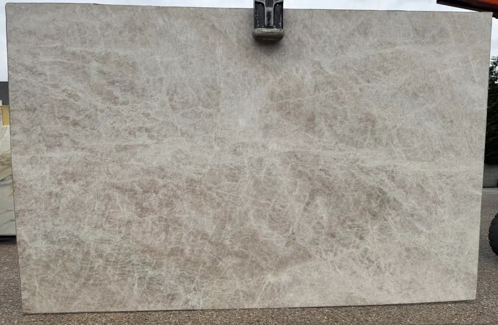
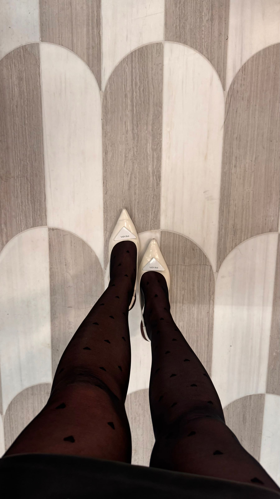

Timeless Stone Selection in Miami Interior Design

by Paula Ambrosio

@paulaambrosio_

Jan 28, 2026

-

2 min read

Timeless Stone Selection in Miami Interior Design: How to Use Natural Stone with Elegance and Intention

Choosing stone for an interior design project is never just about beauty. It is about understanding time, context and place. In cities like Miami, Brickell, Miami Beach and Sunny Isles, stone becomes part of the architecture, the lifestyle and the experience of the space.

As an interior designer working across Miami, Surfside, Coral Gables, Bal Harbour, Boca Raton, Parkland and West Palm Beach, my approach to stone selection is always guided by one principle: timelessness.

Trends come and go. Natural stone, when used correctly, lasts.

## Why Timeless Stones Matter in Miami Interiors

Miami is a city of light, heat and movement. Materials must age well, perform well and still feel elegant years after installation. This is why timeless, natural stones are always my first choice.

Classic stones bring calm, sophistication and longevity to interiors, whether the project is a luxury condo in Brickell, a beachfront residence in Miami Beach or a private home in Boca Raton or Parkland.

Stone should never overpower a space. It should enhance it quietly.

## Natural Stone as a Luxury Statement

Natural stone has a soul. Each slab is unique, with movement, veins and texture that cannot be replicated. This individuality is what makes high end interiors feel personal and refined.

In areas like Sunny Isles, Bal Harbour and Surfside, where ocean views and natural light dominate, stone works as a grounding element. It connects the interior to nature while maintaining elegance.

However, natural stone requires knowledge. Not every stone belongs in every space.

## Taj Mahal Quartzite: A Personal Favorite

If I had to name one stone that represents timeless elegance, it would be Taj Mahal quartzite with a leather finish.

Its warm tone, subtle movement and soft texture make it incredibly versatile. Taj Mahal works beautifully in kitchens, bathrooms, fireplaces and feature walls. It brings class without being loud.

In Miami condos, especially in Brickell and Downtown Miami, Taj Mahal adds warmth to modern architecture. In Coral Gables and Boca Raton, it complements more classic interiors effortlessly.

The leather finish adds depth and sophistication, making the stone feel lived in and luxurious at the same time.

## Mixing Stones in the Same Space

One of the most common questions I receive is whether it is possible to use more than one type of stone in the same environment. The answer is yes, but only when done intentionally.

In a single space, such as a kitchen or bathroom, it is possible to work with two or even three different stones. The key is hierarchy.

One stone should lead. The others should support.

For example, Taj Mahal can be the primary stone on countertops or islands, while a softer limestone or a subtle marble can appear on backsplashes or walls. In larger homes in West Palm Beach or Parkland, mixing stones can create depth and architectural interest.

What matters most is harmony in tone, scale and finish.

## Understanding Where Each Stone Belongs

Stone selection must always consider function.

Some stones are ideal for countertops but not for floors. Others work beautifully on walls but require more maintenance in wet areas. In Miami Beach and Sunny Isles, humidity and salt air also influence these decisions.

A professional interior designer understands where to place each stone to ensure durability and longevity without compromising design.

This knowledge is what transforms stone from a decorative element into a design foundation.

## Stone as Part of the Design Layers

Stone is never a standalone decision. It is part of a larger design language.

It must work with wood tones, wall finishes, lighting and furniture. In Brickell high rises, stone often balances glass and steel. In Coral Gables homes, it complements architectural details and warmer materials.

Layering stone correctly adds richness and sophistication to the space without overwhelming it.

## Why Stone Selection Defines Luxury Interior Design in Miami

In cities like Miami, Bal Harbour, Boca Raton and West Palm Beach, luxury is defined by quality, not excess. Timeless stone choices communicate refinement, intention and confidence.

Stone is one of the first things people notice and one of the last things they forget.

Choosing it wisely is essential.

## Final Thought

Natural stone is an investment in beauty and longevity. When selected with knowledge and intention, it becomes timeless.

In Miami interior design, stone is not just a material. It is part of the story of the space.

Paula Ambrosio

