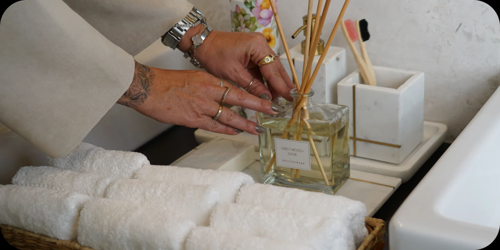

Designing a home or commercial space is an exciting journey, but it can quickly become overwhelming when you have to manage multiple vendors, budgets, and timelines. That’s why turnkey interior design services have become the ultimate solution for homeowners and businesses looking for convenience and quality in one package.

### What Is a Turnkey Interior Design Service?

A turnkey service means everything is handled for you from start to finish: concept development, space planning, material sourcing, furniture selection, project management, and final installation.

### Key Advantages of Turnkey Interior Design

- **Time-saving and stress-free:** No need to coordinate different professionals; the designer takes care of everything.
- **Budget control:** Costs are defined upfront, avoiding unpleasant surprises.
- **Cohesive style:** Every element supports the design vision.
- **Quality execution:** An experienced team manages the details through installation.

### Who Can Benefit from Turnkey Services?

- Busy professionals
- Luxury homeowners
- Investors developing properties for resale or rental

If you’re looking for a hassle-free, stylish, and personalized approach, a turnkey interior design service is the smartest choice. With our team, you only need to sit back and enjoy the transformation.

Contact us to discover how our turnkey solutions can bring your space to life.

