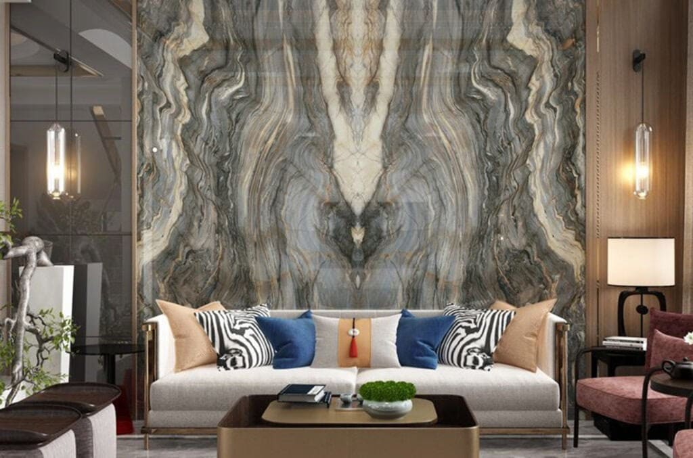
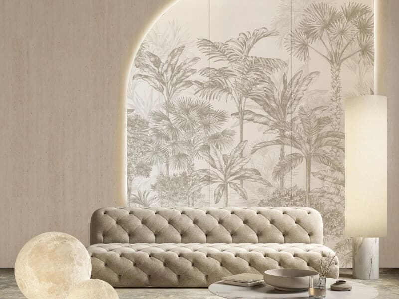

The Art of Layered Walls in Miami Interior Design

by Paula Ambrosio

@paulaambrosio_

Jan 24, 2026

-

1 min read

## Walls That Speak: Wall Coverings, Colors, Lighting and the Art of Layering Walls in Miami

Walls are not just boundaries. In high end interior design, walls are one of the most powerful storytelling elements in a space. They define mood, scale, warmth and personality. In Miami interiors, where natural light is abundant, walls must be designed with even more intention.

A well designed wall is never flat. It is built in layers, just like the rest of the space.

## Wall Coverings as a Design Statement

Wall coverings have evolved far beyond traditional wallpaper. Today, they are a key element in luxury interiors.

Textured wallpapers, natural fibers, fabric wall panels and custom wall finishes add depth and refinement. They soften large surfaces and create visual interest without overwhelming the space. In Miami homes, wall coverings are often used to balance modern architecture with warmth and tactility.

The goal is not to cover every wall, but to choose the right wall. Accent walls in living rooms, bedrooms, dining areas or foyers become focal points when treated with intention.

## Choosing the Right Wall Colors

Color on walls sets the emotional tone of a home. In Miami, lighter and warmer tones are often used as a base to enhance natural light and create a sense of openness. Soft whites, warm beiges, sand tones and muted greys provide a timeless foundation.

That does not mean walls should be boring. Depth comes from undertones and finishes. A warm white with a subtle texture feels completely different from a flat painted surface. Accent colors can be introduced through one feature wall, lacquered panels or textured finishes.

The most important rule is balance. Walls should support the design, not compete with it.

## The Architectural Layer of the Wall

Before wallpaper or paint is even considered, the architectural layer of the wall must be addressed.

This includes paneling, moldings, niches, millwork, hidden doors and built ins. These elements give structure and rhythm to the wall and elevate the entire space. Even minimal interiors benefit from subtle architectural details.

A well designed wall starts with proportion. Vertical lines can make ceilings feel higher. Horizontal elements can visually widen a room. These decisions are always intentional in professional interior design.

## Lighting as a Wall Layer

Lighting is one of the most overlooked layers of wall design, yet it is one of the most impactful.

Wall sconces, picture lights, indirect LED strips and architectural lighting transform how walls are perceived. Light reveals texture, enhances materials and creates atmosphere. Without proper lighting, even the most beautiful wall finish can fall flat.

In luxury interiors, lighting is designed to wash walls gently, highlight artwork and create depth. It is never harsh. It is always integrated.

## Styling Walls with Art and Decor

The final layer of a wall is styling. Art, mirrors and sculptural elements bring personality and soul to the space.

Art placement is just as important as art selection. Scale, spacing and alignment matter. A single oversized piece can be more powerful than multiple small ones. Mirrors can reflect light and expand the space when positioned correctly.

This layer should feel curated, not cluttered. Walls need breathing room.

## Why Layered Walls Elevate Interior Design

Layered walls create rooms that feel finished and intentional. They guide the eye and add quiet sophistication. In Miami, where architecture often leans modern and clean, wall layering is what adds warmth and character.

A professional interior designer understands how to combine wall coverings, color, architecture, lighting and styling into one cohesive composition.

That is the difference between a wall that exists and a wall that speaks.

## Final Thought

Walls are not a background. They are part of the design narrative.

When walls are designed in layers, they support the entire space and elevate the experience of living in it. That is the essence of refined interior design.

