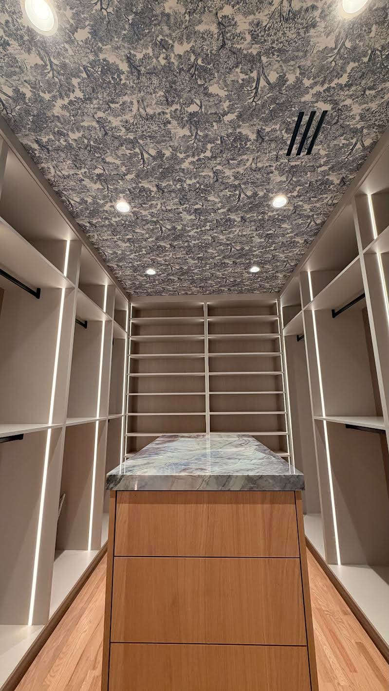
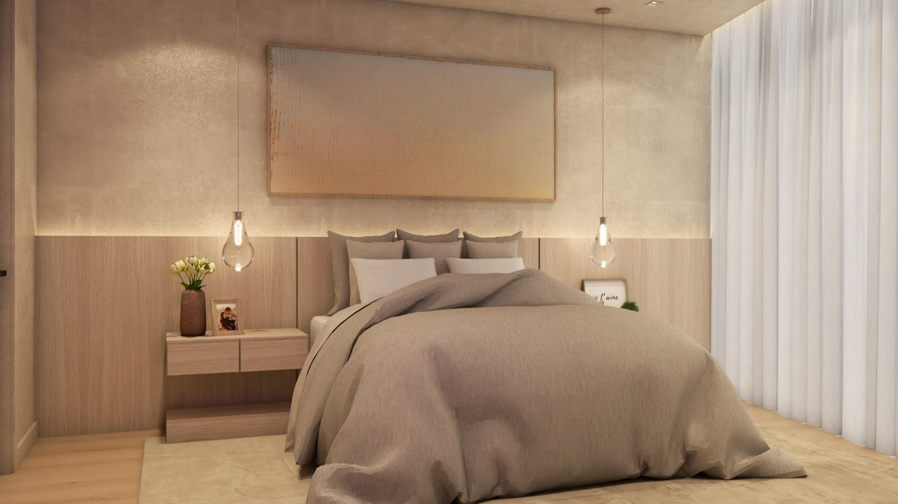
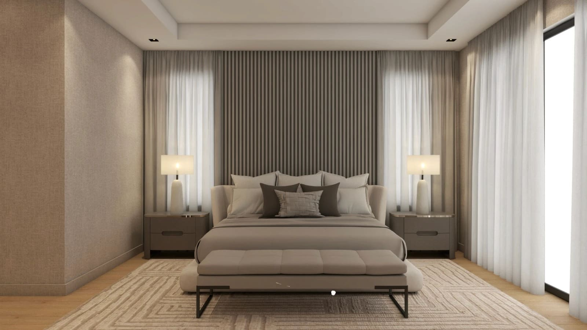
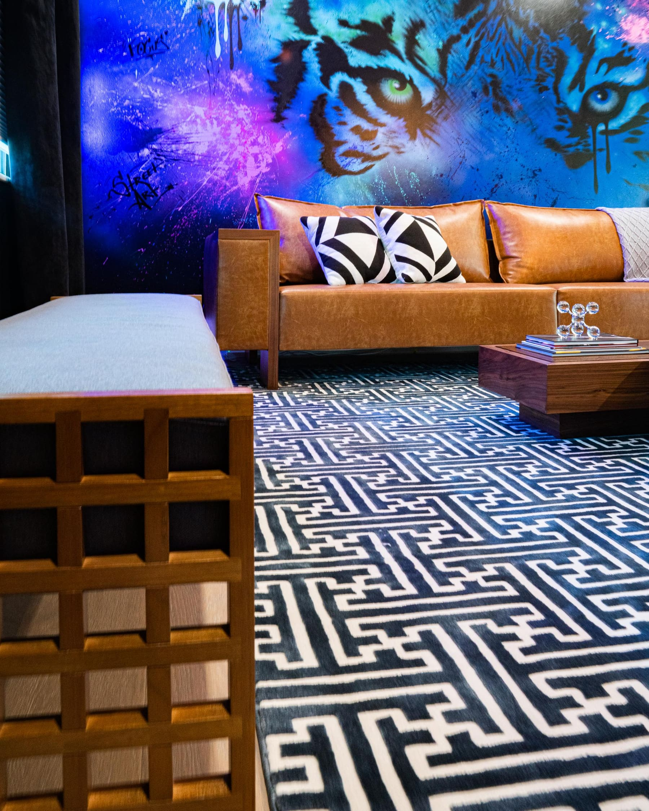
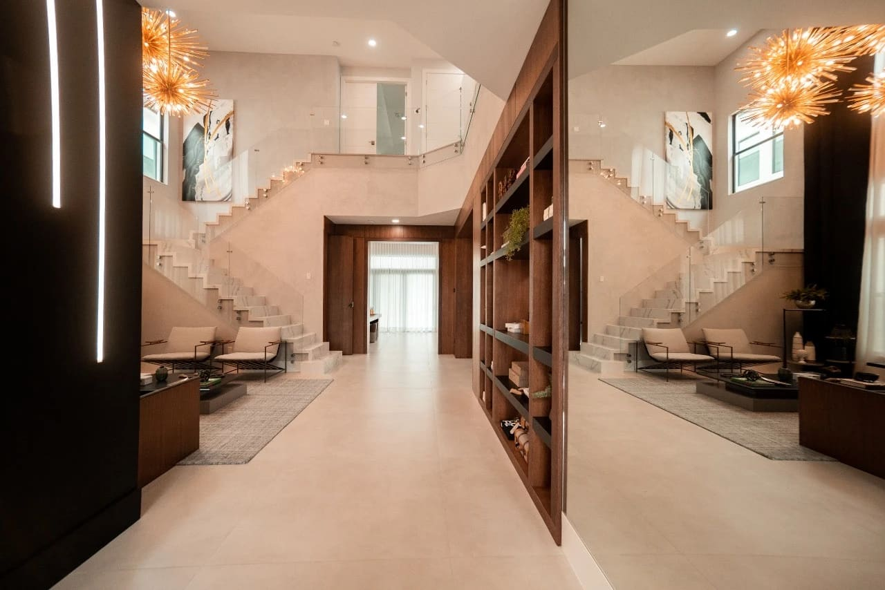

Wall Layers in Interior Design: How Texture, Light and Art Tell the Story of a Home in Miami

Walls are never just walls. In high-end interior design, they are one of the most powerful storytelling tools in a space. Walls hold texture, light, color, art and memory. They create volume, warmth and identity. They are where a home begins to speak.

In interior design projects across Miami, Brickell, Miami Beach, Sunny Isles Beach and Coral Gables, walls are no longer treated as flat backgrounds. They are designed in layers, intentionally and emotionally.

That is what enhances an interior from beautiful to unforgettable.

## Walls as Layers of Texture and Volume

Every sophisticated interior starts with the understanding that walls create perception. Through layers, walls gain depth and movement. They stop being static and become architectural.

Textures add softness and dimension. Volume gives rhythm. Together, they create a sense of comfort and presence. This is especially important in Miami interiors, where architecture is often clean and modern. Layered walls bring balance and warmth.

A well-designed wall invites you in without saying a word.

## Wallpaper as an Architectural Element

Wallpaper today goes far beyond patterns. It has become an architectural layer.

Textured wallpapers, natural fiber wall coverings, fabric panels and subtle metallic finishes allow walls to feel tactile and refined. Used correctly, wallpaper adds depth without overwhelming the space.

In luxury residences in Miami Beach and Sunny Isles, wallpaper is often used to soften large walls and reflect light beautifully. In Brickell condos, it introduces warmth and personality into modern, urban spaces.

Wallpaper should never compete with the design. It should support it.

## Color as an Emotional Layer

Color on walls defines mood. In Miami interiors, lighter and warmer tones are often used as a base to enhance natural light and create a sense of openness.

Soft whites, sand tones, warm greiges and muted neutrals allow other layers to shine. Accent colors can appear through one statement wall, lacquered finishes or textured applications.

Color should feel intentional and timeless. Walls are meant to hold the space together, not dominate it.

## Lighting: The Invisible Layer That Transforms Walls

Lighting is one of the most powerful wall layers, yet one of the most underestimated.

Wall sconces, indirect LED lighting, picture lights and architectural lighting reveal texture and create atmosphere. Light changes how we perceive materials, colors and art.

A textured wall without lighting loses its impact. With the right lighting, it becomes a focal point. In high-end interiors across Miami and Coral Gables, lighting is designed to wash walls gently and highlight layers with elegance.

Lighting tells walls when to whisper and when to shine.

## Wood, Millwork and Wall Architecture

Wood panels and custom millwork add another essential layer to walls. They bring warmth, structure and identity.

Built-in wood elements create rhythm and proportion. Fluted panels add movement. Flat panels create calm. Millwork transforms walls into functional architecture.

In Miami interiors, wood often balances glass, stone and metal. In Coral Gables homes, it complements architectural heritage. In Brickell, it humanizes modern spaces.

Millwork is where walls become part of the architecture.

## Art, Mirrors and Personal Storytelling

Art and mirrors are the final emotional layer of a wall.

Artwork brings narrative and soul. It reflects the homeowner’s journey, taste and identity. Mirrors expand space and amplify light when placed intentionally.

This layer should feel curated, never cluttered. A single powerful piece can be more impactful than many small ones. Walls need space to breathe.

In luxury interior design, restraint is part of elegance.

## Why Layered Walls Define High-End Interior Design

Layered walls create spaces that feel complete and intentional. They bring comfort, sophistication and storytelling into a home.

In Miami interior design, where lifestyle, light and architecture intersect, walls are not a backdrop. They are a central design element.

When walls are designed in layers, a house becomes a home.

## Final Thought

Walls hold texture, light and memory. They give depth to spaces and meaning to design.

When thoughtfully layered, walls do more than define rooms. They tell stories, create emotion and enhance everyday living.

That is the true power of wall design in interior design.

Paula Ambrosio.

