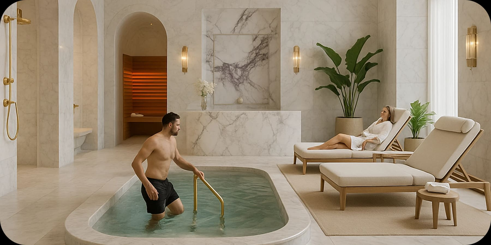
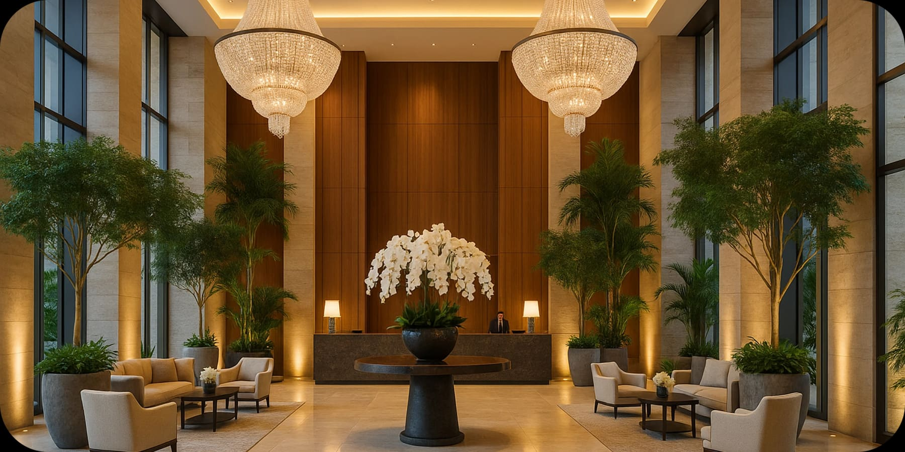
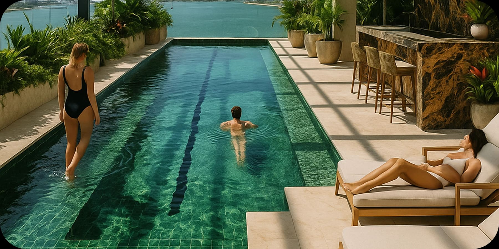

Wellness as Luxury: The New Hospitality Trend in Miami

by Paula Ambrosio

@paulaambrosio_

Sep 1, 2025

-

1 min read

Miami is positioning itself as a global hub for the wellness lifestyle, where luxury hotels and residences are integrating infrared saunas, ice baths, and meditation areas into their spaces.

Interior design for hospitality is no longer just about aesthetics. It is about creating environments that promote physical health, emotional balance, and quality of life.

Today, Miami resorts and luxury developments are embracing natural materials such as Carrara marble, sustainable wood, and brush gold finishes, blending sophistication with comfort in a way that enhances the guest experience.

