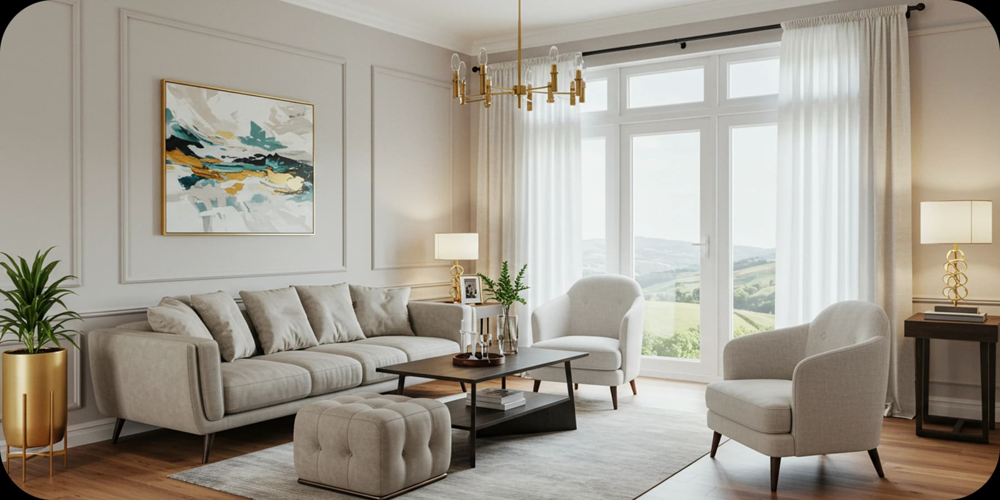
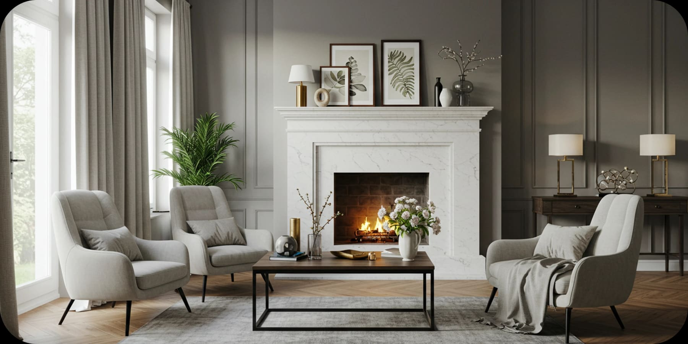
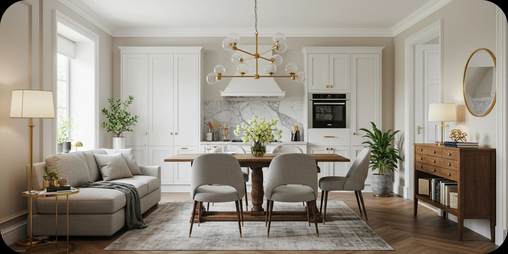

by Paula Ambrosio

@paulaambrosio_

-

4 min read

### How Interior Design Increases Property Value and Speed of Sale

Did you know that homes with high-end interior design sell 30% faster than those without professional decor? A well-designed space doesn’t just look beautiful,it influences buyer emotions, enhances perceived value, and maximizes your return on investment.

## The Science Behind Interior Design and Faster Sales

✔ First Impressions Matter: Buyers decide within seconds if they connect with a home. A stunning interior instantly captivates.

✔ Emotional Connection: Staged and tastefully decorated homes help buyers visualize themselves living in the space.

✔ Higher Perceived Value: A home with elegant furniture, modern finishes, and cohesive styling appears more luxurious and worth a premium price.

## Key Elements That Sell Homes Faster:

- Neutral Yet Stylish Color Palettes: Timeless shades create a welcoming atmosphere.
- Thoughtfully Designed Layouts: Smart furniture placement enhances space and flow.
- Quality Furnishings & Décor: Details like lighting, artwork, and textiles enhance appeal.

## Investors, Take Note!

🏡 A well-styled home doesn’t just sell faster,it sells for more! Don’t leave money on the table by skipping professional design.

🚀 Looking to maximize your property’s value? Contact us today for expert interior design solutions that guarantee results!

