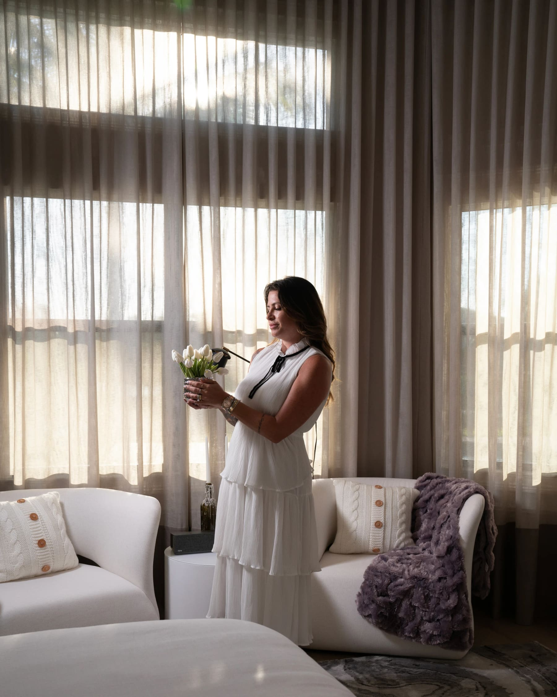
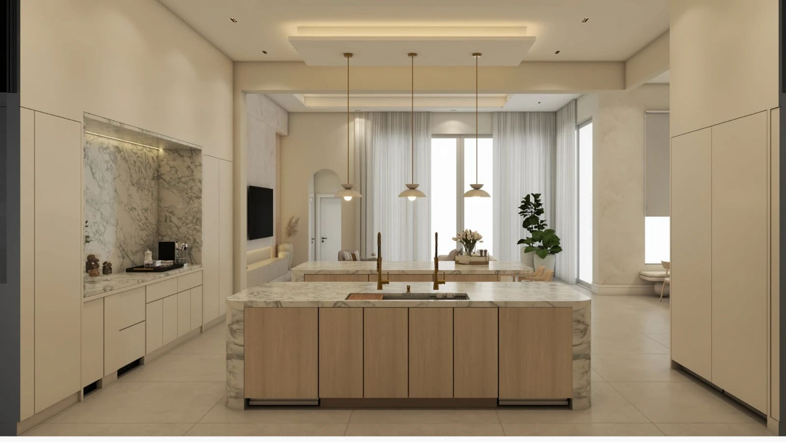
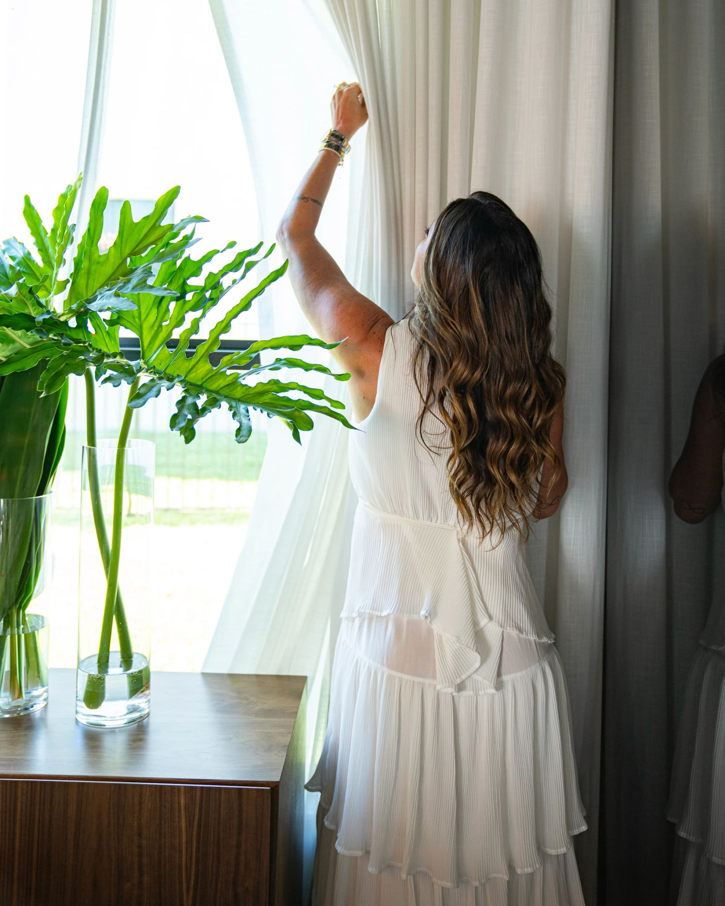
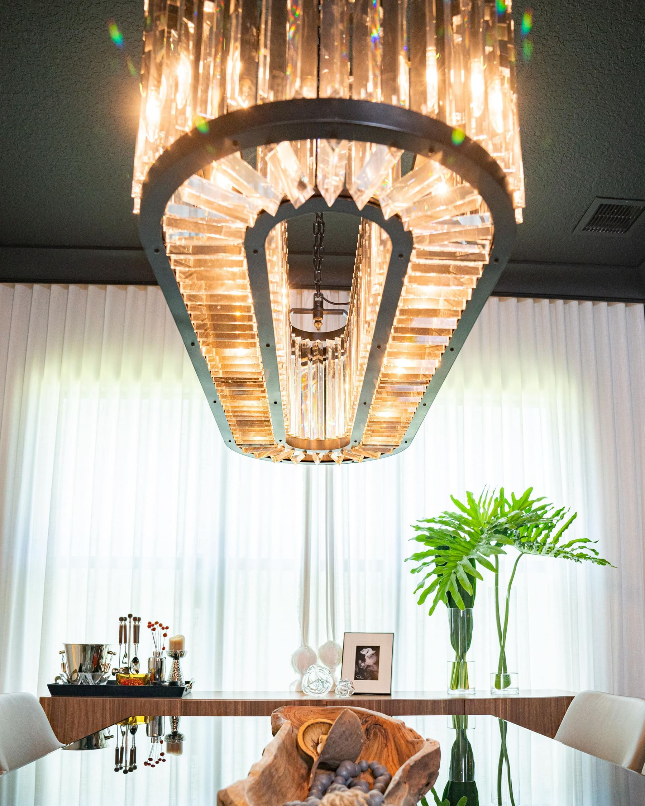
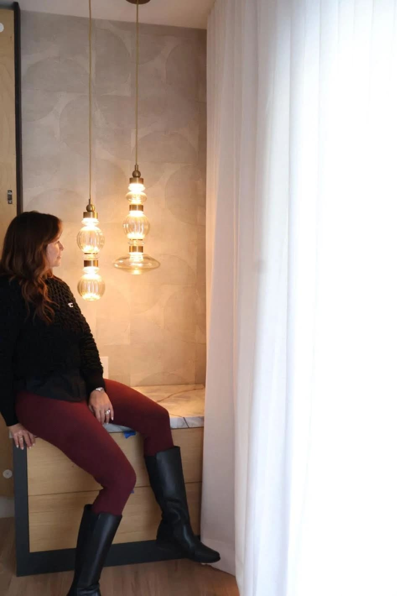

Window Treatments in Miami Interior Design: Curtains, Shades and Light Control

by Paula Ambrosio

@paulaambrosio_

Feb 2, 2026

-

1 min read

Window Layers in Interior Design: Curtains, Shades and Light Control in Miami Homes.

Windows are the connection between the interior and the outside world. They bring light, rhythm and life into a home. But without the right layers, they can also bring discomfort, poor sleep and visual imbalance.

In interior design projects across Miami, Brickell, Miami Beach, Sunny Isles, Bal Harbour, Coral Gables and Boca Raton, window treatments are never just decorative. They are functional, emotional and essential to well-being.

Designing windows correctly changes how a home feels and how people live inside it.

## Why Window Layers Matter More Than People Think

Light is powerful. It influences mood, sleep, skin and overall comfort.

Sleeping without proper window treatments exposes the face to early morning light. Over time, constant light stimulation affects rest and can accelerate signs of fatigue and skin aging. The body never fully disconnects.

Interior design is also about care. Curtains and shades are not a luxury. They are protection.

In Miami, where sunlight is strong year-round, controlling light is essential.

## Curtains, Shades and the Importance of Layering

The most sophisticated window solutions are always layered.

Sheer curtains filter daylight softly and create privacy without blocking light. Blackout curtains or shades provide full darkness when needed, especially in bedrooms. Together, they offer flexibility and comfort throughout the day.

Layering allows the space to adapt. Morning, afternoon, night. Calm, energy, rest.

One single layer is rarely enough.

## Blackout Solutions for Bedrooms and Well-Being

Bedrooms should be dark, quiet and restorative.

Blackout curtains or motorized blackout shades are essential in bedrooms, especially in high-rise buildings in Brickell and Downtown Miami, where city lights remain on all night.

Darkness supports deeper sleep. Better sleep supports skin health, mood and overall wellness.

A well-designed bedroom always includes proper light control.

## Curtain Cove: With or Without Lighting

Curtain coves are an architectural detail that enhances window design.

A recessed curtain cove hides hardware and creates a clean, elegant look. When combined with indirect lighting, it adds softness and depth to the ceiling and walls.

Cove lighting should be subtle. The goal is not to shine, but to create atmosphere.

In Miami interiors, especially in Coral Gables and Bal Harbour, curtain coves add sophistication without visual clutter. Whether with light or without, they bring intention to the space.

## Shades and Modern Window Solutions

Shades offer precision and minimalism.

Roller shades, Roman shades and motorized systems are ideal for modern interiors in Brickell and Miami Beach. They provide clean lines and efficient light control.

Motorized solutions add comfort and are especially valuable in large windows and high ceilings. They integrate technology into daily living without sacrificing aesthetics.

## Fabric, Texture and Color Choices

Curtains add softness and texture to interiors.

Natural fabrics, neutral tones and subtle textures age beautifully. They complement stone, wood and layered walls. Avoid overly shiny fabrics that reflect light aggressively.

Window treatments should frame the view, not fight it.

In Sunny Isles and Boca Raton, lighter fabrics enhance the coastal lifestyle. In urban settings, slightly heavier textures bring balance.

## Window Design as Part of the Interior Layers

Windows are part of the design layers.

They must work with wall textures, flooring, lighting and furniture. Well-designed window treatments connect ceilings to floors and bring vertical elegance to a space.

A room without proper window layers feels unfinished, no matter how beautiful the furniture is.

## Final Thought

Light should be invited, not imposed.

Thoughtful window treatments protect rest, skin and comfort while elevating the entire design. Curtains and shades are not details. They are essential layers of a well-designed home.

In Miami interior design, mastering window layers is mastering how people live.

Paula Ambrosio.

### 

